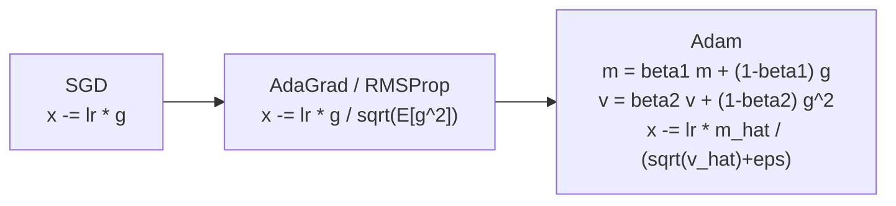
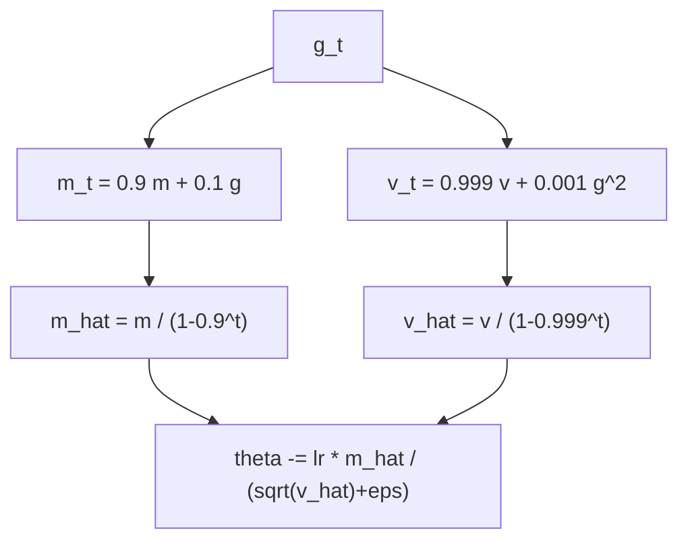
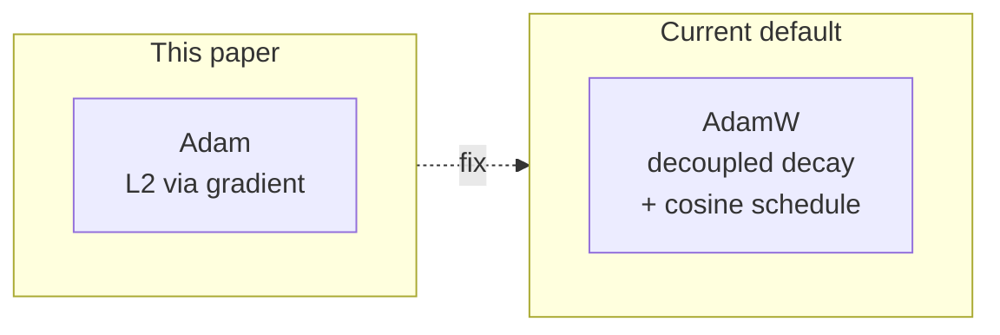

## Notes

> **Thesis:** Adaptive per-parameter step sizes from first and second moments of gradients give fast, robust stochastic optimization with little tuning.

Paper: Kingma and Ba, ICLR 2015 (arXiv:1412.6980). Adam = Adaptive Moment Estimation. Now the default optimizer for Transformers, VAEs, GANs, and diffusion models.

### 1. What problem Adam solves

SGD uses one global learning rate. For sparse gradients or ill-conditioned landscapes, we want per-parameter adaptation. AdaGrad and RMSProp adapt by dividing by root-mean-square of past gradients, but AdaGrad decays too aggressively, RMSProp lacks momentum and bias correction. Adam combines both: momentum on gradient plus adaptive scaling.

### 2. Algorithm

Given gradient $g_t = \nabla_\theta f_t(\theta_{t-1})$:

$$m_t = \beta_1 m_{t-1} + (1-\beta_1) g_t$$
$$v_t = \beta_2 v_{t-1} + (1-\beta_2) g_t^2$$
$$\hat{m}_t = m_t / (1-\beta_1^t) ,\quad \hat{v}_t = v_t / (1-\beta_2^t)$$
$$\theta_t = \theta_{t-1} - \alpha \hat{m}_t / (\sqrt{\hat{v}_t} + \epsilon)$$

Defaults: $\alpha=0.001$, $\beta_1=0.9$, $\beta_2=0.999$, $\epsilon=10^{-8}$. Bias correction removes initialization bias (both moments start at 0, so early estimates are toward zero without $1-\beta^t$ denominator).

### 3. Why bias correction matters

Without correction, $m_t$ and $v_t$ are biased toward zero early, so steps are too small. Correction is $\hat{m}_t \approx m_t$ after ~10 steps for $\beta_1=0.9$ and ~1000 steps for $\beta_2=0.999$. Removing it hurts early convergence, especially for large models with warmup.

### 4. Intuition: momentum + adaptation

* $m_t$ is an exponential moving average of gradients — momentum that smooths noise and accelerates along consistent directions.
* $v_t$ estimates uncentered variance — divides step by typical magnitude, so rare features get larger steps, frequent features get smaller steps.
* Ratio $m_t / \sqrt{v_t}$ is approximately sign-like and bounded by ~1, giving stable updates even with varying gradient scales.

Compare: SGD is $g$, momentum is $m$, RMSProp is $g/\sqrt{v}$, Adam is $m/\sqrt{v}$.

### 5. Convergence and properties

Analysis assumes convex (online) regret bound $O(\sqrt{T})$, similar to AdaGrad, but under bounded gradients and bounded diameter. Non-convex theory came later. Practical properties:

* Invariant to diagonal rescaling of gradients.
* Step size bounded by $\alpha$ (when $\hat{m}/\sqrt{\hat{v}} \approx \pm 1$).
* Memory: two moments per parameter (2x parameters).
* Requires little tuning — $\alpha=0.001$ works across many problems, unlike SGD which needs scheduling.

Note: original paper's convex convergence proof had a flaw; Reddi et al. 2018 showed non-convergence in some settings and proposed AMSGrad.

### 6. Hyperparameters in practice

For Transformers in this vault: Adam with $\beta_1=0.9, \beta_2=0.98$ (or 0.999), warmup 4000 steps, then $1/\sqrt{t}$ decay, exactly as [[Attention Is All You Need]]. Later models use AdamW (weight decay decoupled) — not in this paper but standard now.

### 7. Glossary

* **Moment:** $m_t$ first moment (mean), $v_t$ second moment (uncentered variance) of gradients.
* **Bias correction:** dividing by $1-\beta^t$ to remove zero-initialization bias.
* **Adaptive stepsize:** per-parameter learning rate derived from historical gradient magnitudes.

### 8. Common confusions

* **Adam vs AdamW:** Adam includes L2 in gradient (affected by adaptive scaling); AdamW decouples it so decay is uniform. For Transformers always use AdamW now.
* **Epsilon is not learning rate:** $\epsilon$ is for numerical stability in denominator; learning rate is $\alpha$.
* **Adam is not always best:** for generalization, SGD+momentum can outperform Adam on some vision tasks with long training.

---

### Summary

Adam fuses momentum and per-parameter adaptation with bias correction, giving a robust default for stochastic non-convex optimization. Two moving averages, four hyperparameters, and an update bounded by $\alpha$ explain its wide adoption — including every Transformer training run in this vault.

### Key Takeaways

* $m_t$ smooths gradients, $v_t$ scales by magnitude — together they give $m/\sqrt{v}$.
* Bias correction is essential early in training.
* Bounded updates and invariance to rescaling make Adam forgiving to tune.
* Modern practice is AdamW with scheduled decay, building directly on this algorithm.

Related in vault: [[Attention Is All You Need]], [[Auto-Encoding Variational Bayes]], [[Deep Residual Learning for Image Recognition]], [[Denoising Diffusion Probabilistic Models]].
