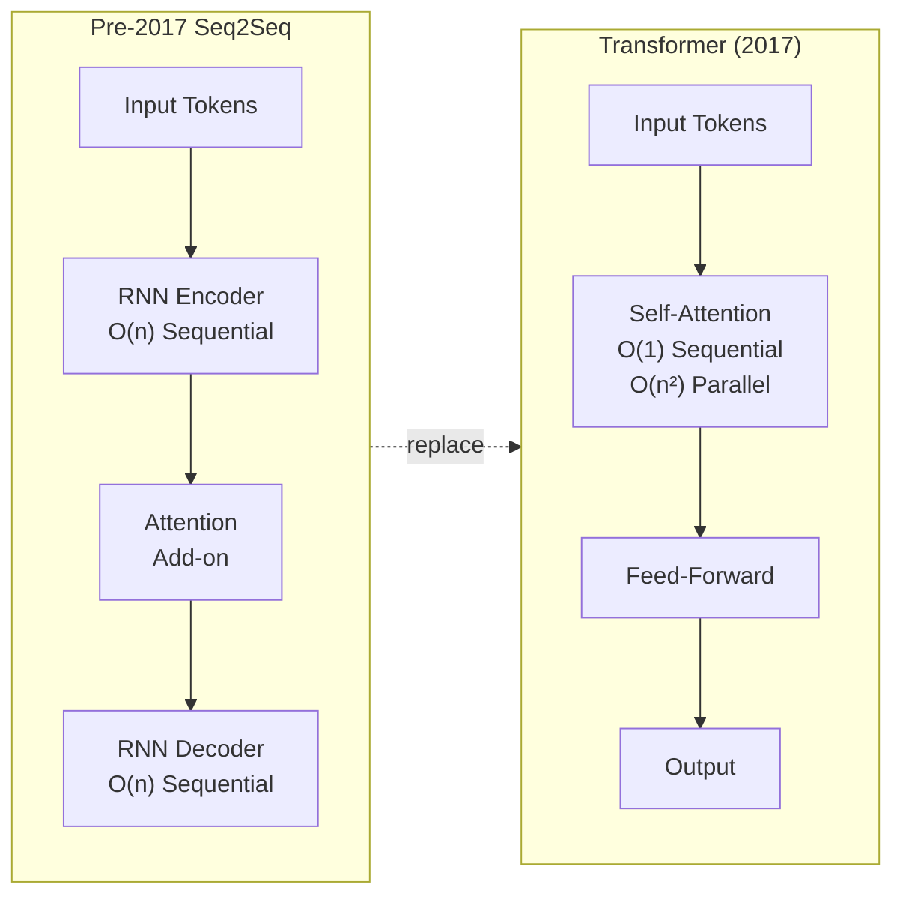
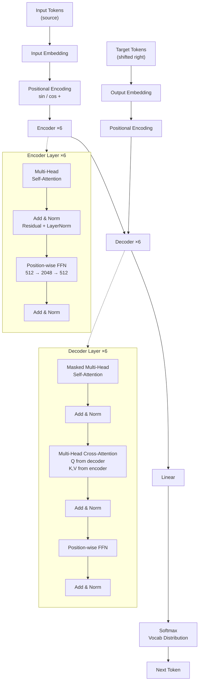
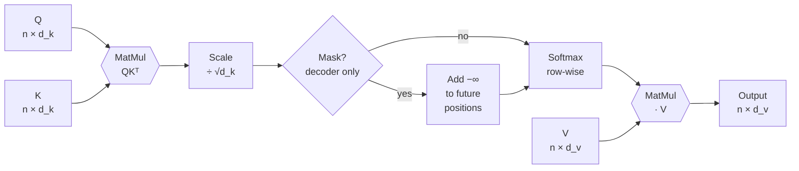
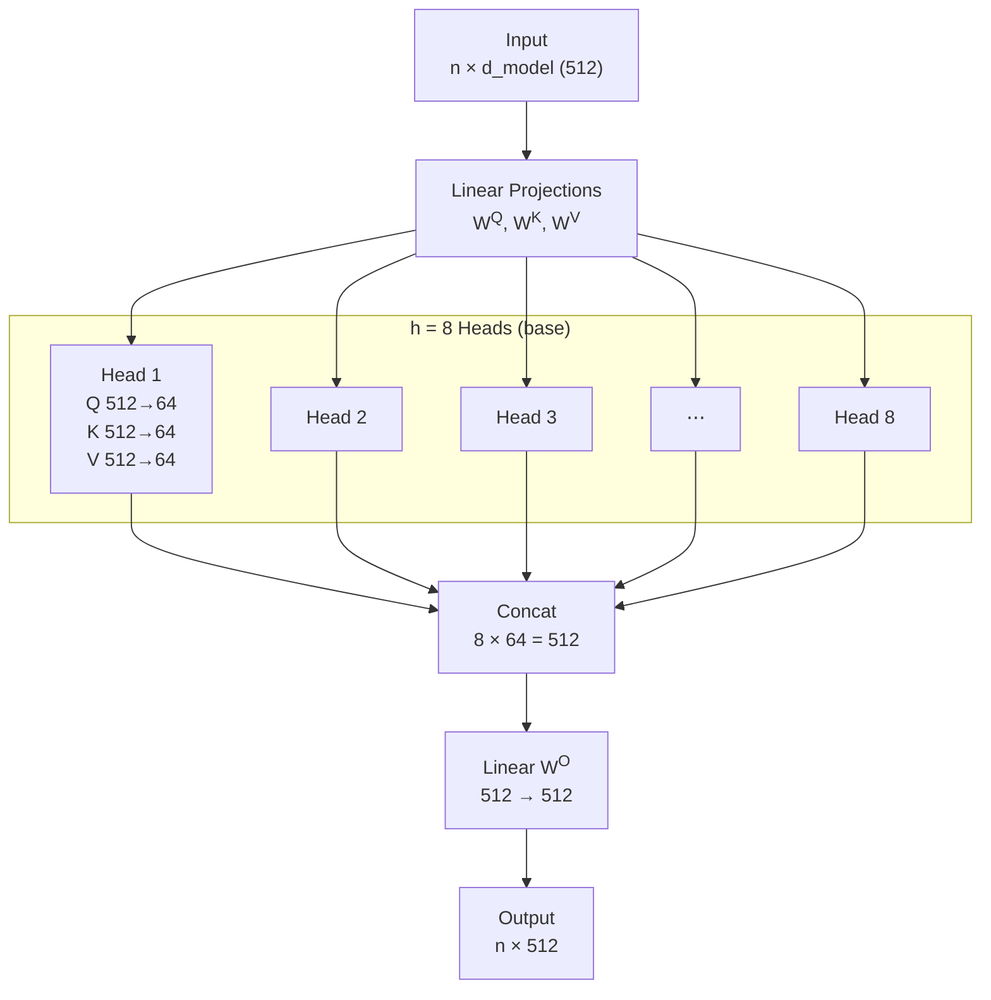
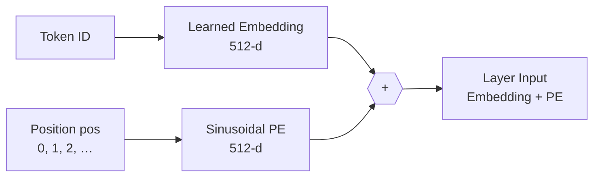
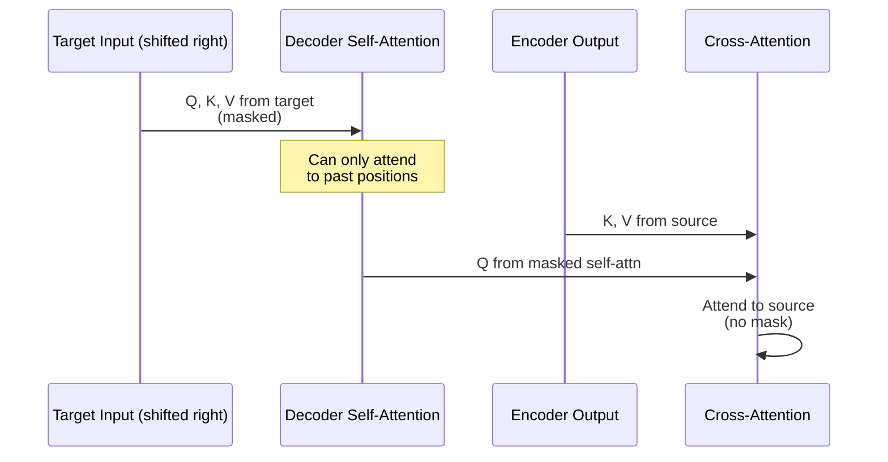
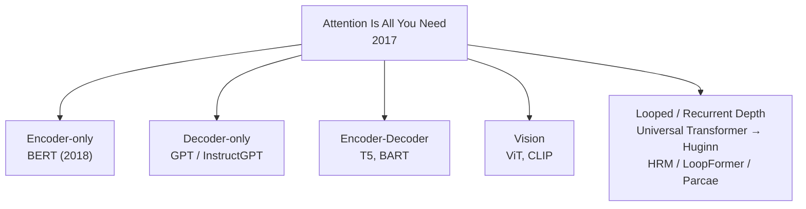

## Notes

> **Thesis:** A sequence transduction model built *only* from attention — no recurrence, no convolution — can outperform RNN/CNN systems on translation while training in parallel.

Paper: Vaswani et al., NIPS 2017 (arXiv:1706.03762). 6 authors from Google Brain/Research. The architecture is the vanilla Transformer that underlies BERT, GPT, ViT, CLIP, and every looped/recurrent-depth variant in this vault.

### 1. Why attention alone?

Before 2017, seq2seq meant RNNs (or LSTMs/GRUs) + attention as an add-on:

* RNN reads token-by-token → $O(n)$ sequential steps, cannot parallelize, gradients vanish over long distances.
* CNNs improve parallelism but need many layers to connect distant tokens ($log(n)$ or linear receptive field growth).
* Bahdanau/Luong attention helped, but still sat on top of recurrence.

Question the authors asked: if attention is already doing the heavy lifting for long-range dependencies, do we need the recurrence at all?

Answer: no. Self-attention alone gives **O(1)** path length between any two positions, with **O(1)** sequential operations (matrix multiplies are fully parallel), at the cost of **O(n²·d)** work per layer.



### 2. Overall architecture — encoder / decoder

Input embeddings + positional encodings go through stacks of identical layers. N=6 in the base and big models.



Key choices:
* **Residual connections** around every sub-layer, then `LayerNorm(x + Sublayer(x))`. (Later implementations use Pre-Norm: `x + Sublayer(LayerNorm(x))` — more stable for deep stacks.)
* **Decoder is autoregressive**: predicts token *t* using only tokens `< t`. Enforced by masking (Section 7).
* Cross-attention in the decoder is where source and target meet: queries come from the decoder, keys and values from the encoder output.

### 3. Scaled dot-product attention — the core operation

For each position, compute a weighted sum of values, where the weight is similarity between its query and each key.

**Inputs:** Query matrix Q, Key matrix K, Value matrix V. Each row is one position.

$$\text{Attention}(Q, K, V) = \text{softmax}\left(\frac{QK^T}{\sqrt{d_k}}\right) V$$

* `QK^T` — pairwise dot products (similarity scores), shape n_q × n_k.
* ` / sqrt(d_k)` — scaling. Without it, dot products grow large in high dimensions (|q·k| ~ sqrt(d_k)), pushing softmax into flat-gradient regions.
* `softmax` row-wise — turns scores into a distribution (weights sum to 1).
* Multiply by `V` — weighted sum; output shape n_q × d_v.



Intuition: each output position explains itself as "look at all input positions, take a weighted average of their values, where the weight is how much I query for that key." No recurrence, so every position can attend to every other in one step.

**Complexity comparison:**

| Layer type | Sequential ops | Path length (any two positions) | Work per layer |
|---|---|---|---|
| Self-attention | O(1) | O(1) | O(n²·d) |
| Recurrent (RNN) | O(n) | O(n) | O(n·d²) |
| Convolution (k) | O(1) | O(log_k n) | O(k·n·d²) |

Self-attention wins when `n < d` (true for most translation sentences; n ~ 30-100, d = 512). For very long sequences, the n² term dominates — the reason later work explores sparse, linear, and looped attention.

### 4. Multi-head attention — why multiple heads?

A single attention head averages in one representation subspace. Multi-head runs the same operation *h* times in parallel with different learned projections, then concatenates.



Formal form:

$$\text{MultiHead}(Q,K,V) = \text{Concat}(\text{head}_1, \dots, \text{head}_h) W^O$$
$$\text{head}_i = \text{Attention}(QW_i^Q, KW_i^K, VW_i^V)$$

* Base: d_model=512, h=8, d_k=d_v=64 (512/8).
* Big: d_model=1024, h=16, d_k=d_v=64.

Each head can learn a different relation: one tracks syntax, another coreference, another positional adjacency. Empirical finding in the paper: different heads indeed attend to different linguistic phenomena without explicit supervision.

### 5. Position-wise feed-forward, residuals, and normalization

Each layer's FFN is applied identically to each position:

$$\text{FFN}(x) = \max(0, xW_1 + b_1)W_2 + b_2$$

* Two linear layers with ReLU in between.
* Base: 512 → 2048 → 512. Big: 1024 → 4096 → 1024.
* Position-wise means the same weights for every position, but different across layers.

Residual + LayerNorm stabilizes depth:
* `LayerNorm(x + Sublayer(x))` — post-norm in the original.
* Dropout 0.1 on attention weights, sub-layer outputs, and embedding sums.

### 6. Positional encoding — giving the model order

Self-attention is permutation-equivariant (shuffle the input, output shuffles the same way). To encode order without recurrence, add a deterministic sinusoidal vector:

$$PE_{(pos, 2i)} = \sin(pos / 10000^{2i/d_{model}})$$
$$PE_{(pos, 2i+1)} = \cos(pos / 10000^{2i/d_{model}})$$



Properties the authors valued:
* Deterministic, no extra parameters.
* For any fixed offset k, `PE_{pos+k}` is a linear function of `PE_{pos}` → model can learn relative positions.
* Extrapolates to longer sequences than seen in training (unlike learned positional embeddings, which were also tried and performed similarly).

They also learned that adding (not concatenating) the encoding works, and that the model treats embedding + PE as a single vector to disentangle.

### 7. Masking — making the decoder autoregressive

During training, the entire target is known, but prediction of token *t* must not see tokens `> t`.

Mask is a triangular matrix added before softmax:

```
positions:   1   2   3   4
         1 [ 0  -inf -inf -inf ]
         2 [ 0   0  -inf -inf ]
         3 [ 0   0   0  -inf ]
         4 [ 0   0   0   0  ]
```

`-inf` → softmax → 0 weight. When combined with the shifted-right target (start token `<s>` prepended), the model learns `P(y_t | y_<t, x)`.



### 8. Training setup

* **Datasets:** WMT 2014 En-De (4.5M sentence pairs) and En-Fr (36M).
* **Tokenizer:** Byte-pair encoding ([[BPE-Neural Machine Translation of Rare Words with Subword Units|BPE]]) with 32k (En-De) / 37k (En-Fr) shared vocab.
* **Batching:** ~25k source + 25k target tokens per batch (dynamic batching by length).
* **Optimizer:** Adam with β1=0.9, β2=0.98, ε=1e-9, custom LR schedule: `lr = d_model^-0.5 · min(step^-0.5, step · warmup^-1.5)` with warmup=4000. LR increases linearly then decays as 1/sqrt(step).
* **Regularization:** Residual dropout 0.1, label smoothing 0.1 (hurts perplexity slightly, helps BLEU).
* **Hardware / time:** 8× P100 GPUs. Base: 12 hours. Big: 3.5 days.

### 9. Results

| Model | En-De BLEU | En-Fr BLEU | Params |
|---|---|---|---|
| ByteNet, ConvS2S, GNMT+MoE (prior SOTA) | ~23–26 | ~38–41 | various |
| **Transformer base (65M)** | 27.3 | 38.1 | 65M |
| **Transformer big (213M)** | **28.4** | **41.8** | 213M |

Big beat the best ensembles at the time by >2 BLEU on En-De, with 3.5 days on 8 GPUs. Training throughput far exceeded RNN systems because every position computes in parallel.

Ablations (En-De base):
* Removing multi-head (single head, same params) → drop ~0.9 BLEU.
* Learned positional embeddings ≈ sinusoidal (small ~0.1 diff).
* `d_k` scaling matters: without `1/sqrt(d_k)`, performance collapses for large d_k.

### 10. Why this paper matters now

* **All modern LLMs are Transformers.** BERT keeps the encoder, GPT keeps the decoder (masked self-attention only), ViT treats image patches as tokens, CLIP uses two encoders. Understanding attention, heads, and masking explains every later architecture in this vault.
* **Foundation for looped variants.** Universal Transformers (Dehghani et al., 2018) loop the Transformer block with ACT to get adaptive depth. Huginn, HRM, LoopFormer, and Parcae reuse this exact block but iterate it: `x_{t+1} = TransformerBlock(x_t)` with shared weights. Read this note first, then the looped papers will click: they are asking "what if N=∞ and we learn when to stop?"
* **Path to scaling laws.** The O(1) path length made it practical to stack 6 layers in 2017. Scaling that to 96+ layers (GPT-3) and then to scaling laws (Kaplan et al.) is continuous with Section 8's batch/optimizer choices.



### 11. Glossary

* **Self-attention:** Attention where Q, K, V all come from the same sequence (encoder or decoder self-attn). Lets each position look at every other position in the same sequence.
* **Cross-attention:** Attention where Q comes from the decoder and K,V from the encoder output. Lets the target look at the source.
* **Query / Key / Value:** Borrowed from retrieval. Query is "what I am looking for", key is "what I have", value is "what I carry". Similarity(Q,K) selects V.
* **d_model / d_k / d_v:** Model width (512/1024) and per-head key/value dimensions (64). h·d_k = d_model.
* **Multi-head:** Multiple independent attention operations with different projections, concatenated. Captures different relation types.
* **Positional encoding:** Added vector giving the model position information since attention has no inherent order.
* **Autoregressive:** Generates one token at a time, each prediction conditioned on previously generated tokens.
* **LayerNorm:** Normalizes activations per position across the feature dimension, stabilizes deep stacks.
* **Label smoothing:** Replaces hard 0/1 targets with 0.1 / 0.9, penalizes overconfidence, improves generalization.

### 12. Common confusions

* **Attention is not just an alignment matrix.** The output is `weighted sum of values`, not just the weights. The values carry content.
* **Heads do not correspond to words.** A head is a learned projection subspace. What it attends to is emergent, not assigned.
* **Positional encoding is not an embedding lookup.** Sinusoids are fixed functions; the model does not learn them (in the original). They add directly to the token embedding.
* **Masking is not dropout.** Masking sets future scores to -∞, guaranteeing zero weight. Dropout randomly zeros weights for regularization.

---

### Summary

The Transformer replaces recurrence with self-attention and achieves both better quality and faster training through parallelism. Six encoder layers and six decoder layers, each with multi-head attention, residual + norm, and a position-wise FFN, plus sinusoidal position codes and causal masking, suffice to beat the best RNN systems of 2017. Every architectural choice — scaling by sqrt(d_k), 8/16 heads, 4000-step warmup — is motivated by keeping gradients healthy while maintaining O(1) access between any two positions. From here, read [[Universal Transformers]] to see the same block looped with adaptive halting, then [[Huginn - Scaling up Test-Time Compute with Latent Reasoning]] and [[Hierarchical Reasoning Model]] for how modern looped reasoners iterate this block at test time.

### Key Takeaways

* Self-attention gives global receptive field in O(1) steps with full parallelism; cost is O(n²) memory/compute.
* Multi-head = many learned similarity metrics running in parallel; concatenating them beats a single larger head.
* Order must be injected explicitly; sinusoids work as well as learned embeddings and extrapolate better.
* The encoder-decoder distinction matters: encoder = unmasked self-attn; decoder = masked self-attn + cross-attn.
* Training recipe (Adam + warmup + label smoothing) is as important as the architecture for achieving 28.4 BLEU.
* This paper is prerequisite for every other paper in the vault — treat its block diagram as the base case that later looped papers iterate.

Related in vault: [[Universal Transformers]], [[Looped Transformers as Programmable Computers]], [[Huginn - Scaling up Test-Time Compute with Latent Reasoning]], [[LoopFormer - Elastic-Depth Looped Transformers]], [[Parcae - Scaling Laws For Stable Looped Language Models]], [[A Mechanistic Analysis of Looped Reasoning Language Models]], [[Hierarchical Reasoning Model]], [[BPE-Neural Machine Translation of Rare Words with Subword Units]], [[BERT - Pre-training of Deep Bidirectional Transformers]], [[GPT-3 - Language Models are Few-Shot Learners]].
