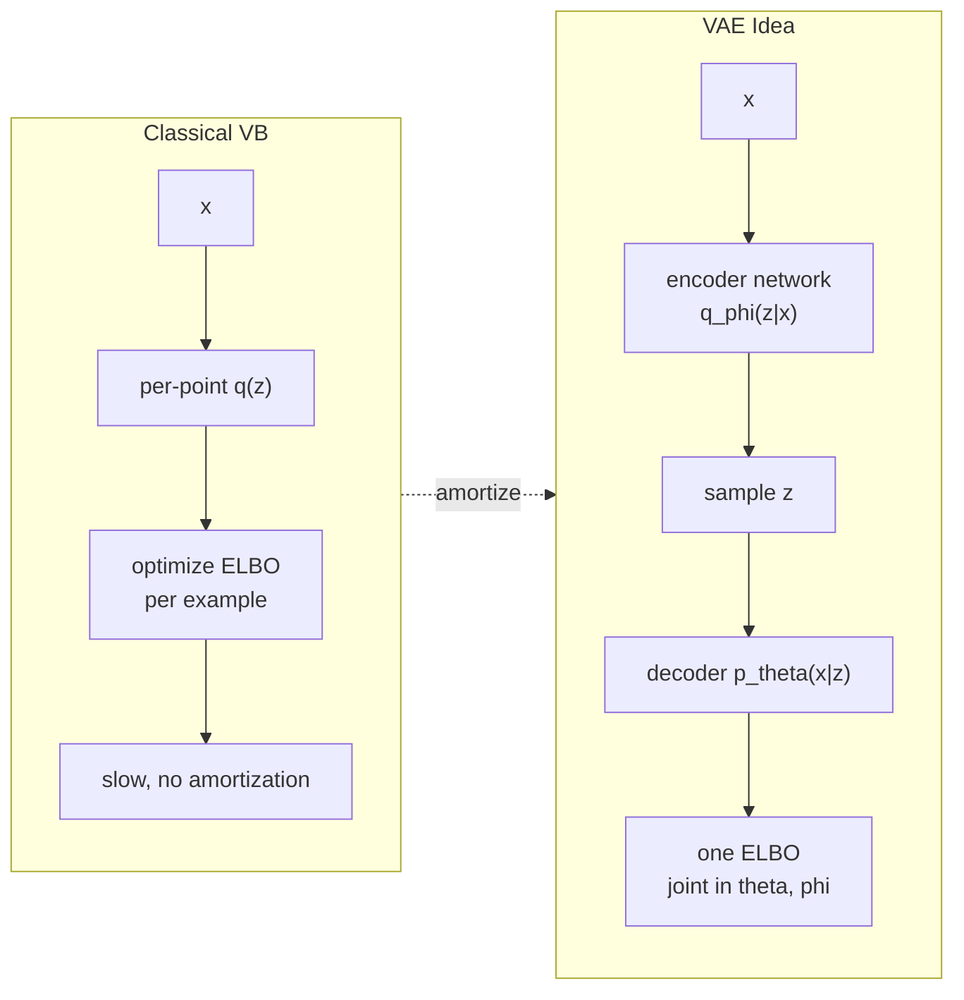
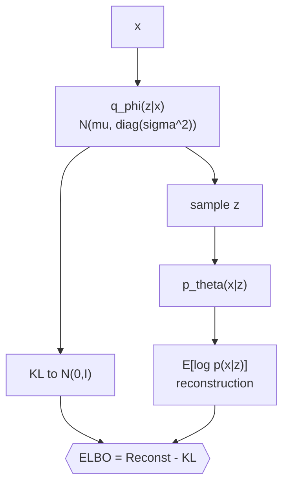
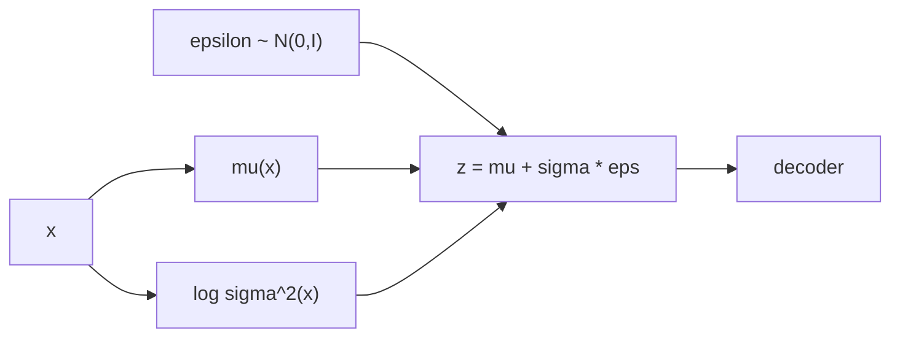
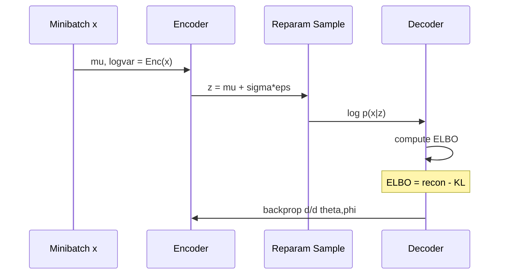

## Notes

> **Thesis:** Directed probabilistic models with continuous latents can be trained efficiently by optimizing a variational lower bound with a reparameterized gradient estimator.

Paper: Kingma and Welling, ICLR 2014 (arXiv:1312.6114). Introduces the Variational Autoencoder (VAE). The core problem is posterior inference for $p_\theta(z|x)$ is intractable; they make it tractable with amortized inference.

### 1. Why variational inference needed

We want to learn $p_\theta(x) = \int p_\theta(x|z) p(z) dz$ where $z$ is latent. Two problems: marginal is intractable, posterior $p_\theta(z|x)$ is intractable.

Classical EM requires posterior. Mean-field VB requires per-datapoint optimization. VAE replaces per-point optimization with a neural encoder $q_\phi(z|x)$ shared across data.

### 2. ELBO derivation

For any $q_\phi(z|x)$:

$$\log p_\theta(x) = D_{KL}(q_\phi(z|x) \| p_\theta(z|x)) + \mathcal{L}(\theta,\phi;x)$$

Since KL >= 0, $\mathcal{L}$ is a lower bound:

$$\mathcal{L}(\theta,\phi;x) = \mathbb{E}_{q_\phi}[\log p_\theta(x|z)] - D_{KL}(q_\phi(z|x) \| p(z))$$

First term is reconstruction, second regularizes $q$ toward prior $p(z)=N(0,I)$. Maximizing ELBO simultaneously improves generative model and inference model, and tightens bound as $q$ approaches true posterior.

### 3. Reparameterization trick

Sampling $z \sim q_\phi(z|x)$ is not differentiable. Rewrite $z$ as deterministic function of noise:

$$z = \mu_\phi(x) + \sigma_\phi(x) \odot \epsilon, \quad \epsilon \sim \mathcal{N}(0,I)$$

Then $\nabla_\phi \mathbb{E}_{q_\phi}[f(z)] = \mathbb{E}_{p(\epsilon)}[\nabla_\phi f(\mu + \sigma \epsilon)]$ — low variance, single sample often suffices. Contrast with score-function (REINFORCE) estimator which has high variance.

Without this trick, VAEs would not train with SGD. This is the paper's key technical contribution.

### 4. Gaussian VAE instantiation

* Prior $p(z)=N(0,I)$
* Posterior $q_\phi(z|x)=N(\mu_\phi(x), \text{diag}(\sigma^2_\phi(x)))$
* Likelihood $p_\theta(x|z)$ — Bernoulli for binarized MNIST, Gaussian for continuous.

KL has closed form:

$$-D_{KL} = \tfrac12 \sum_j (1 + \log \sigma_j^2 - \mu_j^2 - \sigma_j^2)$$

Architecture in paper: encoder and decoder are MLPs with one hidden layer (500 units, ReLU) for MNIST; latent dim 20-50. Later practice uses CNNs for images, Transformers for text.

Training: minibatch SGD (Adam was not yet standard — they use AdaGrad + RMSProp variants). One sample per datapoint per step.

### 5. AEVB algorithm

### 6. Results and limitations

* MNIST: ELBO -88 nats, better than wake-sleep. Frey Faces: generates realistic faces by sampling $z \sim N(0,I)$.
* Latent space is smooth and interpolatable — walk in $z$ produces gradual image changes, unlike autoencoders.
* Limitation noted later: Gaussian prior + factorized $q$ causes posterior collapse, blurry samples vs GANs, ELBO does not guarantee good $p(x)$ when $q$ is restricted. Connects to [[Generative Adversarial Networks]] (sharper, no likelihood) and [[Denoising Diffusion Probabilistic Models]] (better likelihood via hierarchical latents).

### 7. Glossary

* **Amortized inference:** one network predicts posterior parameters for any $x$, rather than optimizing per $x$.
* **ELBO:** evidence lower bound, $\mathcal{L} \le \log p(x)$, tight when $q=p(z|x)$.
* **Reparameterization:** rewriting a sample as deterministic function of parameters plus fixed noise.
* **KL divergence:** $D_{KL}(q\|p)=\mathbb{E}_q[\log q/p]$, zero iff $q=p$.

### 8. Common confusions

* **VAE vs plain autoencoder:** AE has no prior or KL; its latent space is not regularized and not generative (cannot sample).
* **ELBO is not $\log p(x)$:** optimizing ELBO only guarantees $\log p(x)$ does not decrease; gap is posterior approximation error.
* **One sample is enough:** due to reparameterization, gradient variance is low; no need for many $z$ per $x$.

---

### Summary

VAE turns intractable posterior inference into an optimization problem solved jointly with generation. The ELBO splits into reconstruction plus KL, and the reparameterization trick makes gradients tractable. This amortized, differentiable variational framework is the basis for all modern latent-variable generative models.

### Key Takeaways

* Directed models with continuous latents become trainable by replacing per-point VB with a shared encoder.
* ELBO decomposition gives an interpretable reconstruction-regularization trade-off.
* Reparameterization $z=\mu+\sigma\epsilon$ is required for low-variance SGD; score-function alone fails.
* Gaussian VAE gives a smooth, samplable latent space but with blurry reconstructions — the trade-off that later diffusion models address.

Related in vault: [[Generative Adversarial Networks]], [[Denoising Diffusion Probabilistic Models]], [[Attention Is All You Need]], [[Adam: A Method for Stochastic Optimization]].
