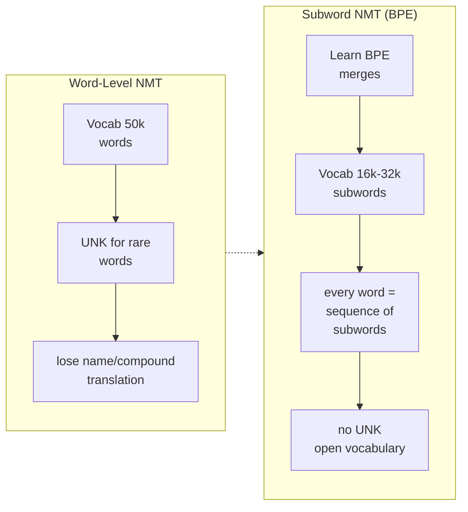
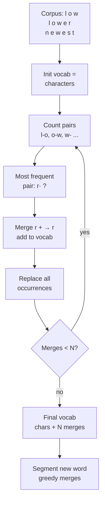
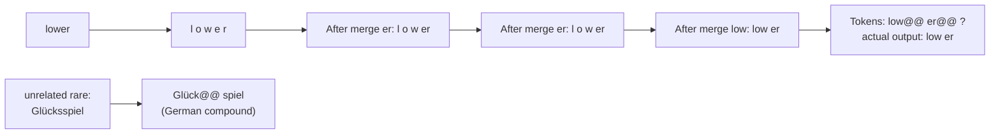
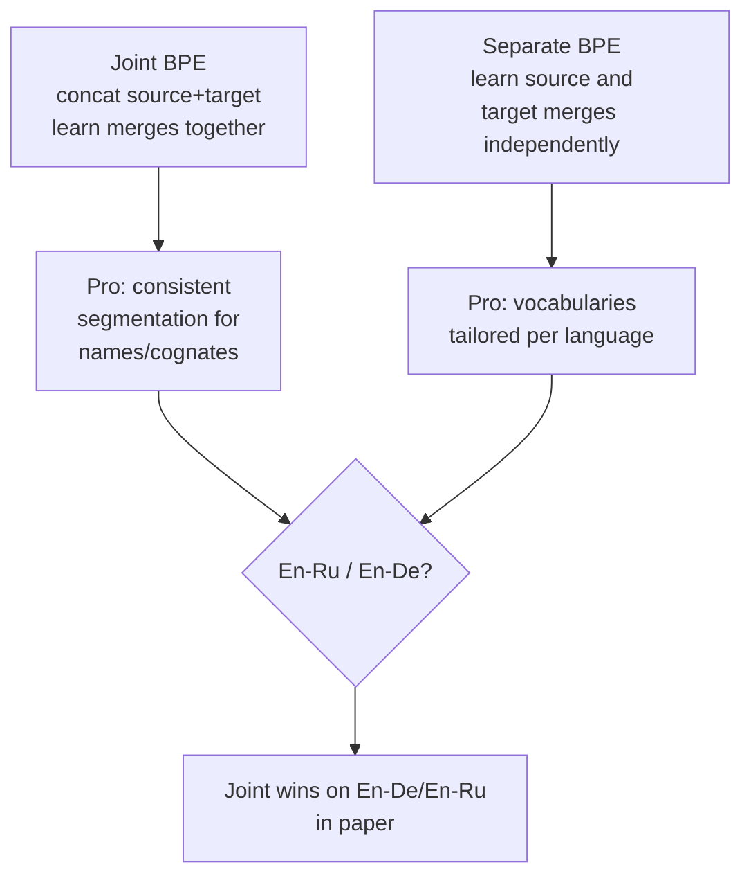
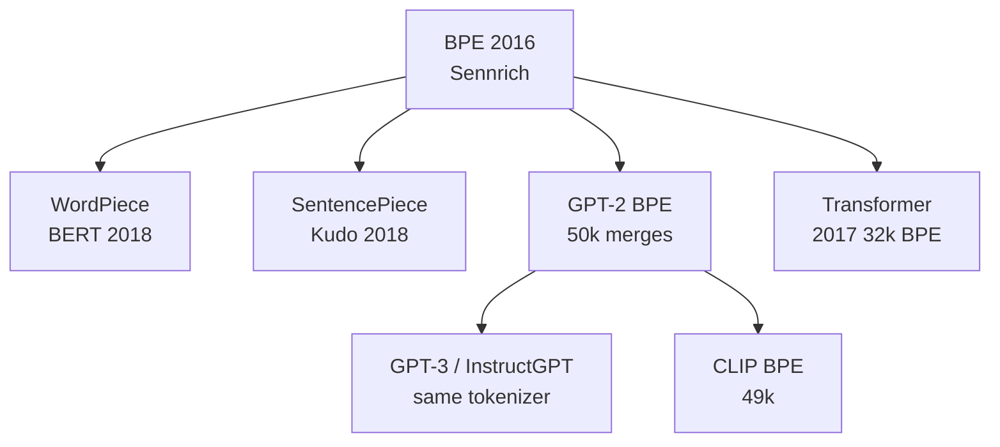

## Notes

> **Thesis:** Representing rare and unknown words as sequences of subword units learned by byte-pair encoding lets an NMT system translate open vocabularies with a fixed-size vocabulary and no UNK token.

Paper: Sennrich, Haddow, and Birch, ACL 2016 (arXiv:1508.07909). Edinburgh. Motivated by the fixed-vocabulary bottleneck in NMT where rare words became UNK and transliteration failed.

### 1. Why subwords?

Early NMT used word-level vocabularies (30k-50k) with back-off to UNK:

* Zipf distribution means most word types are rare, but rare types carry most information (names, compounds, morphology).
* Copying or dropping UNK hurts translation, especially for morphologically rich languages (German) where compounds are productive.
* Character-level models are open-vocabulary but sequences are long and modeling is harder.

Idea: trade between word and character. Represent every word as a concatenation of frequent subwords. Frequent words stay whole, rare words are split.

### 2. Byte-pair encoding for text

BPE was originally a compression algorithm (Gage 1994). Adaptation to NMT:

1. Initialize vocabulary with all characters plus end-of-word marker `</w>`.
2. Represent corpus as sequence of characters + `</w>`.
3. Repeatedly count most frequent adjacent pair (e.g., `e r`), merge it into a new symbol `er`, replace all occurrences.
4. Repeat for N merges (the only hyperparameter). Each merge adds one entry to the vocabulary.
5. At test time, segment each word greedily by applying merges in learned order.

Practical details in the paper:

* Apply BPE to joint source+target vocabulary (shared merges improve consistency for names).
* Number of merges: 59,500 for En-De, 89,500 for En-Ru in experiments, but 16k-32k works well for ablations. The paper studies the curve.
* Special `</w>` marker lets the model distinguish word boundaries after segmentation.

### 3. Segmentation example

Given merges learned on English, the word `lower` might be segmented based on frequency.

Paper example (German): `Forschungsinstitut` infrequent as whole but `Forschung@@ Institut` or `Forsch@@ ung@@ s@@ institut` if split into known subwords. Model can then translate compositionally.

Encoding uses `@@` in the paper to mark non-final subwords (modern SentencePiece uses `▁`).

### 4. Joint vs separate BPE

Experiment: separate BPE must transliterate names independently; joint BPE segments `Barack Obama` the same way in both languages, improving attention alignment.

### 5. Results

* WMT 2015 En-De and En-Ru. Baseline: word-level with UNK + dictionary back-off (Luong et al.).
* BPE with 59.5k merges vs 90k: BPE matches or beats baseline BLEU, but crucially **eliminates UNK** and improves rare-word F1.
* On words ranked >50k by frequency, BPE gains +2-5 BLEU over UNK replacement. Human judgment prefers BPE for rare words.
* Vocabulary size sensitivity: BLEU is flat across 30k-90k merges. Character unigrams (0 merges) hurt. Choice of N is not critical.

| Vocab | En-De BLEU (newstest2013) | Rare F1 |
|---|---|---|
| WDict + unk replace | 20.8 | low |
| BPE-issuffix 59.5k | 21.5 | +1.1 |
| BPE-joint 89.5k | 22.0 | best |

### 6. Why this paper matters now

* **Every modern tokenizer descends from this.** GPT-2, GPT-3, BERT WordPiece, and SentencePiece are BPE variants. The Transformer in [[Attention Is All You Need]] uses 32k shared BPE in the original WMT experiments. Without BPE, the scaling-law models in this vault could not have a fixed vocabulary that scales to trillions of tokens.
* **Open vocabulary is assumed.** Later papers (Scaling Laws, ViT, CLIP) treat tokenization as preprocessing. Understanding merge count vs sequence length tradeoff explains why 50k is standard: `vocab size ≈ sequence length` tradeoff. Larger vocab = shorter sequences (fewer tokens) but sparser embeddings.
* **Foundation for later looped work.** Loop variants keep the same tokenizer; reasoning is done over the same subword space.

### 7. Glossary

* **BPE (Byte-Pair Encoding):** Greedy merging of most frequent adjacent symbol pair, originally for compression. Adapts word segmentation to corpus statistics.
* **Subword unit:** A token that is between a character and a word (e.g., `ing`, `@@tion`). Vocabulary consists of characters + merged subwords.
* **UNK (unknown token):** Placeholder for out-of-vocabulary words in word-level models. BPE eliminates it.
* **Joint BPE:** Learn merges on concatenated source and target corpora.
* **Type vs token:** Type is distinct vocabulary entry, token is occurrence. BPE controls number of types.
* **Morphology:** Internal structure of words (roots, affixes). BPE approximates morphemes without linguistic rules.

### 8. Common confusions

* **BPE is not linguistic morpheme segmentation.** It is purely frequency-driven. It sometimes aligns with morphemes (`un@@ happy`) and sometimes does not (`th@@ e`). Do not assume merges are meaningful.
* **Merge count is not vocab size exactly.** Vocab = characters + merges + special tokens. 32k merges ≈ 32k types, but paper reports both.
* **BPE vs WordPiece vs SentencePiece:** Same idea (frequent subwords), different training objective: BPE uses frequency of pairs, WordPiece uses likelihood gain, SentencePiece treats space as a character and trains BPE/unigram on raw text.
* **Joint BPE does not mean shared embedding matrix.** Even with shared segmentation, source and target can have separate embeddings. The shared vocabulary only guarantees consistent splitting.

---

### Summary

BPE solves the open-vocabulary problem with one hyperparameter (number of merges) and no UNK. Initialize with characters, repeatedly merge the most frequent pair, segment new words by applying merges greedily. Frequent words remain intact, rare words split into known pieces, enabling compositional translation of compounds and names. The paper shows BLEU parity with word-level systems plus strong gains on rare words, and establishes the tokenization regime used by every later Transformer in this vault.

### Key Takeaways

* Rare words are the real vocabulary problem; UNK replacement is a weak fix.
* Frequency-driven subwords give open vocabulary with a fixed table: every string is segmentable.
* Joint source+target BPE helps alignment of names and cognates.
* Merge count is forgiving (16k-90k); pick it to trade vocab size against sequence length.
* This paper is prerequisite for understanding why later models talk about tokens, not words.

Related in vault: [[Attention Is All You Need]], [[BERT - Pre-training of Deep Bidirectional Transformers for Language Understanding]], [[Language Models are Few-Shot Learners]], [[Scaling Laws for Neural Language Models]], [[Universal Transformers]].
