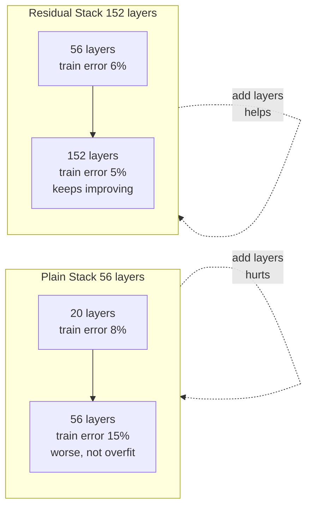
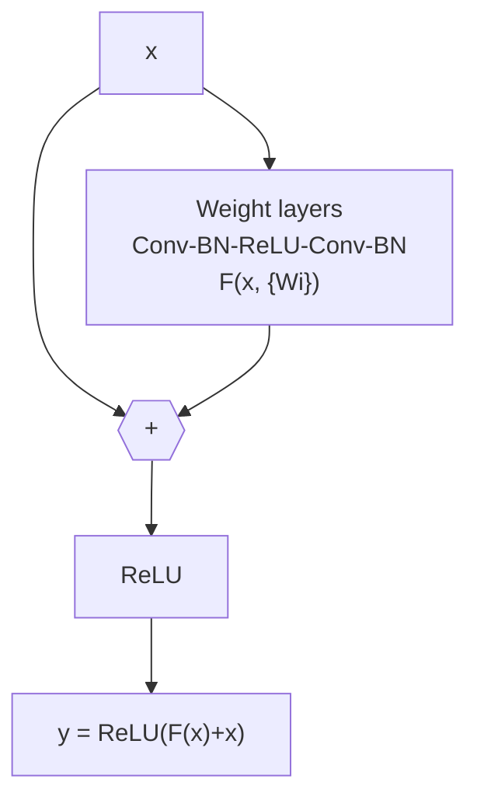
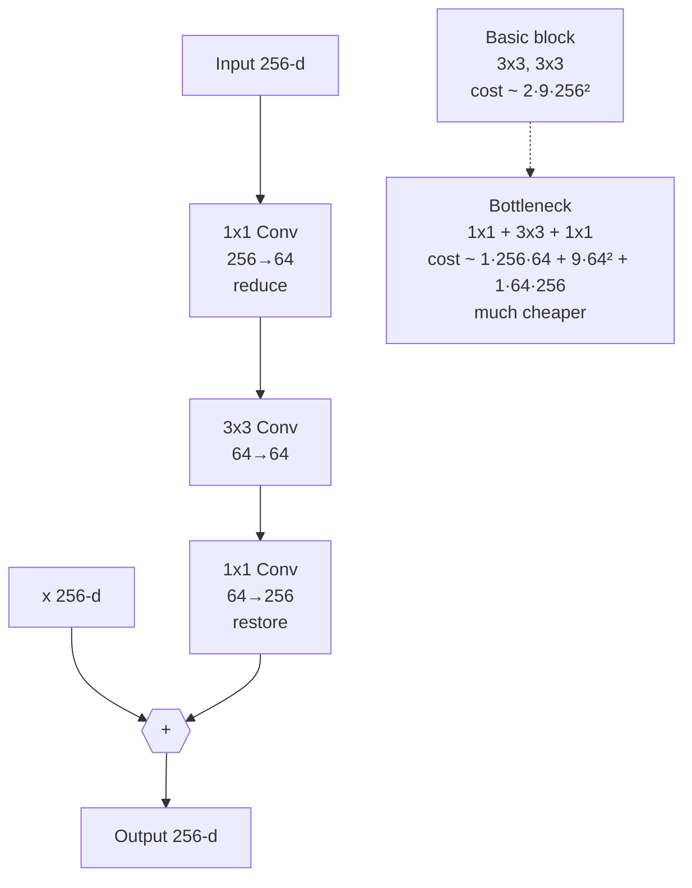
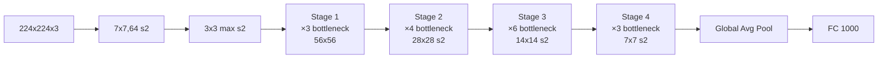
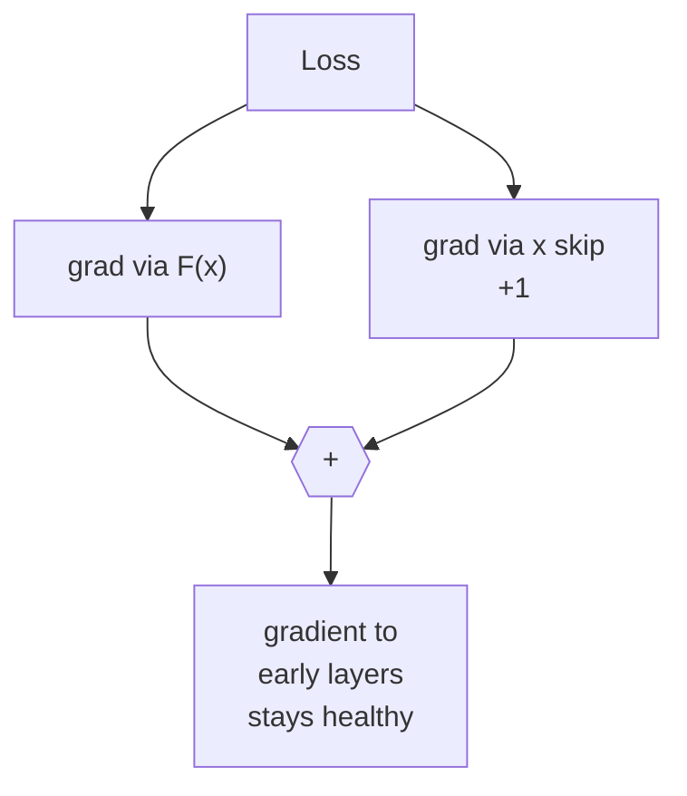
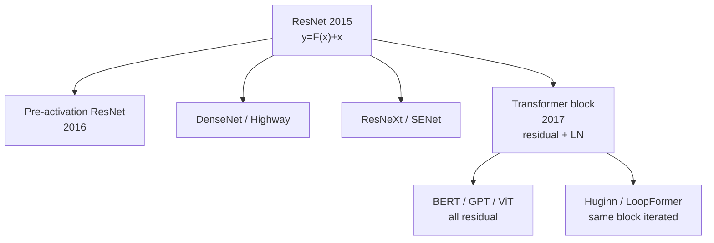

## Notes

> **Thesis:** Reformulating layers to learn residual functions `F(x) = H(x) - x` with identity skip connections lets networks be 100+ layers deep by solving the degradation problem where deeper plain nets get higher training error.

Paper: He et al., Microsoft Research, CVPR 2016 (arXiv:1512.03385 Dec 2015). Introduces the residual block that makes 152-layer ImageNet models trainable, winning ILSVRC 2015.

### 1. The degradation problem

Before ResNet, deeper CNNs were hypothesized to be strictly more expressive but in practice behaved worse:

* Not overfitting: training error also increased when going from 20 to 56 layers (CIFAR-10 plain net). If deeper could copy shallower via identity, training error should not rise.
* Vanishing/exploding gradients were partly addressed by normalization and initialization, yet optimization stalled.
* Hypothesis: solvers struggle to approximate identity mappings with stacked nonlinear layers.

### 2. Residual reformulation

Instead of hoping stacked layers fit `H(x)`, let them fit `F(x) = H(x) - x` and reconstruct `H(x) = F(x) + x` via a skip.

For dimensions that change (stride 2 or channel increase), use a projection `Ws x` (1x1 conv) on the skip: `y = F(x) + Ws x`.

Why easier? If identity is optimal, the solver can push `F(x)` to zero (just drive weights to zero) rather than approximating identity through nonlinearities. Gradients flow directly through the skip: `dy/dx` has a +1 term.

Formally, for a block:

$$y = \sigma(F(x, \{W_i\}) + x)$$

where `F = W_2 σ(W_1 x)` (basic block) or `F = W_3 σ(W_2 σ(W_1 x))` (bottleneck).

### 3. Bottleneck architecture for deep nets

Basic 3x3 block is expensive at 152 layers. Bottleneck reduces cost with 1x1 projections:

ResNet-50/101/152 use bottleneck blocks with counts [3,4,6,3] etc. ResNet-34 uses basic blocks.

ImageNet architecture: 7x7 conv stride 2, maxpool stride 2, then 4 stages with stride 2 at each stage transition, average pool, 1000-way FC.

### 4. Identity vs projection skips

Experiments compare three options for dimension-changing skips:

* A: zero-padding for extra dimensions (no extra params)
* B: projection only when dimensions change, otherwise identity
* C: all skips are projections

B slightly beats A, C is marginally better than B but adds params. Paper recommends B for efficiency. Key result: identity skip in same-dimension blocks is already sufficient; the power is from the additive form, not from extra parameters.

### 5. Optimization behavior

Residual nets have smoother loss landscapes. The +1 in the gradient prevents vanishing even without batch norm, but the paper still uses BN after every conv and before ReLU.

Training setup: SGD with momentum 0.9, weight decay 1e-4, batch 256, initial LR 0.1 divided by 10 when plateau, 60k minival split, standard augmentation (scale/color jitter, crop, flip), BN.

This is why 1000-layer CIFAR experiments still train (though test accuracy saturates; 1202-layer is worse than 110 due to overfitting, not degradation).

### 6. Results

| Model | ImageNet top-1 error | top-5 error | Params |
|---|---|---|---|
| VGG-16 | 28.07% | 9.33% | 138M |
| GoogLeNet | - | 9.15% | 6.8M |
| PReLU-net | 24.27% | 7.38% | - |
| ResNet-34 | 26.73→25.03% (plain→res) | 8.58→7.76 | 21.8M |
| ResNet-50 | 24.7% | 7.0% | 25.6M |
| ResNet-101 | 23.6% | 6.84% | 44.5M |
| ResNet-152 | 23.0% | 6.71% | 60M |
| Ensemble | 21.43% | 5.71% | - |

ILSVRC 2015 winner: ResNet-152 ensemble at 3.57% top-5 (first below human estimated 5.1%). Also swept COCO detection/segmentation: +3-6 mAP from replacing VGG with ResNet.

CIFAR-10: ResNet-110 at 6.43% vs plain 56 at 7.93%. Even 1202-layer residual trains (training error <0.1%) but overfits.

### 7. Why this paper matters now

* **The skip is universal.** Transformer blocks are residual: `x + Attention(LN(x))`, `x + FFN(LN(x))`. ViT, BERT, GPT, and every looped variant in this vault stack residuals dozens of times because of this paper. Without skips, a 96-layer GPT-3 would be untrainable.
* **Depth scaling precedent.** ResNet proved accuracy scales with depth if optimization is fixed. This intuition transfers directly to Scaling Laws and to looped depth where iterations act as virtual depth.
* **Bottleneck pattern repeats.** The 1x1 reduce → 3x3 → 1x1 restore pattern is the same as Transformer's `512 → 2048 → 512` FFN and LoRA's low-rank factorization.

### 8. Glossary

* **Degradation:** Training error increases when adding more layers to a plain network, not caused by overfitting. Indicates optimization difficulty, not capacity.
* **Residual function F(x):** The learned difference from identity. Easier to push to zero than to learn identity directly.
* **Skip / shortcut connection:** Direct additive path bypassing nonlinear layers. Identity if dimensions match, projection if not.
* **Bottleneck block:** 1x1 reduce, 3x3 conv, 1x1 expand. Reduces compute while preserving depth.
* **Batch Normalization (BN):** Normalizes activations per mini-batch. Stabilizes residual training along with skips.
* **ILSVRC / ImageNet:** 1.2M image classification benchmark (1000 classes). Standard vision benchmark until 2017.

### 9. Common confusions

* **Residual is not just gradient highway.** It also changes the function class: the network learns refinements to identity, which is a good prior for vision where nearby layers should be similar.
* **Deeper is not always better, even with residuals.** After ~150 layers, gains diminish and overfitting dominates on small datasets (CIFAR 1202-layer). Residuals fix optimization, not generalization.
* **Projection skip vs identity is minor.** Most of the gain comes from the additive form itself. Adding params to the skip helps little, which is why later Transformers use pure identity + LayerNorm.
* **ResNet does not use dropout.** Regularization comes from BN and weight decay. Dropout was common in VGG/AlexNet but omitted here.

---

### Summary

Deep plain networks degrade because solvers cannot approximate identity through stacked nonlinearities. Reformulating each block to learn `F(x) = H(x) - x` and adding `x` back via an identity skip makes identity trivial (push `F` to zero) and gives gradients a direct +1 path backward. With bottleneck 1x1-3x3-1x1 blocks, ResNet scales to 152 layers and cuts ImageNet top-5 error from 7% to 3.57% (ensemble), establishing the residual pattern that every later deep network reuses.

### Key Takeaways

* Degradation is an optimization problem, not overfitting; test with training error.
* `y = F(x) + x` makes identity the baseline, not a learned special case.
* Bottleneck design makes 100+ layers cheap; 1x1 convolutions are the workhorse.
* Identity skips suffice for same dimensions; projections only needed when shape changes.
* Residual + normalization is the deep learning default since 2015, from vision to Transformers to looped reasoners.

Related in vault: [[Attention Is All You Need]], [[An Image is Worth 16x16 Words - Transformers for Image Recognition at Scale]], [[Universal Transformers]], [[Looped Transformers as Programmable Computers]], [[Scaling Laws for Neural Language Models]].
