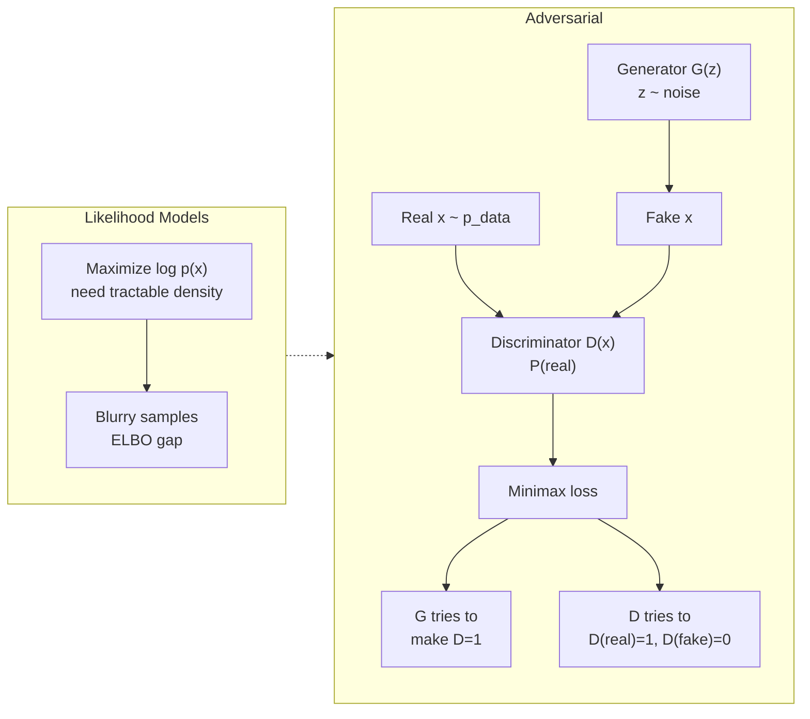
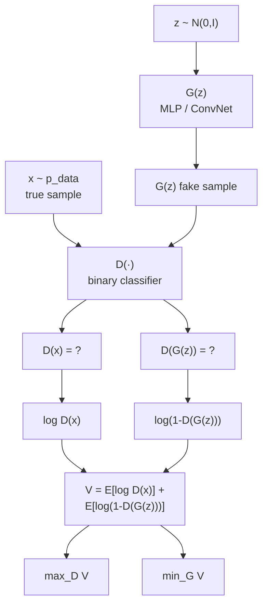
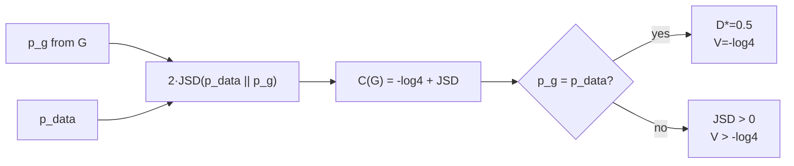
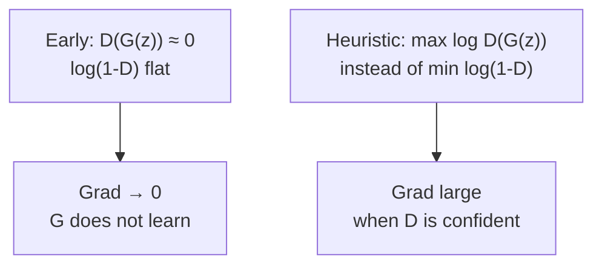
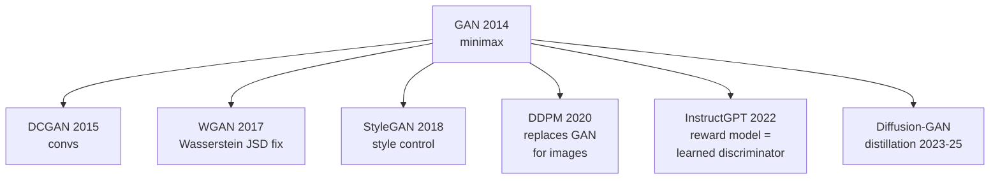

## Notes

> **Thesis:** A generative model can be learned by pitting two networks against each other: a generator that tries to fool a discriminator, and a discriminator that tries to tell real data from generated data. Training is a minimax game whose optimum recovers the data distribution without explicit likelihood.

Paper: Goodfellow et al., NIPS 2014 (arXiv:1406.2661). 8 authors from Montreal. Proposes the framework that spawned the GAN family and influenced later generative models even after diffusion replaced GANs for many tasks.

### 1. Why adversarial?

Before GANs, generative models were either:

* **Likelihood-based** (VAEs, autoregressive models) requiring tractable densities and often producing blurry samples.
* **MCMC-based** (RBMs, DBNs) requiring Markov chains and approximate inference.

Question: can we learn a generator without ever writing down `p(x)` explicitly, just by learning to fool a learned critic?

### 2. The minimax game

Noise `z ~ p_z` (e.g., Gaussian), generator `G(z; θ_g)` maps to data space, discriminator `D(x; θ_d)` outputs probability `x` is real.

$$ \min_G \max_D V(D,G) = \mathbb{E}_{x \sim p_{data}}[\log D(x)] + \mathbb{E}_{z \sim p_z}[\log(1 - D(G(z)))] $$

* D wants `D(x)→1` on real, `D(G(z))→0` on fake → maximize V.
* G wants `D(G(z))→1` → minimize V.

Training alternates: `k` steps of D (paper uses `k=1`), then one step of G, both via SGD.

### 3. Optimal discriminator and global optimum

For fixed G, let `p_g` be distribution of `G(z)`. Optimal D is:

$$ D_G^*(x) = \frac{p_{data}(x)}{p_{data}(x) + p_g(x)} $$

Plugging into V yields `C(G) = max_D V = -log 4 + 2·JSD(p_data || p_g)` where JSD is Jensen-Shannon divergence. So `C(G)` is minimized when `p_g = p_data`, giving `C* = -log 4` and `D* = 1/2` everywhere (discriminator is maximally confused).

This is the theoretical guarantee: with enough capacity and training, the game converges to the true data distribution and the generator is perfect. In practice optimization is non-convex and guarantees do not transfer directly.

### 4. Practical training issues

Early in training, G is poor and D rejects fakes confidently → `log(1 - D(G(z)))` saturates (gradient near 0). Paper recommends alternative G objective:

* Original: minimize `log(1 - D(G(z)))` — saturates.
* Heuristic: maximize `log D(G(z))` — same fixed point, stronger gradient early.

Other observations:

* No Markov chains needed: gradients via backprop only.
* No inference network needed: `z` is not inferred from `x` (unlike VAE).
* Mode collapse noted implicitly: G may map many `z` to one `x` that fools D. Not solved here, but becomes the central GAN research thread.

### 5. Experiments

* Fully connected nets on MNIST, Toronto Face Dataset. Convolutional GANs on CIFAR-10. Parzen window log-likelihood estimates (now known to be flawed, but were standard).
* Samples: MNIST digits sharp, CIFAR samples plausible but not photorealistic by modern standards. Paper intentionally keeps generator and discriminator as plain MLPs to show framework, not architecture.

| Dataset | Generator | Discriminator | Criterion |
|---|---|---|---|
| MNIST | MLP 2× ReLU | MLP maxout | Parzen estimate 225 (vs DBN 138) |
| TFD | MLP | MLP maxout | Parzen 2057 |
| CIFAR-10 | conv + MLP | conv + MLP | Parzen - |

Visual quality on MNIST interpolation: latent walk `z_1 → z_2` produces smooth digit morphs, showing the generator learned a continuous manifold.

### 6. Why this paper matters now

* **Adversarial learning as a primitive.** Even after diffusion (DDPM 2020) overtook GANs for image generation, adversarial losses reappear in RLHF reward models (a discriminator), in GAN-based distillation of diffusion, and in recent consistency models. The minmax framing is a reusable modeling tool.
* **Contrast with VAE/DDPM.** GAN (implicit density, sharp samples, unstable training) vs VAE (explicit ELBO, blurry, stable) vs Diffusion (iterative denoising, sharp, stable but slower). Knowing all three explains the generative model design space in this vault.
* **Mode collapse → diversity research.** Later work (WGAN, StyleGAN, BigGAN) addresses stability and coverage. The tradeoff between sample quality and diversity articulated here predicts Scaling Laws' coverage concerns.

### 7. Glossary

* **Generator G:** Network mapping noise `z` to data space. Implicitly defines `p_g`.
* **Discriminator D:** Binary classifier `x → [0,1]` predicting real vs generated.
* **Minimax game:** Zero-sum objective where D maximizes and G minimizes the same `V`.
* **Jensen-Shannon Divergence (JSD):** Symmetric divergence between two distributions, bounded in [0, log 2]. `C(G) = -log4 + 2·JSD`.
* **Mode collapse:** Failure where G generates limited diversity (e.g., one digit) because that mode suffices to fool D.
* **Implicit generative model:** Defines sampling procedure `x = G(z)` without explicit density `p_g(x)`.

### 8. Common confusions

* **GAN does not maximize likelihood.** Objective is JSD, not `log p_data`. Likelihood can be low even with good samples, and Parzen estimates in the paper are now considered unreliable.
* **`D*=1/2` is the optimum, not the typical state.** In practice D and G capacities are unequal and optimization oscillates. Reaching 1/2 everywhere would mean perfect generation, which never happens.
* **Saturating vs non-saturating G loss have same fixed point but different dynamics.** Using `max log D(G(z))` is not theoretically cleaner, just practically necessary early in training.
* **GAN is not a replacement for VAE.** VAE gives inference `q(z|x)` and a density bound; GAN gives neither but often gives sharper samples. Diffusion later gets both.

---

### Summary

GANs frame generation as a game: D learns to detect fakes, G learns to produce samples D cannot detect. For fixed G, optimal D is the Bayes ratio of `p_data` to `p_g`, and the game value is `2·JSD(p_data||p_g) - log4`, minimized when `p_g = p_data` and `D=1/2`. Alternating SGD with a non-saturating G heuristic (`max log D(G(z))`) trains the pair without Markov chains or inference nets, producing sharp samples but with stability and mode-coverage challenges that define later generative research.

### Key Takeaways

* Implicit generation via adversarial pressure avoids writing `p(x)` explicitly.
* Game value reduces to JSD; global optimum is perfect distribution matching.
* Early gradient saturation requires the log-D heuristic for G.
* Samples are sharper than VAE but training is less stable; tradeoff predicts later diffusion adoption.
* Adversarial framing persists beyond images, notably in RLHF reward modeling.

Related in vault: [[Auto-Encoding Variational Bayes]], [[Denoising Diffusion Probabilistic Models]], [[Training language models to follow instructions with human feedback]], [[Attention Is All You Need]].
