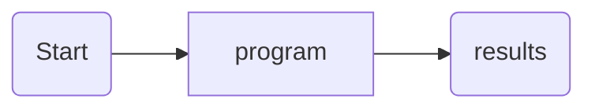
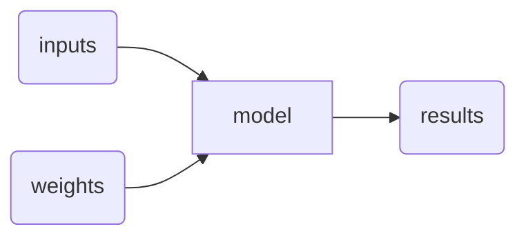
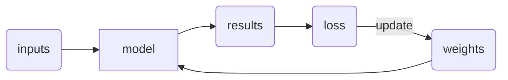
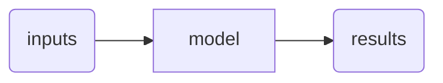

---
tags:
  - "#ML"
  - "#Code"
  - Fast-ai
Web page: https://course.fast.ai/Lessons/lesson1.html
Video: " https://www.youtube.com/watch?v=8SF_h3xF3cE"
---
```timestamp-url 
 https://www.youtube.com/watch?v=8SF_h3xF3cE
 ```

```timestamp 
 22:39
 ```
### Why is it possible to create a bird classifier on a generic laptop now vs it being impossible before?
- in 2012 the approach used at the time was to create a big team of various experts to manually create features and then feed those features into a ML model
	- this approach requires immense manpower and funding in order to create a single model
- In the present neural networks learns these features automatically.
- Deep learning is ==deep== because you can take features and combine them into more advanced features
- The learning outcome is to discover how neural networks learn these features

```timestamp 
 28:46
 ```
### ML Myths

| Myths               | Truth                                                          |
| ------------------- |-------------------------------------------------------------- |
| Advanced Math       | Highschool math is sufficient                                  |
| Lots of data        | Some record breaking results are found with < 50 items of data |
| Expensive computers | cloud providers decrease this barrier                          |
>for the majority of deep learning this is true 

```timestamp 
 43:49
 ```
### Data blocks, Dataloaders, & Learners
- datablocks represent your data
- over many projects what are all the parameters that change from project to project
	- `blocks`: Input & Output
	- `get_items`: Items
	- `splinter`: Validation set
	- `get_y`: label
	- `item_tfms`: Item transforms
- dataloaders feed batches to a NN batch by batch
- A learner links a model with the data
	- `.fine_tune`: fine tunes an existing model on your data
>fast.ai docs can be found [here](https://docs.fast.ai/)

```timestamp 
 01:11:12
 ```
### What is happening in a neural network
- Classic computer program

- Neural network

- it is a mathematical function that takes the inputs and weights multiplies them a bunch of times and returns a result
- ok but how does it learn?


- run the model and find out how bad it is (loss) then use backprop to update weights to get a better result (lower loss)
- when interpreting the result the loss and update is removed

- this looks pretty similar to a classic computer program
### Code Example
```python
from fastai.vision.all import *
path = untar_data(URLs.PETS)/'images'

def is_cat(x): return x[0].isupper()
dls = ImageDataLoaders.from_name_func(
    path, get_image_files(path), valid_pct=0.2, seed=42,
    label_func=is_cat, item_tfms=Resize(224))

learn = vision_learner(dls, resnet34, metrics=error_rate)
learn.fine_tune(1)
```
### Homework
#todo
- [x] ⏫ Read chapter 1 of the book [here](https://fastai.github.io/fastbook2e/intro.html) ✅ 2023-09-15
- [x] ⏫ play around with [[Lesson 1]] Kaggle notebooks [here](https://www.kaggle.com/code/jhoward/is-it-a-bird-creating-a-model-from-your-own-data) and [here](https://www.kaggle.com/code/jhoward/jupyter-notebook-101) ✅ 2023-09-15
	- [x] make a dog classifier instead ✅ 2023-09-15
 
