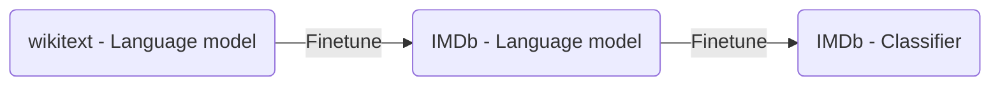

---
tags:
  - Code
  - Fast-ai
  - ML
Web page: https://course.fast.ai/Lessons/lesson4.html
Video: https://www.youtube.com/watch?v=toUgBQv1BT8
---
## Video Notes
```timestamp-url 
 https://www.youtube.com/watch?v=toUgBQv1BT8
 ```

```timestamp 
 05:18
 ```
### Finetuning models
Finetuning means taking weights of a trained neural network and use it as initialization for a new model being trained on data from the same domain (often e.g. images). It is used to: speed up the training. overcome small dataset size.

Ex.


### Tokenization and Numericalization
If a deep learning model uses matrix multiplication with numbers how can you input words into it?
This is solved by tokenization and numericalization.

**Tokenization** is the act of breaking down a sentence into discrete tokens. Sometimes a token represents an entire word and sometimes it breaks down words into parts. A tokenizer may also encode information such as the beginning / end of a word / sentence.

**Numericalization** is the act of turning the tokens created from the tokenization step and giving them a numerical value so that matrix multiplication is possible
## Textbook notes 
