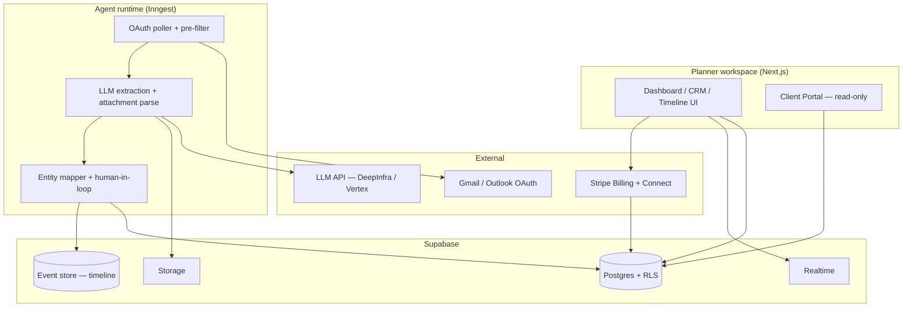
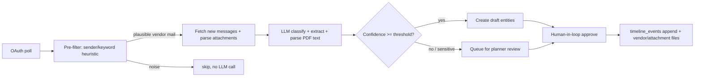

> [!summary] Design Doc Summary
> **What**: A unified SaaS operating system for event/wedding planners that replaces 5-10 fragmented tools by auto-centralizing vendor email (timelines, delivery dates, files) via an AI agent, then monetizing it through CRM, a true event-sourced timeline, portals, and payments.
>
> **Wedge**: AI email ingestion is the differentiator and day-one value; the rest is the monetization surface.
>
> **Stack**: Supabase (Postgres + Auth + RLS + Realtime) + Next.js + TypeScript; Stripe (Billing for planner subs + Connect for payouts); Inngest for jobs; DeepSeek-V4-Flash-0731 / DeepInfra primary, Gemini / Vertex fallback for extraction.
>
> **MVP slice** (milestone-sequenced, no fixed dates): Foundation → Event Store (true event-sourcing, SEQUENCE + schema versioning) → CRM (Stripe Signature e-sign) → AI Ingest (OAuth read-only, human-in-loop) → Timeline UI → Client Portal (read-only, split pay token) → Payments Connect.
>
> **Key calls**: timeline writes are DB-enforced (direct DML revoked); emails never retained unless opted in; Google restricted-scope verification is a launch-blocker for server-side OAuth (client-side-only avoids the audit but kills the background agent).
---

# 1. Purpose & scope

Build a single operating system for event/wedding planners that replaces 5-10 fragmented tools. The differentiated wedge is **automated vendor centralization from email**, not another CRM with a timeline bolted on. Scheduling, payments, and portals make the ingested data actionable and billable.

In scope for this doc: architecture, data model, event-sourcing engine, AI ingestion pipeline, the four MVP modules, API contract summary, and the phased plan through v2.0.

Out of scope for MVP (explicitly deferred): Vendor Portal (write), Change-Order Engine, P&L dashboard, day-of mobile app, WebRTC push-to-talk, timeline auto-generation, venue constraint DB, template marketplace, referral automation. Sequenced in [[Design Doc#9. Phased implementation plan|§9]].

---

# 2. Product thesis

An event manager integrated with AI agents that taps into email and centralizes timelines, delivery dates, and files in one place.

**Strategic tension (named explicitly):** the highest-risk assumption — that LLM extraction on *real, messy* vendor email produces something a planner finds valuable — is the core thesis. v1.0 buried it under the Foundation, Event Store, and CRM milestones before AI Ingest even began. [[Design Doc#9. Phased implementation plan|§9]] introduces a **Phase 0 validation spike** that tests the thesis on real planners with a throwaway CRUD prototype, *before* committing to the heavier infrastructure. Phase 0 is a de-risking step, not a scope cut: the chosen architecture (true ES + OAuth) still ships in the MVP. If Phase 0 fails, the whole plan is re-examined rather than built on a false premise.

---

# 3. Architecture

## 3.1 Stack

| Layer                 | Choice                                                                   | Why                                                                                                                          |
| --------------------- | ------------------------------------------------------------------------ | ---------------------------------------------------------------------------------------------------------------------------- |
| Database + Auth + RLS | Supabase Postgres                                                        | Planner-level isolation is the #1 requirement; RLS delivers it near-free                                                     |
| Real-time             | Supabase Realtime                                                        | Vendor/assistant check-ins, presence, portal updates later                                                                   |
| File storage          | Supabase Storage                                                         | Vendor docs, contracts, attachments from email                                                                               |
| App framework         | Next.js (App Router) + TypeScript                                        | One language, AI coding-agent fluent, SSR for portals                                                                        |
| Payments              | Stripe Billing (planner subscription) + Stripe Connect (client payouts)  | Subscription = primary revenue; Connect = secondary rake                                                                     |
| E-sign                | Stripe integration with DocuSign eSignature or Zoho Sign                 | Real, enforceable contract signatures in MVP                                                                                 |
| LLM                   | DeepSeek-V4-Flash-0731 / DeepInfra (primary), Gemini / Vertex (fallback) | DeepSeek-V4-Flash-0731 is incredibly cheap on DeepInfra. $0.8/1M input tokens, $0.18/1M output tokens, $0.016/1M cached read |
| Background jobs       | **Inngest** (native retries + DLQ)                                       | OAuth polling, LLM extraction, Stripe webhooks all need retry/DLQ                                                            |
| Email OAuth           | Google Gmail API + Microsoft Graph (read-only scopes)                    | Inbox scanning per planner                                                                                                   |
| Hosting               | Vercel (Next) + Supabase cloud                                           | Standard, low-ops                                                                                                            |

## 3.2 System diagram



## 3.3 Multi-tenancy & auth

- Every table carries `planner_id` (tenant root). RLS: a row is visible only if `planner_id = auth.uid()` (or the planner is an invited team member in phase 2).
- Supabase Auth handles planner signup/session. OAuth connections stored as encrypted tokens in `provider_connections` scoped to `planner_id`.
- Clients and vendors are **not** auth users in MVP. They access portals via signed, short-lived magic links. To contain risk (see [[Design Doc#6.6 Portal auth split|§6.6]]), the **view link and the pay action use different tokens**: viewing is low-stakes; paying requires a separately minted, single-use, short-TTL pay token (or re-auth via emailed one-time link) so a forwarded timeline link cannot be used to pay.

## 3.4 Real-time

Supabase Realtime for client portal live timeline updates and, later, vendor check-ins/chat. The event store writes broadcast a change event the UI subscribes to. **Known scaling caveat ([[Design Doc#10. Critical-path risks & de-scope fallback|§10]]):** Realtime-under-RLS at high connection counts has historically had rough edges; validate before assuming it holds past beta.

## 3.5 Background job runtime

Inngest runs, with native retries and a visible DLQ:

1. Per-planner OAuth poll (every 10-15 min, rate-limited).
2. LLM extraction job (pre-filter → attachment parse → extraction call → mapping).
3. Stripe webhook handlers (idempotent; Inngest retries on transient failure).
4. Subscription lifecycle jobs (renewal, dunning, cancellation).

Jobs are idempotent on `(planner_id, message_id)`, so re-polling never double-ingests. The DLQ is monitored (alert on growth), not silent.

---

# 4. Data model

Postgres via Supabase. All tables: `id uuid pk`, `planner_id uuid`, `created_at`, `updated_at`. RLS on `planner_id`. Below are MVP tables; phase-2 tables noted as `// later`.

## 4.1 Core tables

```
planners
  id, email, name,
  stripe_customer_id text,            -- Stripe Billing customer
  stripe_subscription_id text,        -- primary revenue line (added v1.1)
  stripe_account_id text,             -- Stripe Connect account (added v1.1)
  subscription_tier, subscription_status [active|past_due|canceled|paused],
  email_retention_opt_in boolean default false,  -- OQ#3: default off
  created_at

clients
  id, planner_id, name, email, phone, address, notes

events
  id, planner_id, client_id, name, type [wedding|corporate|gala|conference],
  ceremony_start, venue_id (nullable), status [lead|booked|active|complete],
  budget_total, package_tier

vendors
  id, planner_id, name, category, email, phone, notes

provider_connections
  id, planner_id, provider [gmail|outlook], encrypted_refresh_token,
  encrypted_access_token, scope, last_polled_at, status,
  verification_state [unverified|verifying|verified]  -- Google restricted-scope gate

emails
  id, planner_id, provider_conn_id, external_message_id, from_address,
  subject, received_at, thread_id,
  body_retained boolean default false,   -- OQ#3: false unless opted in
  processed_state [pending|extracted|mapped|review|archived]

attachments
  id, planner_id, email_id, storage_path, filename, mime, size,
  parsed_text_path text nullable   -- extracted text from PDFs for LLM context

timeline_events            -- THE EVENT STORE — see footnote 1
  id uuid pk
  planner_id uuid
  event_id uuid
  seq int                  -- assigned by a REAL Postgres SEQUENCE per aggregate
  version_id uuid
  schema_version int default 1   -- event-schema versioning (added v1.1)
  event_type text
  payload jsonb
  actor_id text            -- 'planner:<uuid>' | 'client:<uuid>' | 'agent:<run_id>'
  created_at timestamptz
  unique (planner_id, event_id, seq)

timeline_snapshots
  event_id, version_id, up_to_seq, state_json, created_at

agent_runs
  id, planner_id, email_id, model, provider, prompt_version,
  raw_output_json, status, created_at

contracts
  id, planner_id, client_id, event_id, template_id, status [draft|sent|signed],
  stripe_signature_id text, signed_pdf_path, created_at   -- Stripe Signature

payments
  id, planner_id, client_id, event_id, stripe_payment_intent_id,
  amount_cents, currency, status [pending|paid|refunded], type [deposit|balance|addon]

// later (phase 2+)
vendor_portal_access, change_orders, change_order_events, pnl_snapshots,
venue_constraints, team_members, rbac_roles
```

footnote 1: [[Design Doc#5. Event-sourced timeline engine|§5]]

## 4.2 Notes

- `planners.stripe_subscription_id` + `subscription_status` are the **primary revenue line** (see [[Design Doc#7.5 Payments — Stripe Billing (planner subscription = PRIMARY revenue)|§7.5]]). Previously missing; now first-class.
- `planners.stripe_account_id` is required to create a Payment Intent on a planner's behalf.
- `emails.body_retained` defaults false; bodies are purged unless the planner opts in (`email_retention_opt_in`). Extraction text from attachments is stored separately only if needed for the review queue and is also subject to purge.
- `timeline_events.actor_id` is `text` (v1.0's `uuid` type would reject `'agent:<run_id>'`).

---

# 5. Event-sourced timeline engine

This is the core asset and the reason for choosing true event-sourcing.

## 5.1 Event store

`timeline_events` schema in [[Design Doc#4.1 Core tables|§4.1]].

1. **`seq` is not "SELECT max+1".** It is assigned by a **Postgres SEQUENCE** scoped per `(planner_id, event_id)` aggregate (e.g. one sequence per event, or a single global sequence with the unique constraint on `(planner_id, event_id, seq)`). A sequence eliminates the race between a concurrent agent commit and a manual edit that `max+1` would expose. (A `SELECT ... FOR UPDATE` counter row is the alternative; a sequence is simpler and lock-free.)
2. **`schema_version` + `actor_id text`** added. Schema versioning is mandatory: when `ITEM_ADDED`'s payload shape changes (it will), old events must still replay. Each applier is keyed by `schema_version`; an upcast function migrates older shapes to the current one at replay time. Never mutate old payloads in place.

## 5.2 Replay & snapshots

- **Current state** = replay all `timeline_events` for `(planner_id, event_id, version_id)` ordered by `seq`, folding each `payload` (via its `schema_version` applier) into a working state object.
- **Snapshots** reduce replay cost: `timeline_snapshots(event_id, version_id, up_to_seq, state_json)`. On read, load the latest snapshot with `up_to_seq <= requested` and replay only events after it. Snapshot cadence: every 25 events or on version close (Open Question resolution).
- **Rollback** = reconstruct state from snapshot + events up to a target `seq`; no row deletions, fully auditable.

## 5.3 Versioning & diff

- A `version_id` marks a named timeline lineage. The Change-Order Engine (phase 2) mints a new `version_id` per accepted change order, copying prior events and appending the delta.
- **Diff view** = replay version A and version B to end, structural-diff the two state objects.

## 5.4 Engine API (Supabase RPCs — the ONLY write path)

- `timeline_apply(planner_id, event_id, event_type, payload, actor_id)` — pulls next `seq` from the aggregate sequence, writes the event with current `schema_version`, periodically snapshots.
- `timeline_state(planner_id, event_id, version_id, at_seq?)` — reconstructed state.
- `timeline_rollback(planner_id, event_id, to_seq)` — reconstructed prior state (UI confirms before a new corrective event is appended).
- `timeline_diff(planner_id, event_id, version_a, version_b)` — diff.

All four enforce RLS and are the only write path to timeline state.

## 5.5 Database-enforced write restriction (v1.1)

v1.0 relied on a *convention* ("RLS is the only write path"). Conventions are not guarantees — a future contributor or an AI coding agent that doesn't know the convention could `INSERT` directly. **Fix:** `REVOKE INSERT, UPDATE, DELETE` on `timeline_events` (and related timeline tables) from the `authenticated` client role. Grant `EXECUTE` on the four RPCs to `authenticated`. Direct state mutation becomes a database error, not a doc footnote. The agent path uses the `service_role` (bypasses RLS) but still calls the RPCs, so the sequence/snapshot logic is never bypassed.

---

# 6. AI email ingestion pipeline

## 6.1 OAuth & verification

### Model A — Server-side (default, enables the autonomous agent)

- Backend stores an encrypted refresh token (`provider_connections`) and polls Gmail every 10-15 min via Inngest. This is what makes the "agent auto-centralizes vendor mail for you" thesis work: proactive, background, cross-device.
- **Trigger:** restricted-scope verification **including the security assessment** (multi-week, four-figure cost, annual reassessment). Because email is processed on our servers, the assessment is the full tier.
- **Mitigation:** begin verification at project start, run Microsoft Graph (`Mail.Read`) in parallel (lighter for work/school tenants), and investigate whether a narrower scope could reduce the tier (full body extraction likely still needs `readonly`). Until verified, cap real connected inboxes to Google's test allowance. The beta-planner gate depends on clearing this.

### Model B — Client-side only (audit-avoidance fallback)

- Gmail is read in the planner's browser via the Google Identity Services JS library. The access token never leaves the browser; no refresh token is stored server-side; no background poller.
- **Advantage:** avoids the Google security assessment entirely (client-side-only exception).
- **Disadvantages (why this is a fallback, not the plan):**
  1. **No background ingestion.** Access tokens expire in ~1 hour with no silent refresh, so the agent can only run while the planner has the app open. This downgrades the autonomous agent to "open the tab and click sync" — directly contradicting the MVP thesis and `IDEA.md`.
  2. **Storage gray area.** The extracted vendors/timeline items are only useful if persisted to Supabase for the portal/timeline. The moment that derived data is POSTed to our server, we are transmitting restricted-derived data to our backend, which can pull the whole flow back into Google's scope assessment. A truly clean Model B would require storing extracted data only in the browser (e.g. IndexedDB), which prevents cross-device use and breaks the client portal.
- **When to use Model B:** only if Google's verification proves insurmountable (rejection, indefinite delay) AND we are willing to accept a manual, in-browser, single-device sync experience. Otherwise prefer Model A or the dedicated-inbox fallback (Risk 2).

**Decision:** Build Model A as primary. Keep Model B as a documented audit-avoidance fallback and the dedicated per-planner inbox (`planner@yourapp.com`) as the operational fallback (Risk 2). Revisit if Google's verification timeline threatens the launch gate.

## 6.2 Processing



**Cost control:** the pre-filter is a cheap heuristic (no LLM) so only plausible vendor mail reaches the model. A per-event token budget is tracked; if a planner's extraction cost approaches their subscription margin, alert. This prevents the variable-AI-cost trap where a chatty planner's tokens exceed their flat fee.

## 6.3 LLM extraction contract

For each message, the agent returns structured JSON:

```json
{
  "classification": "quote | invoice | contract | change_request | schedule | other",
  "confidence": 0.0-1.0,
  "vendor": { "name": "", "email": "", "category": "", "phone": "" },
  "items": [
    { "description": "", "amount_cents": 0, "delivery_date": "ISO8601|null",
      "timeline_label": "" }
  ],
  "delivery_dates": [ "ISO8601" ],
  "amount_total_cents": 0,
  "attachments_relevant": [ "filename" ],
  "comment": "free-text reconciliation notes for the planner"
}
```

The prompt is versioned; every run records `prompt_version` + `provider` in `agent_runs` so behavior is reproducible and swappable.

**Attachment content is parsed (v1.1).** For wedding vendors, pricing and delivery dates very often live inside an attached PDF quote, not the email body. The pipeline extracts text from relevant attachments (`pdf-parse` or LLM-based OCR), stores it in `attachments.parsed_text_path`, and feeds it into the extraction context. `attachments_relevant` filenames alone are no longer the only signal.

## 6.4 Human-in-the-loop

Extracted entities are **not** auto-committed. They land in a review queue ("3 suggestions from vendor emails"). The planner approves, edits, or discards. On approve, the system appends the corresponding `timeline_events` (actor = `agent:<run_id>`) and creates/updates vendor + attachment rows. This protects against LLM error and against platform liability for timeline mistakes.

## 6.5 Privacy & compliance

- Read-only scope; we cannot send mail. Stated plainly in consent.
- **Email bodies are NOT retained by default.** Per `emails.body_retained = false` and `planners.email_retention_opt_in = false`, bodies (and attachment source files beyond parsed text needed for review) are **purged immediately after extraction**. Only metadata + extracted structured entities persist. Retention only occurs if the planner explicitly opts in (and even then, document the retention window).
- DeepInfra (primary LLM) holds data in memory only during inference and does not store on disk — consistent with this policy at the processor level. Gemini/Vertex fallback also offers ZDR.
- Data Processing Agreement language in ToS. Right-to-delete wired to `planner_id` cascade.
- SOC 2 is a phase-3 goal, not MVP; note it as an Enterprise sales blocker.

## 6.6 Portal auth split

The Client Portal magic link grants **view-only** access (timeline, docs, messages). The **pay action** is gated behind a separate, single-use, short-TTL pay token (or re-auth via emailed one-time link). A forwarded "here's our timeline!" link therefore cannot be used to view payment status or pay — closing the forwarding risk the review identified.

---

# 7. Module specs (MVP)

## 7.1 CRM

- Client create/edit, list, linked to `events`.
- Contract generation: pick a template (start with 2-3: full-service, day-of, corporate), fill fields, render PDF to Storage, send for signature via **Stripe Signature**. On signed webhook, store `stripe_signature_id` + signed PDF. This is real e-sign (OQ#2) — relevant because weddings are a dispute-prone category where click-acknowledge enforceability is weak.
- Questionnaire: flexible JSON-form attached to client (phase 1 basic; rich templates phase 2).

## 7.2 Timeline builder

- UI reads `timeline_state(...)` and renders items on a date/time axis.
- Manual edits call `timeline_apply(ITEM_ADDED/MOVED/...)`.
- Vendor assignment dropdown links a `timeline_item` to a `vendor`.
- Auto call-time calc: helper that, given ceremony start and item offsets, suggests vendor call times (light version of phase-3 auto-gen; configurable buffers table).

## 7.3 Client Portal (read-only)

- Magic-link auth (signed JWT, short TTL, scoped to one `event_id`) for **viewing** only.
- Shows: read-only timeline, document links (Storage), payment status, simple message thread to planner.
- Live updates via Realtime on timeline changes.
- **Pay action** uses the separate pay token ([[Design Doc#6.6 Portal auth split|§6.6]]).

## 7.4 Payments — Connect (client payouts)

- Planner is onboarded via the current **Stripe Connect** flow (legacy Express/Standard naming deprecated; do not use it). Their `stripe_account_id` is stored on `planners`.
- Client pays planner through a Payment Intent created by our app against the planner's Connect account; funds go to planner, platform takes subscription separately ([[Design Doc#7.5 Payments — Stripe Billing (planner subscription = PRIMARY revenue)|§7.5]]) and can take a change-order rake later (phase 2).
- `payments` records intent id, amount, status. Webhook handler is idempotent on `stripe_payment_intent_id`.
- Portal shows balance due (via the pay token gated action).

## 7.5 Payments — Stripe Billing (planner subscription = PRIMARY revenue)

- `planners.stripe_customer_id` + `stripe_subscription_id` + `subscription_status` drive the **primary revenue line** (subscription tiers from the research doc: Solo Starter $49/mo, Solo Pro $99/mo, Firm $199/mo + seats).
- Stripe Billing handles plan creation, proration, and invoicing.
- **Lifecycle handling (explicit, was missing):** failed renewal → `past_due` dunning (retry schedule + planner notification); sustained failure → `canceled` (data retained, plan features locked). Seasonal planner pause → `paused` (data retained, no charge) per the research doc's risk mitigation. All transitions driven by Stripe webhooks through Inngest (idempotent).
- Build milestone: subscription is stood up in **M1/M3** (not deferred to M7).

---

# 8. API contract summary

Primary data access is the Supabase client (auth + RLS enforced server-side). Custom logic:

- **Supabase RPCs** (Postgres functions): the four timeline engine functions ([[Design Doc#5.4 Engine API (Supabase RPCs — the ONLY write path)|§5.4]]), `timeline_call_times(...)`, `agent_review_queue(planner_id)`.
- **Next.js route handlers** (server-side, `service_role` only where RLS must be deliberately bypassed, e.g. agent writes which call the RPCs as the planner):
  - `POST /api/connect/[gmail|outlook]` — OAuth start
  - `POST /api/webhooks/stripe` — Billing + Connect (idempotent)
  - `POST /api/portal/access` — mint client **view** magic link
  - `POST /api/portal/pay-token` — single-use pay token
  - `POST /api/agent/rereview/:runId/approve` — commit extracted entities
  - `POST /api/contracts/:id/sign` — Stripe Signature initiation

No client-side code writes tenant data without RLS; the agent path impersonates the planner via `planner_id` config so RLS still gates it, and direct timeline DML is revoked ([[Design Doc#5.5 Database-enforced write restriction (v1.1)|§5.5]]).

---

# 9. Phased implementation plan

## 9.0 Phase 0 — Validation spike (pre-MVP, throwaway)

- **Purpose:** test the core thesis (LLM extraction on real vendor email is valuable) before committing to the heavier infrastructure (event-sourcing, portal, Connect).
- Throwaway Next + plain Postgres CRUD (no event store, no portal, no Connect).
- Wire OAuth + LLM extraction (DeepSeek/DeepInfra) + review queue against **5 real planners' inboxes**.
- **Exit gate:** >= 60% of extracted items approved by planners as useful; qualitatively, planners say it saves real time.
- **Decision:** pass → proceed to M1 with the chosen architecture. Fail → re-examine the thesis (different extraction approach, or pivot the wedge) before building infrastructure. Phase 0 code is discarded; only learnings carry forward.

## 9.1 MVP — build sequence

| Milestone             | Focus                                                                                                       | Exit gate                                                                  |
| --------------------- | ----------------------------------------------------------------------------------------------------------- | -------------------------------------------------------------------------- |
| **M1 Foundation**     | Supabase project, RLS schema, Auth, Next scaffold, CI; **begin Google restricted-scope verification early** | Planner signup isolated; verification submitted to Google                  |
| **M1.5 Subscription** | Stripe Billing: plans, checkout, webhook lifecycle (renew/dunning/cancel/pause)                             | A planner can subscribe and is billed; failed-renewal path tested          |
| M2 Event Store        | `timeline_events` + SEQUENCE + schema_version + snapshots + replay + 4 RPCs + DML revoke                    | Replay reconstructs state; rollback works in tests; direct INSERT rejected |
| M3 CRM                | Clients, events, contract PDF + **Stripe Signature** e-sign                                                 | Create client, generate + signed contract                                  |
| M4 AI Ingest          | OAuth (prod path), poller, pre-filter, attachment parse, LLM extraction, review queue, commit               | Connect Gmail, 3 vendor emails become timeline items via review            |
| M5 Timeline UI        | Builder UI, vendor assignment, call-time calc                                                               | Manual + agent edits both flow through event store                         |
| M6 Client Portal      | Magic-link view portal, read-only timeline, docs, messages, **separate pay token**                          | Client views live timeline without login; pay gated                        |
| M7 Payments Connect   | Stripe Connect onboarding, Payment Intent, webhook                                                          | Client pays deposit; recorded idempotently                                 |
| **MVP Launch**        | Beta with 10 planners (subject to Google verification clearing)                                             | 10 planners ingesting real email + collecting payment                      |

M4/M5 overlap deliberately: the timeline engine (M2) must exist before ingestion can commit, so ingestion starts once M2 lands, not after M3.

## 9.2 Phase 2 — monetization depth

- Vendor Portal (role-based, write tasks/call times/check-ins).
- Change-Order Engine on top of `version_id` (capture, impact, pricing templates, e-sign, auto-charge, budget guardrails).
- Financial P&L dashboard (per-event revenue/costs/margin, cash-flow timeline) reading from `payments` + `events.budget_total`.

## 9.3 Phase 3 — differentiation + ecosystem

- Day-of mobile PWA (offline-first, IndexedDB + background sync).
- Timeline auto-generation from ceremony time + venue constraint DB.
- Vendor marketplace
- Template marketplace + migration service (switching-cost removal).
- Team/RBAC, referral automation, integrations (QuickBooks/Xero), analytics.

---

# 10. Critical-path risks & de-scope fallback

The two heaviest MVP commitments are true event-sourcing and OAuth inbox access. If either slips, the MVP build is at risk.

**Risk 1 — Event store replay correctness.** Event-sourcing bugs are subtle (seq races, snapshot drift). Mitigation: SEQUENCE for `seq` ([[Design Doc#5.1 Event store|§5.1]]), exhaustive replay/rollback tests from M2, snapshot verification in CI. Fallback if replay correctness is not solid before the MVP launch gate: keep the append-only `timeline_events` as an audit log but serve current state from a materialized `timeline_current` table maintained by the apply RPC. You keep auditability and rollback-via-rebuild-later without blocking the UI on replay correctness. (This fallback is itself a sane MVP design; named here as a safety net, not the target.)

**Risk 2 — Google restricted-scope verification.**
`gmail.readonly` requires formal verification + security assessment (multi-week, four-figure, annual reassessment). Mitigation: begin verification at project start, run Microsoft Graph concurrently, investigate scope minimization. Fallback if not cleared before the MVP launch: cap connected inboxes to Google's test allowance and ship the dedicated per-planner inbox (`planner@yourapp.com`, planner forwards/CCs vendor mail) as the ingestion path — the agent pipeline (pre-filter, parse, extract, review) is identical; only transport changes. OAuth becomes a post-verification upgrade.

**Risk 3 — LLM extraction quality & cost.** Wrong vendors/dates erode trust; variable cost can exceed subscription margin. Mitigation: mandatory human-in-the-loop (never auto-commit); confidence threshold routes low-confidence to review; cheap pre-filter before any LLM call; per-event token budget with alerting. Provider-agnostic layer lets us swap DeepSeek↔Gemini if quality or sovereignty issues arise.

**Risk 4 — Stripe Connect onboarding drop-off.** Mitigation: defer Connect to the final MVP milestone (M7); subscription (Billing) is the MVP revenue line and lands earlier. If Connect onboarding is too heavy for beta, accept manual "mark paid" in MVP and wire Connect at phase-2 start.

**Risk 5 — Supabase RLS/Realtime at scale (added v1.1).** Phase-2 team-member access needs a subquery against team membership in every RLS policy (common slow/subtly-wrong spot). Realtime-under-RLS at high connection counts has had rough edges. Mitigation: load-test RLS policies and Realtime at beta scale before relying on them past MVP; design team RLS with indexed membership lookups.

**Risk 6 — Vendor bill sprawl (added v1.1).** Vercel, Supabase, Inngest, LLM provider(s), and Stripe are five separately-billed, usage-scaling vendors. Mitigation: a cheap weekly cost-check across all five before beta scales, so a usage spike (chatty planner blowing tokens) is caught on the invoice, not after.

**Risk 7 — Stale client data (added v1.1).** A cached "balance due" right after a real payment destroys client trust. Mitigation: nothing on the portal's balance-due/pay path opts into a cached fetch (current Next.js does not cache `fetch()` by default, but be deliberate and add `cache: 'no-store'` on these routes).

---

# 11. Success metrics & verification gates

MVP is done only when these are empirically true, not demoed:

- **Phase 0 gate:** >= 60% of extracted items approved useful by 5 real planners.
- 10 beta planners connected a real inbox and ingested >= 20 vendor emails collectively through the review queue.
- Timeline state reconstructs bit-identically from event store in automated replay tests (CI green); direct timeline DML is rejected by the DB.
- >= 1 real client payment collected via Stripe Connect per beta planner who reached booking.
- Client portal loads for a magic-link client with zero auth friction (100% of test clients reach timeline view); pay action requires its own token.
- Planner subscription (Stripe Billing) is the active revenue line from M1.5, with dunning/cancel tested.

North-star metrics (from research): 200 / 1,000 active planners; 2,000 / 15,000 events; NPS 50 / 65. Phase-3 targets; MVP success is the gates above.

---

# Appendix: source docs

- `Event Manager SaaS.md` — market analysis, opportunity matrix, pricing, roadmap (business justification).
- `tech-intervention-opportunities.md` — same content, opportunity-focused view.
- `IDEA.md` — one-line product thesis (AI vendor manager from email).
- `Solo wedding planners pain points.md` — user pain inventory.

This doc supersedes the research docs wherever they conflict on engineering scope, MVP window, or module cut line.
