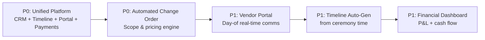

# Highest-Leverage Technology Intervention Opportunities
## Event & Wedding Planner Market Analysis

*Compiled from Reddit/forum research, industry surveys, and practitioner interviews (2024-2026)*

---

## Executive Summary

The event/wedding planning industry suffers from **severe tool fragmentation** (5-10 tools per planner), **revenue leakage from scope creep** (15-20+ unpaid hours/event), and **operational fragility** (single point of failure on event days). The highest-leverage interventions address these three vectors simultaneously through **unified platforms** rather than point solutions.

**Total Addressable Market (US)**: ~50,000 active wedding/event planners (solo + small firms)
**Willingness to Pay**: $50-150/mo for solo; $200-500/mo for multi-planner firms
**Switching Cost Barrier**: High — planners migrate only during off-season (Jan-Mar)

> [!abstract] TL;DR
> Three things bleed planners: **fragmented tools**, **scope creep** (15-20+ unpaid hours/event), and **day-of fragility**. The wins stack when you ship one unified platform instead of point tools, and the two P0 features that move the needle most are the all-in-one platform and automated change-order management.

---

## Opportunity Matrix: Impact vs. Feasibility

| Opportunity                                               | Revenue Impact | Operational Impact | Technical Complexity | Time to MVP | Priority |
| --------------------------------------------------------- | -------------- | ------------------ | -------------------- | ----------- | -------- |
| **Unified Platform (CRM + Timeline + Portal + Payments)** | ★★★★★          | ★★★★★              | High                 | 12-18 mo    | **P0**   |
| **Automated Change Order / Scope Management**             | ★★★★★          | ★★★★☆              | Medium               | 4-6 mo      | **P0**   |
| **Vendor Portal with Real-Time Day-of Comms**             | ★★★★☆          | ★★★★★              | Medium               | 6-9 mo      | **P1**   |
| **Timeline Auto-Generation from Ceremony Time**           | ★★★★☆          | ★★★★☆              | Low-Med              | 3-4 mo      | **P1**   |
| **Financial Dashboard (P&L per Event + Cash Flow)**       | ★★★★☆          | ★★★☆☆              | Medium               | 4-6 mo      | **P1**   |
| **Template Marketplace + Migration Service**              | ★★★☆☆          | ★★★★☆              | Low                  | 2-3 mo      | **P2**   |
| **Assistant/Team Coordination Mobile App**                | ★★★☆☆          | ★★★★★              | Medium               | 4-6 mo      | **P2**   |
| **Referral/Review Automation Engine**                     | ★★★☆☆          | ★★★☆☆              | Low                  | 2-3 mo      | **P3**   |

---

## P0 Opportunities (Build First)



### 1. Unified All-in-One Platform
**The "Operating System" for Event Planners**

#### Core Modules (Single Database, Shared State)
```
┌─────────────────────────────────────────────────────────────────┐
│                    UNIFIED PLATFORM                             │
├───────────────┬──────────────┬──────────────┬───────────────────┤
│   CLIENT      │   PROJECT    │   VENDOR     │   FINANCIAL       │
│   PORTAL      │   WORKSPACE  │   PORTAL     │   DASHBOARD       │
├───────────────┼──────────────┼──────────────┼───────────────────┤
│ Contracts     │ Timeline     │ Call Times   │ Event P&L         │
│ Payments      │ Tasks        │ Load-in Info │ Vendor Payables   │
│ Questionnaires│ Design       │ Contact Info │ Client Balance    │
│ Communication │ Run-of-Show  │ Documents    │ Cash Flow Forecast│
│ Approvals     │ Checklists   │ Check-ins    │ Tax Reports       │
└───────────────┴──────────────┴──────────────┴───────────────────┘
```

#### Critical Differentiators vs. HoneyBook/Aisle Planner
| Feature                     | HoneyBook | Aisle Planner | **This Platform**                        |
| --------------------------- | --------- | ------------- | ---------------------------------------- |
| Native Timeline/Run-of-Show | ❌ Weak    | ✅ Good        | ✅ **Auto-generated + vendor-synced**     |
| Vendor Portal               | ❌ None    | ❌ None        | ✅ **Dedicated, role-based**              |
| Day-of Mobile Mode          | ❌ Basic   | ❌ None        | ✅ **Offline-first, walkie-talkie comms** |
| Change Order Engine         | ⚠️ Manual | ❌ None        | ✅ **Automated with pricing**             |
| Financial Dashboard         | ✅ Basic   | ❌ None        | ✅ **Per-event P&L + forecasting**        |
| Multi-event View            | ✅ Yes     | ⚠️ Limited    | ✅ **Cross-event resource view**          |

#### Technical Architecture Requirements
- **Multi-tenant SaaS** with planner-level data isolation
- **Event-sourced timeline** — every change auditable, rollback-able
- **Offline-first mobile** (IndexedDB + background sync) for day-of
- **Real-time presence** (WebRTC/WebSocket) for vendor/assistant check-ins
- **Document generation** (PDF contracts, timelines, invoices) via template engine
- **Integration layer**: Google Calendar, Outlook, QuickBooks, Xero, Stripe, Square, DocuSign, venue APIs

#### MVP Scope (6 Months)
1. Client intake → contract → questionnaire → payment (core CRM)
2. Timeline builder with vendor assignment + auto-call-time calc
3. Client portal (view-only timeline, payments, docs, messages)
4. Vendor portal (assigned tasks, call times, contact sheet)
5. Basic financial dashboard (revenue, costs, balance per event)

---

### 2. Automated Change Order / Scope Management Engine
**Stops the #1 revenue leak: 15-20+ unpaid hours per event**

#### The Problem Flow (Current)
```
Client: "Can we add 3 more centerpieces?"
    ↓
Planner: "Sure!" (mental note, no documentation)
    ↓
[3 weeks later] Planner spends 4 hrs sourcing, 2 hrs coordinating
    ↓
Event day: Client assumes included. Planner eats $600-1,200 labor.
```

#### The Automated Flow (Target)
```
Client requests change via portal (or planner logs from email/text)
    ↓
System: Shows impacted items, labor estimate, cost delta
    ↓
Planner: Sets price, clicks "Send Change Order"
    ↓
Client: Reviews → e-signs → auto-charged (stored payment method)
    ↓
System: Updates timeline, budget, vendor tasks, financial forecast
    ↓
Planner: Gets paid. Zero admin. Full audit trail.
```

#### Core Features
| Feature | Specification |
|---------|---------------|
| **Change Capture** | Email forwarding (change@planner.app), portal form, mobile quick-add, Slack/Teams bot |
| **Impact Analysis** | Auto-calculates: additional vendor costs, planner hours (configurable rate), timeline shifts, budget % change |
| **Pricing Templates** | Per-service add-on library (e.g., "Additional Centerpiece: $85 + 0.5hr labor") |
| **Approval Workflow** | Client e-sign → auto-invoice → payment → status update |
| **Audit Trail** | Immutable log: who requested, when, what changed, approved by whom, paid when |
| **Budget Guardrails** | Alert when cumulative changes exceed X% of original budget |
| **Vendor Auto-Notify** | Approved changes → instant vendor portal update + email/push |

#### Technical Specs
- **Event-sourced**: Every change = new event in event store (replayable, auditable)
- **Rule engine**: Planner-configurable pricing rules (if X then Y pricing)
- **Idempotent webhooks**: For payment confirmation, vendor acknowledgment
- **Versioned timeline**: Change orders create new timeline version; diff view for planner

#### Revenue Justification
- Average planner: 20 events/yr × 15 hrs unpaid = 300 hrs recovered
- At $75/hr effective rate = **$22,500/yr recovered per planner**
- Platform takes 1-2% of change order value or $10-20/mo premium tier

---

## P1 Opportunities (Build Next)

### 3. Vendor Portal with Real-Time Day-of Communication
**Eliminates the #1 day-of failure mode: communication breakdown**

#### Vendor Portal Features
| Feature | Description |
|---------|-------------|
| **Personalized Dashboard** | Vendor sees ONLY their events, tasks, call times, contacts |
| **Load-in/Load-out Maps** | Venue floor plans with marked loading docks, elevator access, power drops |
| **Contact Sheet** | Planner cell, assistant cells, venue manager, other key vendors (opt-in) |
| **Document Access** | Contracts, BEOs, floor plans, timelines — version-controlled |
| **Check-in/Status** | "En route" / "Arrived" / "Set up" / "Complete" buttons |
| **Real-time Chat** | Threaded per-event, per-vendor; planner broadcasts + 1:1 |

#### Day-of Communication Mode (Critical)
```
┌────────────────────────────────────────────────────────────┐
│  PLANNER MOBILE APP — DAY-OF MODE                          │
├────────────────────────────────────────────────────────────┤
│  [VENUE MAP]  [TIMELINE]  [VENDORS]  [CHAT]  [EMERGENCY]  │
├────────────────────────────────────────────────────────────┤
│  VENDOR STATUS          │  WALKIE-TALKIE (Push-to-Talk)   │
│  ┌──────────────────┐   │  ┌────────────────────────────┐ │
│  │ 🟢 Florist: SET  │   │  │ [HOLD]  All Vendors        │ │
│  │ 🟡 DJ: ARRIVED   │   │  │ [HOLD]  Florist Only       │ │
│  │ 🔴 Photog: LATE  │   │  │ [HOLD]  Assistants         │ │
│  │ ⚪ Rentals: PEND │   │  └────────────────────────────┘ │
│  └──────────────────┘   │  QUICK ACTIONS                 │
│                         │  ┌────────────────────────────┐ │
│  TIMELINE               │  │ 🚨 Emergency Protocol      │ │
│  3:00 PM ▸ Ceremony     │  │ 📞 Call Venue Manager      │ │
│  4:30 PM ▸ Cocktails    │  │ 📋 View Run-of-Show        │ │
│  5:00 PM ▸ Dinner       │  │ 📸 Photo Checklist         │ │
│                         │  └────────────────────────────┘ │
└────────────────────────────────────────────────────────────┘
```

#### Technical Requirements
- **WebRTC** for push-to-talk (works on cellular, no app install for vendors via PWA)
- **Offline-first**: All day-of data cached; queue actions for sync when signal returns
- **Geofencing**: Auto-status updates when vendor enters venue radius (opt-in)
- **Escalation engine**: "Photog late 15 min" → auto-alert planner + assistant + backup photog

---

### 4. Timeline Auto-Generation from Ceremony Time
**Reduces 4-8 hours of manual timeline work per event to 15 minutes**

#### Input → Output Model
```
INPUTS (Planner fills once per event type)
├── Ceremony Start Time: 4:00 PM
├── Event Type: [Wedding / Corporate / Gala / Conference]
├── Venue: [Selected from DB → loads constraints]
├── Vendor List: [Linked from vendor mgmt]
└── Package Tier: [Day-of / Partial / Full]

AUTO-GENERATED OUTPUTS
├── Master Timeline (100+ line items)
├── Vendor Call Times (with buffers)
├── Run-of-Show (condensed for day-of)
├── Setup/Teardown Schedule
├── Rehearsal Timeline (if wedding)
└── Guest-Facing Timeline (simplified)
```

#### Buffer Logic (Configurable per Planner)
| Activity | Default Buffer | Customizable |
|----------|---------------|--------------|
| Vendor arrival → setup start | 30 min | ✅ |
| Ceremony → cocktail start | 60 min | ✅ |
| Meal service duration | 90 min | ✅ |
| Room flip (ceremony→reception) | 45 min | ✅ |
| Vendor load-out start | 30 min post-event | ✅ |
| Contingency buffer (end of night) | 60 min | ✅ |

#### Venue Constraint Database
- **Structured data**: Loading dock dimensions, elevator access, power amps, noise curfew, alcohol restrictions, preferred vendor requirements
- **Community-sourced**: Planners contribute/update venue profiles (Wikipedia model)
- **Auto-apply**: Select venue → constraints auto-applied to timeline generation

#### Technical Approach
- **Rule engine** (Drools / custom DSL) for timeline generation
- **Template library**: 20+ event-type templates (wedding subtypes: Catholic, Jewish, Indian, Civil, Elopement, etc.)
- **Diff/merge**: Planner edits → system preserves customizations on re-generation
- **Export formats**: PDF (client), CSV (vendor), ICS (calendar), JSON (API)

---

### 5. Financial Dashboard: Per-Event P&L + Cash Flow Forecast
**Solves "I don't know if I made money until tax time"**

#### Dashboard Components
```
┌─────────────────────────────────────────────────────────────────┐
│                    EVENT P&L: "Smith Wedding"                   │
├──────────────────┬──────────────────┬──────────────────────────┤
│ REVENUE          │ COSTS            │ MARGIN                   │
├──────────────────┼──────────────────┼──────────────────────────┤
│ Planning Fee     │ Vendor Payables  │ Gross Margin: $18,400    │
│  $12,000         │  $28,500         │  (42%)                   │
│ Change Orders    │ Labor (Planner)  │ Net Margin: $11,200      │
│  $3,200          │  $4,800 (160hr)  │  (25%)                   │
│ Referral Fees    │ Software Alloc.  │ Effective Hourly: $70/hr │
│  $600            │  $400            │                          │
│ ──────────────── │ ──────────────── │ ──────────────────────── │
│ TOTAL: $15,800   │ TOTAL: $33,700   │                          │
└──────────────────┴──────────────────┴──────────────────────────┘
│ CASH FLOW TIMELINE                                             │
│ [■■■■■■■■■■■■□□□□□□□□]  Jan         │[■■■■■■■■■■■■■■■■□□]  Jun │
│ Deposit: $4,000  │              │ Final: $5,800    │           │
│ 2nd: $4,000      │              │ Vendor Pay: $28K │           │
└─────────────────────────────────────────────────────────────────┘
```

#### Key Metrics Tracked
| Metric | Purpose |
|--------|---------|
| **Effective Hourly Rate** | Total net margin ÷ total planner hours (exposes underpricing) |
| **Vendor Cost %** | Vendor payables ÷ client budget (benchmarks against industry) |
| **Change Order Rate** | Change order revenue ÷ base fee (measures scope management) |
| **Cash Flow Gap** | Max negative cumulative cash position (prevents float crises) |
| **Profit per Event Type** | Identifies most/least profitable service packages |

#### Forecasting Features
- **Rolling 12-month cash flow** based on booked events + pipeline probability
- **Vendor payment schedule** vs. client payment schedule (highlight gaps)
- **Tax liability estimate** (quarterly estimated payment calculator)
- **Scenario modeling**: "What if 20% events cancel?" / "What if I hire assistant at $35k?"

---

## P2 Opportunities (Enable Scale)

### 6. Template Marketplace + Migration Service
**Reduces switching cost — the #1 barrier to adoption**

#### Marketplace Components
| Template Category | Examples |
|-------------------|----------|
| **Contracts** | Full-service, day-of, partial, destination, elopement, corporate |
| **Questionnaires** | Design preference, vendor priorities, family dynamics, logistics |
| **Timelines** | By event type, culture, venue type, guest count |
| **Checklists** | 12-month, 6-month, 30-day, day-of, post-event |
| **Email Sequences** | Inquiry → booking → 90-day → 30-day → week-of → post-event |
| **Pricing Calculators** | Build-your-package with margin guardrails |

#### Migration Service (White-Glove Onboarding)
```
Week 1: Data Export Review
  → Planner exports from HoneyBook/Dubsado/17hats/Spreadsheets
  → Our team maps fields, identifies gaps

Week 2: Template Customization
  → Select marketplace templates → customize to planner's brand/process
  → Build first 3 event templates in new system

Week 3: Parallel Run
  → Run 1-2 active events in BOTH systems
  → Daily 15-min check-in calls

Week 4: Cutover
  → Full migration complete
  → 30-day support Slack channel
```

#### Business Model
- **Free templates** for platform subscribers
- **Premium templates** ($29-99) by celebrity planners / educators
- **Migration service**: $499-999 one-time (free for annual plans)
- **Revenue share**: Template creators earn 70% of sales

---

### 7. Assistant/Team Coordination Mobile App
**Enables delegation — the only path to scale beyond ~25 events/yr**

#### Core Features
| Feature | Solo Planner Value | Multi-Planner Firm Value |
|---------|-------------------|-------------------------|
| **Task Assignment** | Delegate to day-of assistants | Assign leads, seconds, interns |
| **Shared Timeline** | Assistant sees same run-of-show | Real-time sync across team |
| **Check-in/Check-out** | Track assistant hours for payroll | Geo-verified timecards |
| **Vendor Contact Access** | Assistant can call vendors | Role-based access control |
| **Emergency Protocols** | Assistant knows escalation path | Firm-wide SOPs |
| **Post-Event Debrief** | Structured retro template | Aggregate insights across team |

#### Day-of Assistant Mode
```
ASSISTANT MOBILE VIEW (Simplified)
┌────────────────────────────────────┐
│  TODAY: Smith Wedding — 3:00 PM    │
├────────────────────────────────────┤
│  MY TASKS (5)                      │
│  ☐ 2:00 PM - Meet florist at dock  │
│  ☐ 2:30 PM - Check ceremony chairs │
│  ☐ 3:45 PM - Flip room (protocol)  │
│  ☐ 5:00 PM - Distribute meals      │
│  ☐ 10:00 PM - Vendor load-out      │
├────────────────────────────────────┤
│  QUICK CONTACTS                    │
│  📞 Planner: [CALL] [TEXT]         │
│  📞 Venue Mgr: [CALL]              │
│  📞 Florist: [CALL]                │
├────────────────────────────────────┤
│  [EMERGENCY: Alert Planner + Log]  │
└────────────────────────────────────┘
```

#### Technical Notes
- **PWA (Progressive Web App)** — no app store friction for seasonal assistants
- **Role-based permissions**: Lead planner sees all; assistant sees assigned only
- **Offline-capable**: Full day-of functionality without signal
- **Audit log**: Every action timestamped for post-event review

---

## P3 Opportunities (Growth Engine)

### 8. Referral & Review Automation
**Turns happy clients into predictable pipeline**

#### Automation Flows
| Trigger | Action | Channel |
|---------|--------|---------|
| Event marked "Complete" | Send client NPS survey (1-question) | Email + SMS |
| NPS ≥ 9 | Request Google/Yelp/WeddingWire review | Deep-link to review site |
| NPS ≤ 6 | Alert planner + trigger recovery call task | In-app + Slack |
| 30 days post-event | Send vendor thank-you + referral ask | Email (branded) |
| 6 months post-event | Anniversary check-in + referral reminder | Email |
| Vendor completes 3+ events | Auto-invite to preferred vendor list | In-app |

#### Referral Tracking
- **Unique referral links** per client/vendor
- **Attribution dashboard**: Source → booked revenue
- **Reward automation**: Gift card / credit on booked referral
- **Vendor reciprocity**: Track which vendors refer back

---

## Implementation Roadmap

### Phase 1: Foundation (Months 1-6)
| Sprint     | Focus                                     | Deliverable            |
| ---------- | ----------------------------------------- | ---------------------- |
| 1-2        | Auth, multi-tenancy, data model           | Core infrastructure    |
| 3-4        | Client CRM + Contracts + Payments         | Booking workflow       |
| 5-6        | Timeline Builder + Vendor Assignment      | Planning workspace     |
| 7-8        | Client Portal + Vendor Portal (read-only) | Stakeholder access     |
| 9-10       | Financial Dashboard (P&L)                 | Business visibility    |
| 11-12      | Change Order Engine                       | Revenue protection     |
| **Launch** | **Beta with 10 planners**                 | **Validate + iterate** |

### Phase 2: Day-of Excellence (Months 7-12)
| Sprint | Focus | Deliverable |
|--------|-------|-------------|
| 13-14 | Mobile App (Planner + Assistant) | Day-of operations |
| 15-16 | Real-time Comms (Push-to-talk, chat) | Vendor coordination |
| 17-18 | Timeline Auto-Generation | Planning speed |
| 19-20 | Venue Constraint Database | Accuracy |
| 21-22 | Offline Sync + Geofencing | Reliability |
| **Launch** | **Day-of Mode GA** | **Differentiation** |

### Phase 3: Scale & Ecosystem (Months 13-18)
| Sprint | Focus | Deliverable |
|--------|-------|-------------|
| 23-24 | Template Marketplace + Migration | Switching cost removal |
| 25-26 | Team/Firm Features (RBAC, multi-planner) | Scale enablement |
| 27-28 | Referral/Review Automation | Growth engine |
| 29-30 | Integrations (QuickBooks, venue APIs, etc.) | Workflow completeness |
| 31-32 | Analytics/Benchmarking (anonymized) | Industry insights |
| **Launch** | **Platform v2.0** | **Market leadership** |

---

## Competitive Positioning

### vs. General CRM (HoneyBook, Dubsado, 17hats)
| We Win On | They Win On |
|-----------|-------------|
| Native timeline/run-of-show | Mature contract/invoice engine |
| Vendor portal + day-of comms | General service business fit |
| Change order automation | Larger template libraries |
| Per-event P&L + cash flow | Lower price entry point |
| Planner-specific workflows | More integrations |

**Strategy**: Don't compete on "CRM features." Compete on **event operations**. Position as "HoneyBook + Timeline Genius + Slack for Vendors + QuickBooks Lite — unified."

### vs. Wedding-Specific (Aisle Planner, WedPlanner)
| We Win On | They Win On |
|-----------|-------------|
| Corporate/social event support | Wedding-specific features (seating, registry) |
| Multi-event dashboard | Deeper wedding vendor network |
| Financial forecasting | Established wedding market presence |
| Team scaling features | Simpler for pure wedding planners |

**Strategy**: Own **"all event types"** — corporate planners have higher budgets, year-round work, and need multi-event views.

---

## Pricing Strategy

| Tier             | Target                          | Price                 | Includes                                                    |
| ---------------- | ------------------------------- | --------------------- | ----------------------------------------------------------- |
| **Solo Starter** | <10 events/yr, new planners     | $49/mo ($490/yr)      | CRM, 3 active events, client portal, basic timeline         |
| **Solo Pro**     | 10-25 events/yr, established    | $99/mo ($990/yr)      | Unlimited events, change orders, vendor portal, P&L, mobile |
| **Firm**         | 2+ planners, 25+ events/yr      | $199/mo + $49/planner | Team features, RBAC, multi-planner dashboard, API           |
| **Enterprise**   | Venues, large firms, 50+ events | Custom                | White-label, dedicated support, custom integrations         |

**Add-ons**:
- Template Marketplace: Free (Pro+), $29-99 premium
- Migration Service: $499 (free on annual Firm+)
- SMS/Voice minutes: Included up to 500/mo, then $0.01/min

---

## Success Metrics (North Stars)

| Metric | Target (Month 12) | Target (Month 24) |
|--------|-------------------|-------------------|
| **Active Planners** | 200 | 1,000 |
| **Events Managed** | 2,000 | 15,000 |
| **Avg Events/Planner** | 12 | 18 |
| **Change Order Adoption** | 60% of planners | 85% of planners |
| **Revenue Recovered/Planner** | $5,000/yr | $12,000/yr |
| **Net Revenue Retention** | 110% | 125% |
| **NPS** | 50 | 65 |
| **Day-of Mobile Adoption** | 40% | 80% |

---

## Risk Mitigation

| Risk | Likelihood | Impact | Mitigation |
|------|------------|--------|------------|
| **Low switching adoption** | High | High | Free migration service; off-season launch; parallel run support |
| **Seasonal cash flow (planners can't pay Jan-Mar)** | High | Medium | Annual billing default; pause subscription option (data retained) |
| **Vendor adoption of portal** | Medium | High | No login required for basic view (magic link); PWA; SMS fallback |
| **Feature bloat / complexity** | High | High | Strict "planner-first" UX research; progressive disclosure; role-based UI |
| **Competitor copies features** | Medium | Medium | Speed of execution; network effects (vendor portal); data moat (venue DB) |
| **Platform liability (timeline errors)** | Low | High | ToS disclaimer; insurance; versioned timeline audit trail |

---

## Appendix: Research Sources Summary

| Source Type | Count | Key Communities |
|-------------|-------|-----------------|
| Reddit Threads Analyzed | 40+ | r/EventPlanners, r/EventProduction, r/weddingplanning, r/Wedding_Planners, r/smallbusiness, r/Entrepreneur |
| Industry Articles | 15+ | PCMA, Catersource, BizBash, Planning Pod, HoneyBook blog, Aisle Planner guides |
| Software Reviews | 20+ | G2, Capterra, Reddit tool discussions, YouTube planner reviews |
| Pain Point Surveys | 3 | PCMA 2025 Planner Pulse, AMI 2024 Meeting Planner Survey, EventMB 2025 Trends |

---

*Document Version: 1.0*
*Last Updated: 2026*
