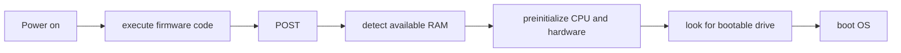
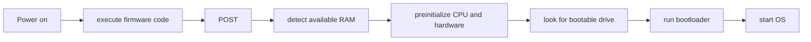

### Summary:

### The Boot Process
On startup your computer begins to execute firmware code that is stored in motherboard ROM

The process goes something like this:

Power on -> execute firmware code
                -> POST -> detect available RAM -> pre-initialize CPU and hardware -> look for bootable drive -> boot OS

#### Firmware standards
On a x86 CPU there are two firmware standards:
- Basic Input/Output System or BIOS
	- Old and outdated standard
	- Simple to use and well supported on majority of x86 machines

- Unified Extensible Firmware Interface or UEFI
	- Modern and feature rich
	- Complex to setup


#### BIOS Boot
In order to maintain compatibility most new [[01 A Minimal Rust Kernel#Firmware standards|UEFI]] machines use an emulated [[01 A Minimal Rust Kernel#Firmware standards|BIOS]] a byproduct of this compatibility is that the CPU is put into ==real mode== which is a 16bit compatibility mode

Updated boot process

Power on -> execute firmware code
                -> POST -> detect available RAM -> pre-initialize CPU and hardware -> look for bootable drive -> run bootloader -> ?

The bootloader is a 512 byte portion of executable code that is stored at the beginning of the disk

Most of the time the bootloader is larger than 512 bytes so it is broken into two parts where the first part is 512 bytes and loads the second part

The bootloader has some key roles:
- Determine the location of the kernel image on the disk and load it into memory
- Switch the CPU from 16bit real mode to 32bit protected mode then to 64bit long mode where 64-bit registers[^1] and the complete main memory are available
- Query information (Ex. Memory map[^2]) from the BIOS and pass it to the OS kernel

Writing a bootloader is annoying and and written in assembly 🤮 however the program [bootimage](https://github.com/rust-osdev/bootimage) can automatically prepend a bootloader to a kernel 

#### Multiboot Standard
Multiboot is a standard created by the Free Software Foundation in order to avoid having every OS from implementing its own bootloader that is only compatible with itself

The standard defines an interface between the bootloader and the operating system, so that any Multiboot-compliant bootloader can load any Multiboot-compliant OS
- Reference implementation: [GNU GRUB](https://www.gnu.org/software/grub/) 
	- Most popular bootloader for linux systems

In order to make the Multiboot-compliant a Multiboot-header needs to be inserted at the beginning of the kernel file.

This does makes it easy to boot an os from GRUB but there are some problems with this method too
- Only 32bit protected mode is supported which means that the CPU configuration to switch to 64bit long mode still needs to be done
- They are designed to make the bootloader simple instead of the kernal
- Documentation for both GRUB and Multiboot is sparse at best
- GRUB needs to be installed on the host system to create a bootable disk image from the kernel file which makes development on Windows or Mac difficult

### Minimal Kernel
Preliminary goal: create a disk image that prints "Hello world" when booted.

In order to achieve this [[00 Create a freestanding Rust binary|the freestanding Rust binary]] needs to be extended.

In [[00 Create a freestanding Rust binary|Rust binary]] cargo was used to build the binary however cargo builds for the host system by default and a kernel that runs on top of Windows/Mac doesn't make sense

#### Rust Nightly
There are three different channels of Rust: stable, beta, nightly
- Stable: tested features
- Beta: new features that have yet to be tested
- Nightly: experimental features

The nightly compiler allows you to opt-in to experimental features such as `!asm` macro for inline asm

`rustup` can be used to easily install / update all three channels side-by-side.

#### Target Specification
Cargo supports different target systems through the `--target` parameter

The target is described by a triple target format -> `CPU-vendor-OS-ABI`  Ex. `x86_64-unknown-linux-gnu`

because there is no underlaying target none of the default targets are useable but Rust allows you to make your own from a JSON file:
```json
{
"Llvm-target": "X86_64-unknown-none", // for running on bare metal
"Data-layout": "E-m:e-i64:64-f80:128-n8:16:32:64-S128",
"Arch": "X86_64",
"Target-endian": "Little",
"Target-pointer-width": "64",
"Target-c-int-width": "32",
"Os": "None", // for bare metal
"Executables": true,
"Linker-flavor": "Ld.lld",
"Linker": "Rust-lld", // lld linker that comes with rust
"Panic-strategy": "Abort", // has the same effect as editing Cargo.toml
"Disable-redzone": true,
"Features": "-mmx,-sse,+soft-float" // -: disable, +: enable
}
```

#### Building the Kernel
In order to build the kernel we need to recompile the `core` library to the target(`x86_64-unknown-none`)

in order to do this we need to add the following:
`.cargo/config.toml`:
```toml
[unstable]
build-std = ["Core", "Compiler_builtins"]
```

in order to build the kernel run:
```shell
cargo build --target x86_64-rust-os.json
```

##### Memory Related Intrinsics
The Rust compiler assumes that certain built-in functions are available for all systems.

Normally these are provided by the `C` library of the system. Since that is not available we can add the following to enable some of these functions:
`.cargo/config.toml`
```toml
[unstable]
build-std-features = ["Compiler-builtins-mem"]
build-std = ["Core", "Compiler_builtins"]
```
* this is only available in the nightly build of Rust

In order to not type `--target x86_64-rust-os.json` in the command-line every time we can add:
`.cargo/config.toml`
```toml
[build]
target = "X86_64-rust-os.json"
```
* this tells cargo to use the above as target whenever there is no `--target` argument

#### Printing to Screen
The easiest way to print to the screen is to use the [VGA buffer](https://en.wikipedia.org/wiki/VGA_text_mode).

The VGA buffer is a section in memory mapped to the VGA hardware that contains the contents displayed on the screen. it normally consists of 25 lines that each contain 80 character cells. Each character cell displays an ASCII chracter with some foreground and background colours.

An example output:


Implementation of the kernel displaying "Hello world!" on start:
```Rust
static HELLO: &[u8] = b"Hello World!";

#[no_mangle]
pub extern "C" fn _start() -> ! {
	let vga_buffer = 0xb800 as *mut u8;

	for (i, &byte) in HELLO.iter().enumerate(){
		unsafe{
			*vga_buffer.offset(i as isize *2) = byte;
			*vga_buffer.offset(i as isize *2 + 1) = 0xb;
		}
	}

	loop{}

}
```
* cast the integer `0xb8000` into a raw pointer
* iterate over the bytes of the static byte string  `HELLO`
* use enumerate in order to get the running variable `i`
* use the offset method to write the string byte and corresponding colour byte

>==Note==: there is the use of the `unsafe` keyword this is **temporary and not the point of using rust**

### Running the Kernel
There are two options for running the kernel
- Using a virtual machine such as QEMU
- Boot it on real hardware using a USB

#### Creating a Bootimage
To turn a compiled kernel into a bootable disk image we need to link it with a boot loader

In order to do so add the following:
`Cargo.toml`
```toml
[dependencies]
bootloader = "0.9.8"
```

then run:
```shell
cargo install bootimage
rustup component add llvm-tools-preview
cargo bootimage
```

What does the bootimage tool really do?
- compiles kernel to an [ELF](https://en.wikipedia.org/wiki/Executable_and_Linkable_Format) file
- compiles bootloader dependency as a standalone executable
- links the bytes of the kernel ELF file to the bootloader


[^1]: registers are temporary storage locations in the processor.
[^2]: A data structure that indicates how memory is laid out