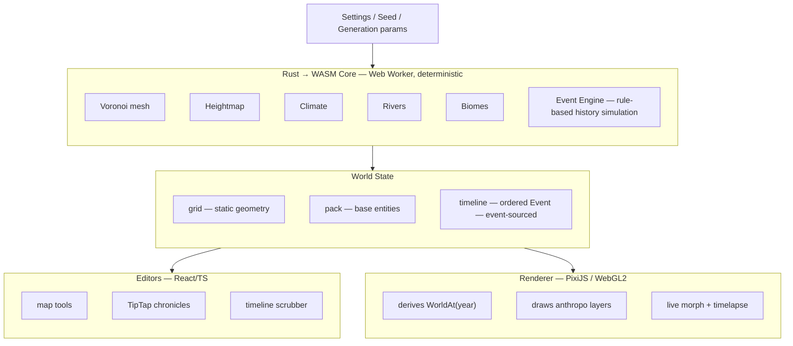
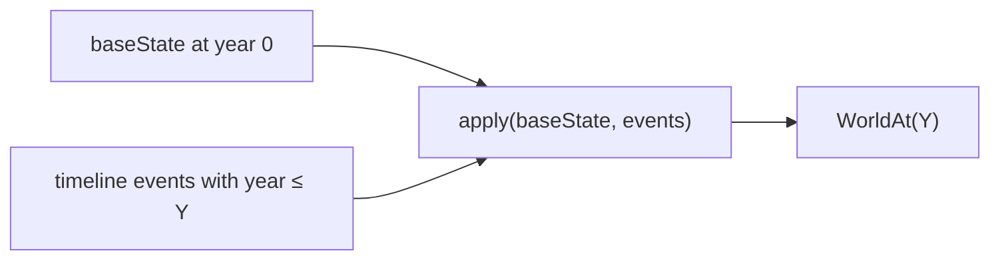
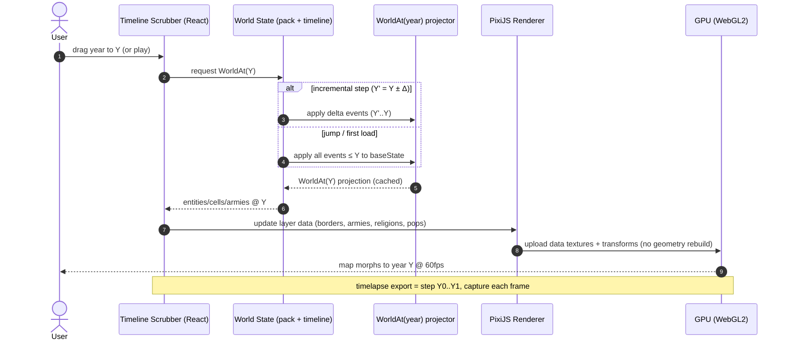
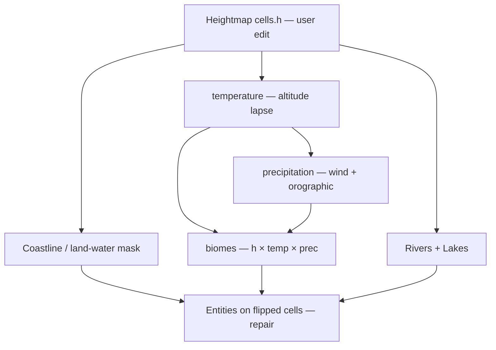
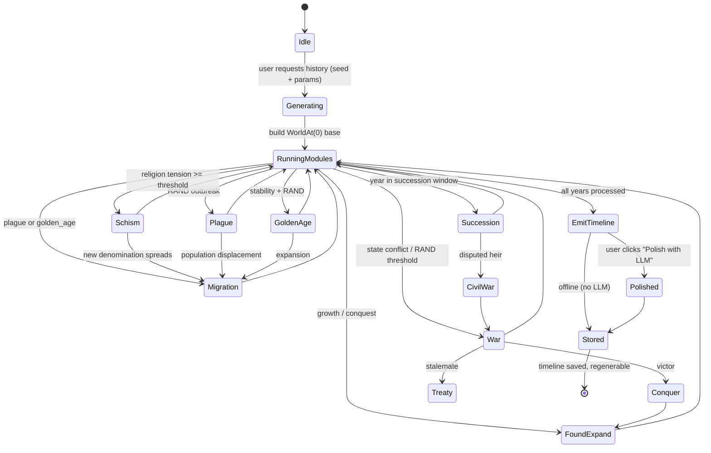

# worldgen

> Design doc v0.1. Built from a source-level study of Azgaar's Fantasy Map Generator
> (FMG v1.139.12) and a `/grill-me` interview with the product owner.
> Goal: an FMG-style map generator **geared to worldbuilding**, 100% local, smooth at
> ≤60k cells, with a **time-varying world** and **procedurally generated history**.

---

## 0. Why this tool exists (the FMG gap)

FMG's slowness at high cell counts is **not** a compute problem — it is a
**rendering + data-model** problem (verified by reading `public/main.js`,
`src/rendators/*`, `src/generators/*`):

| FMG bottleneck | Root cause | Our fix |
| --- | --- | --- |
| Interactivity dies past ~10–20k cells | Every cell = one live SVG `<polygon>` DOM node (100k nodes at max). No LOD, no culling, CPU rasterization. | **GPU renderer (PixiJS/WebGL2)**, 1–2 draw calls for the whole map, viewport culling, layer colors via data textures. |
| Generation blocks the UI | Single-threaded JS, `O(n)` passes over all cells in mutable `grid`/`pack` globals. | **Deterministic Rust→WASM core** run **off-thread** (Web Worker), with optional local native process. |
| One present-time snapshot only | `pack` holds a single static state. | **Event-sourced timeline**: world at year Y = base geometry + all events ≤ Y. |
| No narrative layer | Names only; no history prose. | **Rule-based event engine** emits structured events; **optional LLM polish**; **TipTap** chronicles per entity. |

**Scope decisions baked in:**
- Target: **≤60k cells, 60fps scrub**, 100% local (no server).
- **Terrain is author-editable; climate/biomes/rivers/lakes recompute from it.**
  Two orthogonal axes: (1) *authoring* — the user sculpts the heightmap, and its
  dependents (rivers, lakes, coastline, temperature, precipitation, biomes, and any
  entities on flipped cells) recompute; (2) *timeline* — the year scrubber animates
  only the **anthropological layer** (states, provinces, cities, armies, religions,
  cultures, borders, populations). Heightmap edits are authoring-time and do not
  interact with the year scrubber (see §3.6).
- **No 3D extruded terrain** in MVP (PixiJS is 2D). A separate optional Three.js view is a later add-on, not core.
- LLM is **strictly opt-in**, user supplies their own provider/key; the tool works fully offline.

---

## 1. Tech stack (decided)

| Layer | Technology | Notes |
| --- | --- | --- |
| **Compute / simulation core** | **Rust → WASM** (`wasm-pack`, `wasm-bindgen`) | Voronoi, heightmap, climate, rivers, biomes, event engine. Deterministic, seeded. Runs in a Web Worker. |
| Triangulation | `spade` (Rust Delaunay/Voronoi) | Replaces FMG's `delaunator`. |
| Renderer | **PixiJS v8** (WebGL2) + **React** wrapper | GPU-drawn map; one merged geometry per layer; data-texture color swaps for selection/year. |
| UI framework | **React + TypeScript** | Panels, dialogs, timeline scrubber. |
| Rich-text history | **TipTap + `tiptap-markdown`** | Per-entity chronicle documents; Markdown import/export. |
| Persistence | **IndexedDB + OPFS**; world saved as single `.world` (SQLite via `sql.js` or custom binary) | Serializes `grid` + `pack` + `timeline` exactly, reloads identically. |
| Optional LLM | Client-side `fetch` to user endpoint (OpenAI / Anthropic / Ollama / vLLM) | User key; opt-in; never required. |
| Build / tooling | **Vite** + `vite-plugin-wasm` + Biome | Fast HMR, type-checked. |

> **Local "backend" interpretation:** the efficient backend is the **Rust→WASM worker
> core** (and optionally a Tauri local process for native threading + local Ollama).
> No remote server. This satisfies "100% local" while fixing FMG's perf cliffs.

---

## 2. Architecture (layered, FMG-2.0-inspired but event-sourced)



**Dependency rule (from FMG-2.0):** generators/editors never touch the canvas;
renderer never mutates state; state has no rendering code. Added rule for us:
**the year is a pure read of state** (`WorldAt(year)`), never a mutation.

---

## 3. Data model (the core change from FMG)

FMG stores `pack.burgs`, `pack.states` as **present-time truth**. We add a
**timeline** and make entities **event-addressable**.

### 3.1 Static geometry (`grid`) — generated once, heightmap user-editable
Mirrors FMG: Voronoi cells, `cells.h` (height), `cells.temp`, `cells.prec`,
`cells.biome`, neighbors, vertices. The geometry (mesh, neighbors, vertices) is
static, but **`cells.h` is user-editable** (see §3.6) — and that edit propagates to
its dependents. The mesh itself **never time-varies** with the year scrubber.

### 3.2 Base entities (`pack`) — present-time truth at "year 0" anchor
`State`, `Province`, `Burg`, `Culture`, `Religion`, `Army`, `Route`,
each with base attributes + a `foundedYear` / `dissolvedYear` span.

### 3.3 Timeline (`Event[]`) — the engine
```rust
struct Event {
  id: u64,
  year: i32,                 // in-universe year (can be negative)
  entity_id: u32,
  entity_type: EntityType,   // State | Province | Burg | Army | Religion | Culture | Pop
  kind: EventKind,           // Succession | War | Plague | GoldenAge | Schism | Found | Conquer | Migrate | Treaty ...
  payload: EventPayload,     // structured, type-specific
  narrative: Option<String>, // optional LLM-polished prose (Markdown)
}
```

### 3.4 Deriving the world at year Y (no re-simulation)


- **Borders:** states own cell-sets; `Conquer`/`Secession`/`Found` events add/remove cells.
- **Armies:** `Raise`/`March`/`Battle`/`Disband` move/resize unit markers.
- **Religions:** `Schism` spawns a new `Religion` entity (denomination) with its own followers.
- **Populations:** `Plague`/`GoldenAge`/`Migration` scale burg/state population.
- **Cities:** `Found`/`Raze`/`Growth` toggle & resize burgs.

This projection is **O(events ≤ Y)** and cheap → 60fps scrubbing. We cache the
last-derived `WorldAt(Y)` and apply only the delta when the scrubber moves
incrementally (key for smooth timelapse).



### 3.5 History pane = filtered events
A state's "succession history" = `timeline.filter(entity_id == state.id, kind in [Found, Succession, Conquer, Dissolve])`,
rendered as a TipTap chronicle (Markdown). Religious schism chain = follow
`Schism` events spawning child `Religion` entities.

### 3.6 Heightmap editing & dependency propagation

The heightmap is **not frozen after generation** — the author sculpts it, and the
world reacts. This is the *authoring axis*, distinct from the *timeline axis*
(§3.4): editing terrain changes the **year-0 baseline**; it does not move with the
year scrubber.

**Dependency graph** (edits flow downstream):



**Recompute strategy (responsive + correct):**
- *During an active brush stroke*: apply the height delta locally; recompute
  **temperature + biomes for the affected cells only** (both are local:
  `temp` depends on `h` at the cell; `biome` depends on `h`/`temp`/`prec` and
  neighbors). This gives live visual feedback as land is raised/lowered.
- *On stroke-end (debounced ~200 ms)*: run a **full dependent recompute in the
  worker** — rivers (`resolveDepressions` + downhill flow), lakes, coastline/
  land-water mask, precipitation (wind-advection + orographic), and biomes — for
  correctness, then push the updated arrays back (transferable) and let the renderer
  swap data textures. Precipitation and rivers are global passes, so they are
  debounced rather than run per mouse-move to avoid thrash.

**Editing tools** (port FMG `heightmap-generator.ts` / `heightmap-editor.ts`):
brush **raise / lower** (radial falloff + strength), **flatten**, **smooth**,
plus macro tools **Range**, **Trough**, **Strait**, **Mask**, **Invert**,
**Add**, **Multiply**, and a **reset-to-generated** (restores the seeded baseline).

**Entity repair cascade** (run in the stroke-end recompute): when cells flip
land↔water —
- *Land → Water*: any `Burg` on such a cell is **removed** (warning toast lists
  affected burgs); `cells.state`/`cells.province` for water cells are **unassigned**
  (become unowned, alpha 0); state/province statistics are recomputed; a state that
  loses all its cells is marked `dissolved`.
- *Water → Land*: no automatic action (author may later place a burg/state there).

**Determinism & saving:** the *initial* generation stays seeded/deterministic.
Once the user edits, the **edited `cells.h` becomes canonical** and is exactly what
is serialized in `.world` (it already lives in `grid.cells.h`). "Same seed → same
world" holds for the unedited baseline; edits are explicit authoring overrides
(matches FMG's `.map` behavior). The timeline still derives from `pack` + `timeline`
unchanged.

---

## 4. Event engine (deterministic, seeded, rule-based)

Rust module `event_engine`. Same seed → same history. Run **once on user request**,
stored in `timeline`, **regenerable** with new seed/params (replaces `timeline`).

### 4.1 Rule modules (MVP + stretch)
| Module | Emits | Example |
| --- | --- | --- |
| `succession` | `Succession` | Ruler dies → heir inherits **or** `CivilWar` if disputed. |
| `war` | `War` (+ `Battle`, `Conquer`, `Treaty`) | State A vs B; outcome by army size, pop, terrain, RAND. |
| `plague` | `Plague` | Pop crash + slow recovery; may trigger `Migration`. |
| `golden_age` | `GoldenAge` | Growth buff to pop/economy; may spawn `GoldenAge` narrative. |
| `schism` | `Schism` | Religion splits → new `Religion` (denomination) entity. |
| `found_expand` | `Found`/`Conquer`/`Secession` | Drives border evolution over time. |
| `migration` | `Migrate` | Culture/religion spread across cells. |

Each module is seeded and parameterized (intensity sliders, era start/end, event
probability). Modules run in chronological order, reading the evolving
`WorldAt(year)` so later events react to earlier ones.

### 4.2 Optional LLM polish
After structured events exist, user may click **"Polish with LLM"** → client `fetch`
to their provider turns selected events' `payload` into `narrative` Markdown.
Stored back on the event. **Fully optional; offline tool is complete without it.**



---

## 5. Rendering (PixiJS)

- **Map = merged geometry**, not per-cell sprites. Each anthropo layer (states,
  provinces, burgs, armies, religions, routes) is one Pixi `Graphics`/mesh; colors
  come from a **Uint8 data texture** indexed by cell/entity → recolor on
  selection/year change is a texture upload, not a redraw.
- **Viewport culling** (Pixi built-in) for large maps.
- **Year scrub** updates only the data textures + transform of army/burg markers;
  static geometry untouched → cheap 60fps.
- **Timelapse export:** step the year N→M, render each frame to an offscreen
  canvas, encode to **WebM/MP4** (MediaRecorder or `ccapture`-style). World morphs
  continuously.
- **Terrain/biome layers** drawn once (static); only anthropo layers re-derive per year.

---

## 6. UI / interaction

| Surface | Implementation |
| --- | --- |
| Map canvas | React + PixiJS container; pan/zoom, click-select entity. |
| Layer toggles | Same layers as FMG (states, borders, provinces, religions, cultures, burgs, armies, routes, biomes, heightmap, ice). |
| **Timeline scrubber** | Continuous slider (year −N → +M) + play/pause + speed; exports timelapse. |
| Entity inspector | On select: attributes + "History" tab. |
| **History editor** | **TipTap** per-entity chronicle; Markdown import/export; structured events listed as anchors; LLM-polish button per event/entity. |
| Generators panel | Re-run individual systems (states, religions, cultures, history) like FMG's `regenerate()`; history is one of them. |
| **Heightmap editor** | Brush raise/lower/flatten/smooth + macro tools (range, trough, strait, mask, invert, add, multiply); live biome recolor; debounced full recompute of rivers/lakes/precipitation. |
| World config | Seed, cell count (≤60k), climate params, event-engine intensity. |

---

## 7. Persistence & file format

- Single **`.world`** archive: `grid` (binary) + `pack` (JSON/binary) + `timeline`
  (event array) + `chronicles` (TipTap JSON/Markdown per entity) + `meta` (seed,
  version). Reloads **identically** (FMG `.map` invariant).
- **IndexedDB + OPFS** for autosave; export/import `.world` file.
- Optional **GeoJSON** export of cell polygons (FMG feature, keep it).
- **Markdown export** of any chronicle (TipTap → MD).

---

## 8. MVP scope (your stated MVP)

> A functioning map with **states, religions, and cultures** — each with
> **procedurally generated history** (e.g. succession history of a state; religious
> events causing a schism → different denominations).

### MVP milestones
1. **Rust core M0:** Voronoi mesh + heightmap + climate + biomes (ported FMG algorithms, WASM, deterministic). Verify ≤60k cells generate in <2s off-thread.
2. **Renderer M1:** PixiJS draws terrain + static states/provinces/burgs from `pack`. 60fps pan/zoom at 60k.
2.5. **Heightmap editor M1.5:** editable terrain (brush + macro tools); live temp+biome recolor; debounced full recompute of rivers/lakes/precipitation; entity repair on land/water flips. Authoring axis orthogonal to timeline.
3. **Entities M2:** States, Provinces, Cultures, Religions generated (FMG port, robust to edited terrain) + base attributes.
4. **Event engine M3:** `succession`, `schism`, `war`, `plague`, `golden_age` modules → `timeline`. Regenerable.
5. **Timeline M4:** `WorldAt(year)` projection; continuous scrubber; live border/army/religion morph at 60fps; timelapse export.
6. **History UI M5:** TipTap chronicles per state/religion; structured events listed; succession chain & schism denomination tree render correctly.
7. **LLM polish M6 (optional):** opt-in provider hook; narrative field; never required.
8. **Persistence M7:** `.world` save/load, identical reload.

### MVP out-of-scope (explicit)
- 3D extruded terrain (PixiJS is 2D).
- Routes/markets/military-economy trade sim (stretch, post-MVP).
- Multi-user / server / cloud.
- Maps >60k cells (Z-order tiling stretch).

---

## 9. Performance budget (targets)

| Operation | Target |
| --- | --- |
| Generate 60k-cell world (WASM worker) | < 2s, non-blocking |
| Frame render at 60k cells, idle | 60fps |
| Scrub one year step (derive + recolor) | < 4ms (cached delta) |
| Timelapse export (e.g. 3000yr @ 30fps) | streamed, bounded memory |
| `.world` load (60k) | < 1s |
| Heightmap edit recompute (debounced, 60k) | < 300ms (worker; rivers+lakes+prec+biomes) |
| Live brush recolor (affected cells only) | < 16ms (local temp+biome) |

---

## 10. Open risks / decisions to confirm later
- **Event-engine balance:** rule weights need tuning so history "feels" real, not random churn. Prototype one state's 2000-year run and inspect.
- **Schism modeling:** does a schism split *followers* (pop re-assignment) or just spawn a label? Affects rendering + bal/Pop model. (Recommend: split followers by a seeded fraction.)
- **Determinism across WASM/TS boundary:** lock RNG (`rand::rngs::StdRng` seeded) in Rust; never rely on JS Math.random in core.
- **Timeline size:** 2000 years × many entities could be 10⁵+ events; store compactly (columnar / binary) and stream chronicle render.

---

## 11. Source basis & references
- FMG v1.139.12 source (cloned): `public/main.js` (legacy `generate()` pipeline,
  `calculateTemperatures`, `generatePrecipitation`), `src/generators/{voronoi,
  heightmap-generator, biomes-generator, river-generator, states-generator,
  burgs-generator, population-generator, names-generator, cultures-generator,
  religions-generator}.ts`, `src/renderers/*`, `docs/architecture/architecture.md`,
  `CONTEXT.md`.
- FMG inspirations: O'Leary (terrain), Amit Patel (polygonal maps), Turner (Here Dragons Abound).
- `/grill-me` interview answers: 100% local ≤60k; both simulated-evolution (A) and
  snapshot+narrative (B); deterministic rule engine + optional LLM; PixiJS; React+TipTap
  (Markdown via `tiptap-markdown`); continuous scrubber + timelapse; all anthropo
  features time-vary.

---
*Status: v0.1 — architecture + data model + MVP locked. Ready to break into a build plan / spike the Rust→WASM core + PixiJS renderer.*
