## 1
### 1.A
#### Longest duration
For this counter example assume that we are scheduling tasks 

| Task ID | Start Time | End Time | Duration |
| ------- | ---------- | -------- | -------- |
| 1       | 1          | 4        | 3        |
| 2       | 1          | 3        | 2        |
| 3       | 3          | 5        | 2        |
If tasks are scheduled by longest duration only task 1 would be scheduled where as by using earliest finish time both tasks 2, and 3 can be scheduled

#### Lowest task ID

| Task ID | Start Time | End Time | Duration |
| ------- | ---------- | -------- | -------- |
| 1       | 1          | 4        | 3        |
| 2       | 1          | 3        | 2        |
| 3       | 3          | 5        | 2        |
If tasks are scheduled by lowest task ID only task 1 would be scheduled where as by using earliest finish time both tasks 2, and 3 can be scheduled

#### Latest finish time

| Task ID | Start Time | End Time | Duration |
| ------- | ---------- | -------- | -------- |
| 1       | 1          | 4        | 3        |
| 2       | 1          | 2        | 1        |
| 3       | 2          | 3        | 1        |
If tasks are scheduled by latest finish time only task 1 would be scheduled where as by using earliest finish time both tasks 2, and 3 can be scheduled

### 1.B
Assume that $Q$ is the optimal solution (fitting the most amount of tasks possible) and $\hat{Q}$ is is the **latest start time** approach

In the first step: if the **greedy** choice is made (latest start time) the optimal solution is still possible as the start time for the task chosen in this step is $\geq$ the start time for all other tasks.

This choice reduces the problem to a smaller task scheduling problem from `Start` -> `T1_start` instead of `Start` -> `End`. Continuing with further steps leads to the optimal solution.

Inductive Hypothesis: Assume that for a problem of size $k$, the greedy strategy yields an optimal solution.

Inductive Step: Prove that the hypothesis holds for the problem of size $k+1$. 
If the greedy choice is made for the first task, the problem size reduces to $k$. By the inductive hypothesis, the greedy strategy yields an optimal solution for the remaining $k$ tasks. Hence, the greedy strategy yields an optimal solution for the problem of size $k+1$.

### 1.C
**Counter example:**
Suppose we have three activities with their start times, finish times, and costs as follows:

| Task ID | Start Time | End Time | Cost |
| ------- | ---------- | -------- | ---- |
| 1       | 1          | 3        | 2    |
| 2       | 4          | 6        | 2    |
| 3       | 2          | 5        | 1    |
By utilizing the greedy choice of earliest finish time we would get:

```mermaid
gantt
	dateFormat HH:mm
	axisFormat %H:%M
	start: milestone, 01:00, 1m
	end: milestone, 06:00, 1m
	Cost 2: 01:00, 2h
	Cost 2: 04:00, 2h
```

with a total cost of 4 while the optimal solution would be:

```mermaid
gantt
	dateFormat HH:mm
	axisFormat %H:%M
	start: milestone, 01:00, 1m
	end: milestone, 06:00, 1m
	Cost 1: 02:00, 3h
```


With a total cost of 1

$\therefore$ By counter example the greedy choice of earliest finish time will not yield an optimal solution for this new problem

## 2
`YPPTPQTPYYTPTQPAYPT`
### 2A
In the string `YPPTPQTPYYTPTQPAYPT` there are 19 characters and each character is encoded with 8bits in ASCII therefore 152 bits are needed to encode this string.

### 2.B
1. Find the frequency of each character in the string

| Letter | Frequency |
| ------ | --------- |
| Y      | 4         |
| P      | 7         |
| T      | 5         |
| Q      | 2         |
| A      | 1         |
2. Sort the characters in increasing order of frequency

| Letter | Frequency |
| ------ | --------- |
| A      | 1         |
| Q      | 2         |
| Y      | 4         |
| T      | 5         |
| P      | 7         |
3. Build a Huffman tree from the frequency data


4. Traverse the Huffman tree and build the encodings for each character found in the input file

| Letter | Encoding |
| ------ | -------- |
| P      | 0        |
| T      | 10       |
| Y      | 111      |
| Q      | 1101     |
| A      | 1100     |

5. For each character in the input file, write the bits of the Huffman encoding
YPPTPQTPYYTPTQPAYPT -> 111, 0, 0, 10, 0, 1101, 10, 0, 111, 111, 10, 0, 10, 1101, 0, 1100, 111, 0, 10
6. Output the codeword
`11100100110110011111110010110101100111010`

### 2.C
0 | 111 | 0 | 0 | 0 | 10 | 10 | 10 | 0 | 0 | 0 | 1101
P | Y     | P | P | P | T   | T   | T   | P | P | P | Q

### 2.D
`ABCDABCDABCDABCD`
In the above string since there are only four characters and they all have the same frequency the codeword for all characters is two bits long.

## 3

| Item # | Weight | Value | Density V/W |
| ------ | ------ | ----- | ----------- |
| 1      | 3      | 15    | 5           |
| 2      | 6      | 24    | 4           |
| 3      | 4      | 12    | 3           |
| 4      | 2      | 16    | 8           |

### 3.A
Using the following algorithm:
```python
def knapSack(W, weights, val, n):
    K = [[0 for x in range(W + 1)]
            for x in range(n + 1)]
    for i in range(n + 1):
        for w in range(W + 1):
            if i == 0 or w == 0:
                K[i][w] = 0
            elif weights[i - 1] <= w:
                K[i][w] = max(val[i - 1]
                  + K[i - 1][w - weights[i - 1]],
                               K[i - 1][w])
            else:
                K[i][w] = K[i - 1][w]
    return K[n][W]
```

|       | Capacity | 0   | 1   | 2   | 3   | 4   | 5   | 6   | 7   | 8      |
| ----- | -------- | --- | --- | --- | --- | --- | --- | --- | --- | ------ |
| Items |          |     |     |     |     |     |     |     |     |        |
| 0     |          | 0   | 0   | 0   | 0   | 0   | 0   | 0   | 0   | 0      |
| 1     |          | 0   | 0   | 0   | 15  | 15  | 15  | 15  | 15  | 15     |
| 2     |          | 0   | 0   | 0   | 15  | 15  | 15  | 24  | 24  | 24     |
| 3     |          | 0   | 0   | 0   | 15  | 15  | 15  | 24  | 27  | 27     |
| 4     |          | 0   | 0   | 16  | 16  | 16  | 31  | 31  | 31  | **40** |
the optimal solution would be 40

### 3.B
For a bag with capacity $8$ a greedy algorithm that uses the **density** as its greedy choice would yield items \[4, 1\] as its choices the knapsack ends up with a value of $31$ and a weight of $5/8$ where as the optimum solution would choose items \[2, 4\] and have a value of $41$ and a weight of $8/8$.

### 3.C 
When solving the fractional knapsack problem the greedy algorithm would output:

| items | Total weight | Value | Percentage | total |
| ----- | ------------ | ----- | ---------- | ----- |
| 4     | 2/8          | 16    | 1          | 16    |
| 1     | 5/8          | 15    | 1          | 31    |
| 2     | 8/8          | 12    | 0.5        | 43    |
The result is $43$ which is the optimum solution

## 4
### 4.A
`[1, 5, 2, 6, 3]`
1 + (5 x 2) + (6 x 3) = 29

### 4.B
A Naive solution to this problem would be to go through all possible outcomes for a sequence of numbers and return the version that had the highest value.

For a sequence of length $n$ for each pair of contiguous integers, we have 2 choices: we can either insert an addition operation or a multiplication operation. Therefore the time complexity for this problem would be $O(2^n)$

### 4.C 
A counter example to a greedy approach would be:
`[1, 2, 3, 4]`

In the greedy approach the outcome would be:
1 + (2 x 3) + 4 = 11

Where as the optimum solution is:
(1 x 2) + (3 x 4) = 14

### 4.D
$$V[j] = 
\begin{cases} 
0 & \text{if } j = 0 \\
x_{1} & \text{if } j = 1 \\
max(V[j-1] + V[j], V[j-2] + V[j-1] × V[j]) & \text{if } j \geq 2 
\end{cases}
$$

### 4.E
```python
def max_product_sum(X):
    ln = len(X)
    V = [0]*ln
    V[0] = X[0]
    V[1] = max(X[0] + X[1], X[0] * X[1])
    for j in range(2, ln):
        V[j] = max(V[j-1] + X[j], V[j-2] + X[j-1] * X[j])
    return V[ln-1]
```
The running time for this algorithm is $O(n)$
