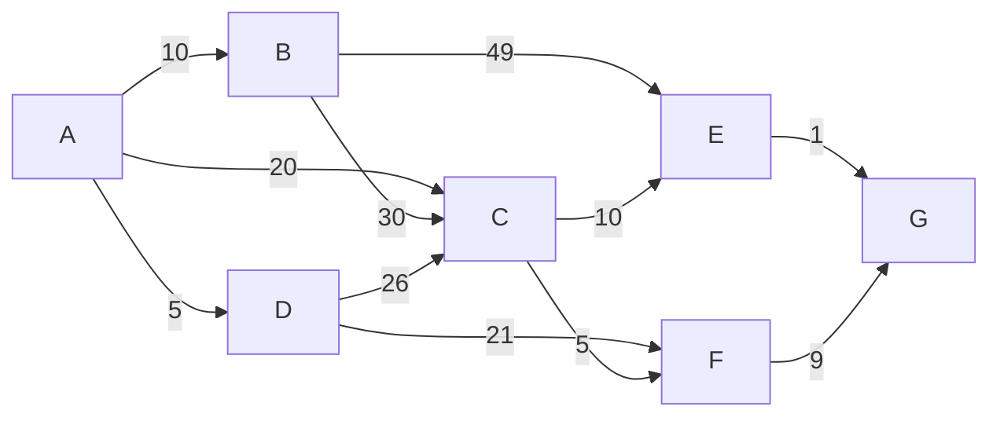

## Question 1

### 1.A
![[Pasted image 20240401202116.png]]
Using breadth-first search and starting from node S the order that the nodes will be visited would be: **S, B, C, E, F, A, D, G**

### 1.B
Using deapth-first search and starting from node S the order that the nodes will be visited would be: **S, B, A, C, F, E, D, G**

### 1.C
Since every edge has an equal weight in the graph, multiple minimum spanning trees can be formed by including different combinations of edges connecting all nodes without forming a cycle. therefore a minimum spanning tree is not unique when the weight of edges in the graph is equal.

## Question 2

### 2.A

| Node | Discovery time | Finish time |
| ---- | -------------- | ----------- |
| 1    | 1              | 6           |
| 2    | 3              | 1           |
| 3    | 2              | 4           |
| 4    | -              | -           |
| 5    | 4              | 2           |
| 6    | 5              | 3           |
| 7    | -              | -           |
| 8    | 6              | 5           |
### 2.B

| Node | Discovery time | Finish time |
| ---- | -------------- | ----------- |
| 1    | 1              | 5           |
| 2    | 4              | 1           |
| 3    | 2              | 4           |
| 4    | -              | -           |
| 5    | 5              | 2           |
| 6    | 6              | 3           |
| 7    | -              | -           |
| 8    | 3              | 6           |

## Question 3

### 3.A
1. Start with node A.
2. Choose the edge A-D with weight 5. Add node D to the MST.
3. Choose the edge D-F with weight 21 . Add node F to the MST.
4. Choose the edge F-G with weight 9. Add node G to the MST.
5. Choose the edge A-B with weight 10. Add node B to the MST.
6. Choose the edge B-C with weight 30. Add node C to the MST.
7. Choose the edge C-E with weight 10. Add node E to the MST.
MST using Prim's algorithm: A, D, F, G, B, C, E
### 3.B
1. Start edge E-G (weight 1). Add it to the MST. (smallest)
2. Add edge A-D (weight 5).
3. Add edge C-F (weight 5). 
4. Add edge A-B (weight 10). 
5. Add edge C-E (weight 10). 
 MST using Kruskal’s algorithm: **E-G, A-D, C-F, A-B, C-E.** 