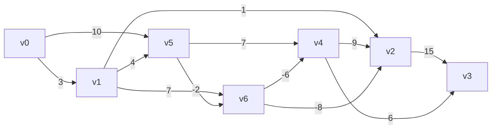
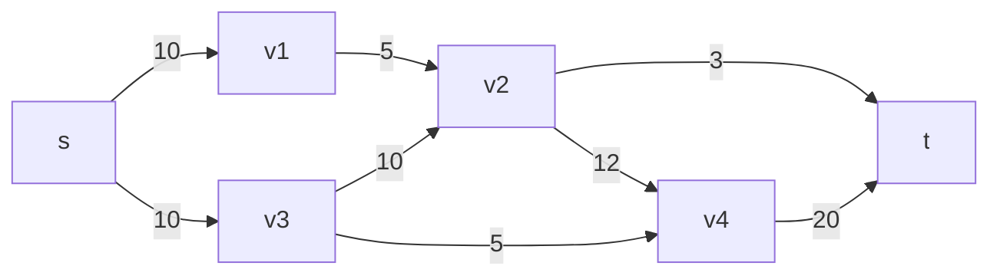
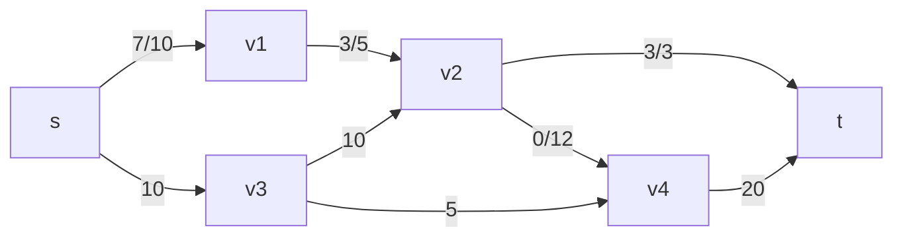
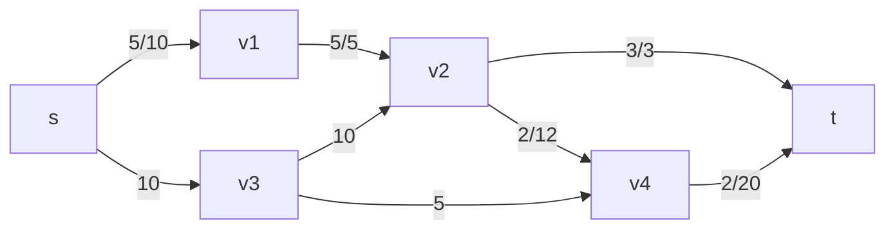
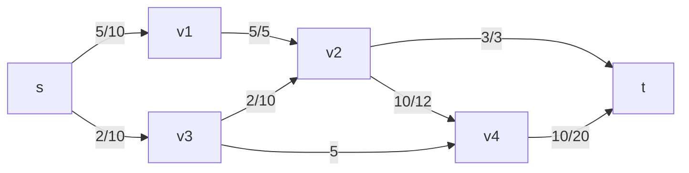
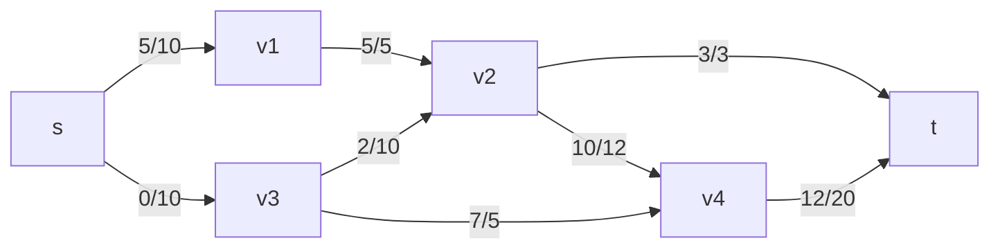

## Question 1

### 1.A

#### 1.A.I
Dijsktra's algorithm can be modified to directly display the shortest path with the following modifications:
1. A HashMap data-structure called `previous` is initialized where the key is the node and the value is the nodes in which they key node is reached in the smallest cost.
2. When a shorter path to a node is found, update `previous` to the current node

#### 1.A.II
1. A HashMap data-structure called `previous` is initialized where the key is the node and the value is the nodes in which they key node is reached in the smallest cost.
2. When a shorter path to a node is found, update `previous` to the current node

### 1.B

#### 1.B.I
**Initialize:**
```
Distance: v0: 0, v1: ∞, v2: ∞, v3: ∞, v4: ∞, v5: ∞, v6: ∞
Predecessor: v0: None, v1: None, v2: None, v3: None, v4: None, v5: None, v6: None
```

**Pass 1:**
Relax all edges in the graph
```
Distance: v0: 0, v1: 3, v2: 4, v3: ∞, v4: 17, v5: 10, v6: 8
Predecessor: v0: None, v1: v0, v2: v1, v3: None, v4: v5, v5: v0, v6: v5
```

**Pass 2:**
Relax all edges in the graph again
```
Distance: v0: 0, v1: 3, v2: 0, v3: 15, v4: 2, v5: 10, v6: 8}
Predecessor: {v0: None, v1: v0, v2: v6, v3: v2, v4: v6, v5: v0, v6: v5
```

**Pass 3:**
```
Distance: v0: 0, v1: 3, v2: 0, v3: 15, v4: 2, v5: 10, v6: 8
Predecessor: v0: None, v1: v0, v2: v6, v3: v2, v4: v6, v5: v0, v6: v5
```
Because no distances were updated we know that we have reached a solution

According to the Bellman-Ford algorithm the shortest path for this graph is `v0 -> v5 -> v6 -> v2, cost: 0`

### 1.B.II

**Initialize:**
```
Distance: v0: 0, v1: ∞, v2: ∞, v3: ∞, v4: ∞, v5: ∞, v6: ∞
Predecessor: v0: None, v1: None, v2: None, v3: None, v4: None, v5: None, v6: None
```

**Step 1:**
start from node `v0` there are only two adjacent nodes `v1, v5` update these nodes and distances
```
Distance: v0: 0, v1: 3, v2: ∞, v3: ∞, v4: ∞, v5: 10, v6: ∞
Predecessor: v0: None, v1: v0, v2: None, v3: None, v4: None, v5: v0, v6: None
```

**Step 2:**
move to `v1` which is the smallest unvisited node. Adjacent nodes are `v2`, `v5`, and `v6`. Update the nodes and distances
```
Distance: v0: 0, v1: 3, v2: 4, v3: ∞, v4: ∞, v5: 7, v6: 10
Predecessor: v0: None, v1: v0, v2: v1, v3: None, v4: None, v5: v1, v6: v1
```

**Step 3:**
move to `v2`. The only adjacent node is `v3`,

```
Distance: v0: 0, v1: 3, v2: 4, v3: 19, v4: ∞, v5: 7, v6: 10
Predecessor: v0: None, v1: v0, v2: v1, v3: v2, v4: None, v5: v1, v6: v1
```

**Step 4:**
move to  `v5`. The adjacent nodes are `v4` and `v6`. Update the nodes and distances.
```
Distance: v0: 0, v1: 3, v2: 4, v3: 19, v4: 14, v5: 7, v6: 5
Predecessor: v0: None, v1: v0, v2: v1, v3: v2, v4: v5, v5: v1, v6: v5
```

**Step 5:**
move to`v6`. The adjacent nodes are `v2` and `v4`. Update the nodes and distances.
```
Distance: v0: 0, v1: 3, v2: -3, v3: 12, v4: -1, v5: 7, v6: 5
Predecessor: v0: None, v1: v0, v2: v6, v3: v2, v4: v6, v5: v1, v6: v5
```

**Step 6:**
move`v4`. The only adjacent node is `v3`. Update the nodes and distances.
```
Distance: v0: 0, v1: 3, v2: -3, v3: 5, v4: -1, v5: 7, v6: 5
Predecessor: v0: None, v1: v0, v2: v6, v3: v4, v4: v6, v5: v1, v6: v5
```

Shortest path to every node:
`v0 -> v1, cost: 3`
`v0 -> v1 -> v5 -> v6 -> v2, cost: -3`
`v0 -> v1 -> v5 -> v6 -> v4 -> v3, cost 5`
`v0 -> v1 -> v5 -> v6 -> v4, cost: -1`
`v0 -> v1 -> v5, cost: 7`
`v0 -> v1 -> v5 -> v6, cost 5`

#### 1.B.III
According to the Bellman-Ford algorithm the shortest path from `v0 -> v2` is `v0 -> v5 -> v6 -> v2, cost: 0`
However using Dijsktra's algorithm `v0 -> v1 -> v5 -> v6 -> v2, cost: -3` was the shortest path with Dijsktra's algorithm arriving at a better answer.


## Question 2


### 2.A
**Initialize:**
The flow on all edges is 0

**Iteration 1:**

- Augmenting Path: s -> v1 -> v2 -> t
- Residual Capacities: 10 -> 5 -> 3
- Minimum Residual Capacity (i.e., flow of this iteration): 3

The updated flows after this iteration:



**Iteration 2:**

- Augmenting Path: `s -> v1 -> v2 -> v4 -> t`
- Residual Capacities: `7 -> 2 -> 12 -> 20`
- Minimum Residual Capacity: `2`

The updated flows after this iteration:



**Iteration 3:**

- Augmenting Path: `s -> v3 -> v2 -> v4 -> t`
- Residual Capacities: `10 -> 8 -> 10 -> 18`
- Minimum Residual Capacity: `8`

The updated flows after this iteration:



**Iteration 4:**

- Augmenting Path:`s -> v3 -> v4 -> t`
- Residual Capacities: `2 -> 5 -> 10`
- Minimum Residual Capacity: `2`

The updated flows after this iteration:



The maximum flow of the network is the sum of the flows into the sink, which is 3 (from v2) + 12 (from v4) = **15**. So, the maximum flow for this graph is **15**.

### 2.B
- Source side: `s, v1, v3, v2`
- Sink side: `v4, t`
- Edges in the cut: `(v2, v4), (v2, t), (v3, v4)`
The capacities of these edges are 12, 3, and 5 respectively. The sum of these capacities is 20, which is still greater than the maximum flow. However, the actual flow across this cut is:
- Flow of `(v2, v4)`: `10`
- Flow of `(v2, t)`: `3`
- Flow of `(v3, v4)`: `2`
The sum of these flows is `10 + 3 + 2 = 15`, which equals the maximum flow. Therefore, this is the minimum cut of the network.

## Question 3
### 3.A
The strongly connected components in the graph are the nodes `A, B, C, D, E, G, I, F` 