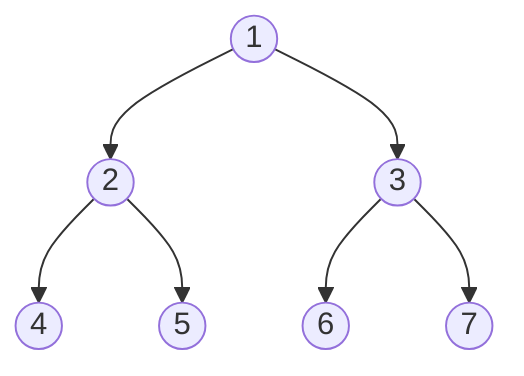

## Tree-Based Sorting
[[Lesson 2|Previously]] we learned how to sort using arrays. The running time for that algorithm was $O(n^2)$ 
In this Lesson, we will see the effect of changing data structures on the performance of an algorithm
In this case we will use **binary trees** instead of arrays

### Binary Search Tree Review

The tree is made up of nodes that have at most two children. values that are greater than the value of the node will be added to the right child. Values that are less than or equal are added to the left child.

>[!note] Key Property:
>BST is a binary tree data structure where for every node $x$ with left child $y$ and right child $z$:
>$y.key<x.key<z.key$
>
>**BST Operations:**
>1. BST-search($k$)
>	- Running Time: Worst-case $T(n) = \Theta(n)$
>2. BST-insert($k$)
>	- Running Time: Worst-case $T(n) = \Theta(n)$
>3. BST-delete($k$)
>	- Running Time: Worst-case $T(n) = \Theta(n)$

### Binary-Search Algorithm:
```python
def binary_search(tree: BST, n: T) -> T:
	node = tree.root
	while(node.key != n or (node.left == None and node.right == None)):
		if(n > node.key):
			node = node.right
		else:
			node = node.left
	if(node.key == n):
		return node
	else:
		return None
```

In order traversal of a binary search tree:
```python
def inorder_walk(node: BST_node) -> None:
	if node != None:
		inorder_walk(node.left)
		print(node.key)
		inorder_walk(node.right)
```
