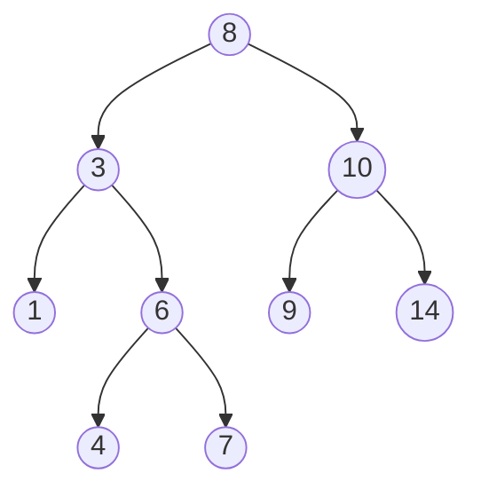

## Tree-Based Sorting
[[Lesson 2|Previously]] we learned how to sort using arrays. The running time for that algorithm was $O(n^2)$ 
In this Lesson, we will see the effect of changing data structures on the performance of an algorithm
In this case we will use **binary trees** instead of arrays

### Binary Search Tree Review


The tree is made up of nodes that have at most two children. values that are greater than the value of the node will be added to the right child. Values that are less than or equal are added to the left child.

>[!note] Key Property:
>BST is a binary tree data structure where for every node $x$ with left child $y$ and right child $z$:
>$y.key<x.key<z.key$
>
>**BST Operations:**
>1. BST-search($k$)
>	- Running Time: Worst-case $T(n) = \Theta(n)$
>2. BST-insert($k$)
>	- Running Time: Worst-case $T(n) = \Theta(n)$
>3. BST-delete($k$)
>	- Running Time: Worst-case $T(n) = \Theta(n)$

### Binary-Search Algorithm:
```python
def binary_search(tree: BST, n: T) -> T:
	node = tree.root
	while(node.key != n or (node.left == None and node.right == None)):
		if(n > node.key):
			node = node.right
		else:
			node = node.left
	if(node.key == n):
		return node
	else:
		return None
```

In order traversal of a binary search tree $O(n)$:
```python
def inorder_walk(node: BST_node) -> None:
	if node != None:
		inorder_walk(node.left)
		print(node.key)
		inorder_walk(node.right)
```
![[Inorder-traversal.gif]]

#### Binary-Search Tree delete
Deleting a leaf node is trivial and $O(1)$ in time complexity
however deleting a node that has children is more complicated and in the worst case is $O(n)$ in time complexity
BST delete steps:
1. BST_search($k$)
2. Replace $k$ with its successor
3. Delete node $k$
![[leafnodedeleted.gif]]

### Binary-Search Tree sort
Time complexity: $T(n) = \Theta(n\lg n) + \Theta(n) = \Theta(n\lg n)$
```python
def BST_sort(nums: List) -> BST_node:
	bst = BST_node(nums[0])
	for i in range(1, nums.len()):
		bst.insert(nums[i])
	return bst
```

In order to make sure that the tree is balanced, we can use various other tree-based data structures such as:
- Red-Black Trees
- AVL Trees (better than RB-trees for search-intensive applications)
- Splay Trees (Pushes frequently accessed elements closer to the root; useful for caching)
- Treap (A combination of a tree and a heap)
- B-Trees (for large multi-degree data)
- 2-3 / 2-3-4-trees (special cases of B-trees)
However on average, randomly inserting elements is a standard BST gives $O(n\lg n)$

### Heapsort
Worst-case: $O(n\lg n)$ - Like merge-sort, but unlike [[Lesson 2#Insertion Sort||Insertion Sort]]
Sorts in place - Like [[Lesson 2#Insertion Sort||Insertion Sort]], but unlike merge-sort

Heapsort combines the best attributes of these deterministic sorting algorithms

### Binary Max-Heap
>[!note] Key Property:
>Max-Heap s a binary tree data structure where for every node $x$:
>$Parent(x).key \geq x.key$
>
>**Max-Heap Operations:**
>1. HEAPIFY($i$)
>	- Running Time: Worst-case $T(n) = \Theta(\lg n)$
>2. HEAP-getmax()
>	- Running Time: Worst-case $T(n) = \Theta(n)$
>3. HEAP-insert($k$)
>	- Running Time: Worst-case $T(n) = \Theta(n)$
>
 **Array Representation:**
 Children of Node $i$ at indices $2i$ and $2i+1$

