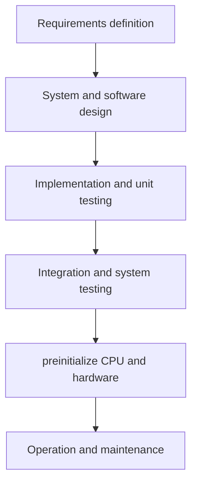

### The software process
- A structured set of activities required to develop a software system
- There are many different types but they all include:
	- Specification
	- Design and implementation
	- Validation
	- Evolution
- A software process model is not an abstract representation of a process. it presents a description of a process from some particular perspective

### Software Process Descriptions
- When we describe and discuss processes, we usually talk about the activities in these processes such as specifying a data model, designing a user interface, etc. and the ordering of these activities. 
- Process descriptions may also include: 
	- Products, which are the outcomes of a process activity;
	- Roles, which reflect the responsibilities of the people involved in the process;
	- Pre- and post-conditions, which are statements that are true before and after a process activity has been enacted or a product produced.

### Plan-driven vs Agile processes
- Plan-driven processes are processes where all of the process activities are planned in advance and progress is measured against this plan.  
- In agile processes, planning is incremental and it is easier to change the process to reflect changing customer requirements. 
- In practice, most practical processes include elements of both plan-driven and agile approaches. 
- There are no right or wrong software processes.

## Software Process models
- The waterfall method
	- Plan-driven model. Separate and distinct phases of specification and development.
- Incremental development
	- Specification, development and validation are interleaved. May be plan-driven or agile.
- Integration and configuration
	- The system is assembled from existing configurable components. May be plan-driven or agile.

### Waterfall model

- The main drawback of the waterfall model is its rigid structure which makes it difficult to implement changes
- The waterfall method is mainly used for large systems eng. projects where a system is developed at several sites

### Incremental Development
![[Ch2 SW Processes_important.pdf#page=11]]
- Pros:
	- Cost of change is reduced
	- Easier to get customer feedback on development
	- Rapid delivery and deployment of useful software
- Cons:
	- Process is not visible to customer
	- System structure tends to get degraded as new increments are added

### Integration and configuration
-  Based on software reuse where systems are integrated from existing components or application systems (sometimes called COTS -Commercial-off-the-shelf) systems). 
- Reused elements may be configured to adapt their behaviour and functionality to a user’s requirements
- Reuse is now the standard approach for building many types of business system

- Types of reusable software
	- Stand-alone application systems
	- Frameworks
	- Web services

- Reuse-oriented software eng.
![[Ch2 SW Processes_important.pdf#page=16]]

