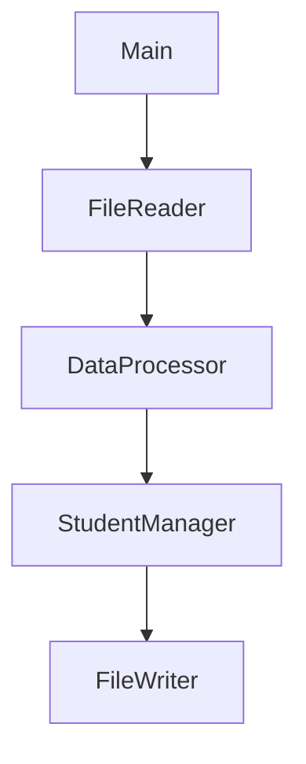
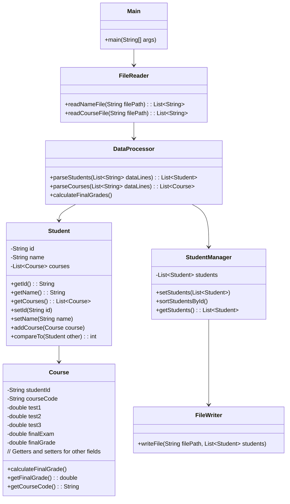

**Student Data Formatter**
**Prepared by:** Vikas Movva | movv7230@myalurier.ca, Ryan McKenna | mcke9080@mylaurier.ca, Gurreet Sanghera | Sang8327@mylaurier.ca
**Date:** November 20, 2024

**Table of Contents**
1. [[#1. Introduction]]
	1. [[#1.1 Purpose]]
	2. [[#1.2 Scope]]
	3. [[#1.3 Definitions, Acronyms, and Abbreviations]]
2. [[#2. System Overview]]
3. [[#3. Architectural Design]]
	1. [[#3.1 System Architecture]]
		1. [[#3.1.1 High-Level Diagram]]
		2. [[#3.1.2 Description]]
4. [[#4. Detailed Design]]
	1. [[#4.1 Classes and Objects]]
		1. [[#4.1.1 Class Diagram]]
		2. [[#4.1.2 Class Descriptions]]
	2. [[#4.2 Data Structures]]
	3. [[#4.3 Algorithms]]
	4. [[#4.4 Error Handling and Reliability]]
5. [[#5. Object-Oriented Features Used]]
	1. [[#5.1 Inheritance]]
	2. [[#5.2 Encapsulation]]
6. [[#6. Sorting Algorithm]]
7. [[#7. Final Grade Calculation]]
8. [[#8. Conclusion]]
9. [[#9. References]]
10. [[#10. Appendices]]
	1. [[#Appendix A Input and Output File Formats]]
	2. [[#Appendix B Java APIs]]

# 1. Introduction
## 1.1 Purpose
The purpose of this Software Design Document is to outline the architecture and detailed design for the Student Data Formatter application. This software reads two text files containing student information and grades, formats the data, sorts it by student ID, and outputs the formatted data to a new file. The design incorporates object-oriented programming principles and emphasizes reliability through offensive programming techniques.

## 1.2 Scope
This document covers both the architectural and detailed design aspects of the Student Data Formatter. It includes class diagrams, descriptions, data structures, algorithms, and error-handling mechanisms. The intended audience includes software developers, project managers, and stakeholders involved in the software development process.

## 1.3 Definitions, Acronyms, and Abbreviations
• **API**: Application Programming Interface
• **OOP**: Object-Oriented Programming
• **SDD**: Software Design Document

# 2. System Overview
The Student Data Formatter is a Java-based application designed to:
- Read two input text files containing student information and grades.
- Format and merge the data.
- Sort the combined data by student ID.
- Output the sorted data to a new file.

The application leverages object-oriented programming features such as inheritance and encapsulation to enhance modularity and maintainability. Reliability is ensured through offensive programming techniques like input validation and exception handling.

# 3. Architectural Design
## 3.1 System Architecture
The system architecture is modular, separating functionalities into distinct components for better maintainability and scalability.

### 3.1.1 High-Level Diagram


### 3.1.2 Description
- **Main**: Entry point of the application; orchestrates the workflow.
- **FileReader**: Reads data from input files.
- **DataProcessor**: Parses the raw data, calculates final grades, and formats it into structured objects.
- **StudentManager**: Manages student objects and handles sorting.
- **FileWriter**: Writes the formatted and sorted data to the output file.

# 4. Detailed Design

## 4.1 Classes and Objects

### 4.1.1 Class Diagram



### 4.1.2 Class Descriptions
- **Main**: Initiates the application and controls the sequence of operations.
- **FileReader**: Contains methods to read student information and grades from input files.
- **DataFormatter**: Parses raw data into Student and Grade objects.
- **Student**: Represents a student with encapsulated fields (id, name, email, grades). Implements Comparable for sorting.
- **Grade**: Represents a course and the corresponding grade.
- **StudentManager**: Manages a list of Student objects and provides sorting functionality.
- **FileWriter**: Outputs the formatted and sorted data to the specified output file.

## 4.2 Data Structures
- **List students**: Stores student objects in StudentManager.
- **List grades**: Stores grades within each Student object.

## 4.3 Algorithms
- **Parsing Algorithm**: Splits each line by a delimiter (e.g., comma) to extract fields and create objects.
- **Merging Algorithm**: Associates grades with the corresponding student based on student ID.
- **Sorting Algorithm**: Sorts the list of students using the compareTo method in Student.

## 4.4 Error Handling and Reliability
- **Input Validation**: Checks for null or malformed data during parsing.
- **Exception Handling**: Uses try-catch blocks to handle IOExceptions and other runtime exceptions.
- **Defensive Coding**: Ensures methods are robust against invalid inputs and states.

# 5. Object-Oriented Features Used
## 5.1 Inheritance
- **Course** class could inherit from a more general **Assessment** class if extended.
- Future extension: Implementing a **Person** superclass for **Student**.

## 5.2 Encapsulation
- All class fields are private.
- Access to fields is provided through public getter and setter methods.

# 6. Sorting Algorithm
Sorting is implemented in the StudentManager class by using the Comparable interface in the Student class.

**Student Class Implementation:**
```java
public class Student implements Comparable<Student> {
    @Override
    public int compareTo(Student other) {
        return this.id.compareTo(other.id);
    }
}

```

**Sorting Method in StudentManager:**
```java
public void sortStudentsById() {
    Collections.sort(students);
}
```

# 7. Final Grade Calculation
The final grade for each course is calculated using the following formula:
`Final Grade = (Test1 × 0.20) + (Test2 × 0.20) + (Test3 × 0.20) + (Final Exam × 0.40)`

**Implementation in the** Course **Class:**
```java
public void calculateFinalGrade() {
    this.finalGrade = (test1 * 0.20) + (test2 * 0.20) + (test3 * 0.20) + (finalExam * 0.40);
}
```
# 8. Conclusion
The Student Data Formatter application effectively reads, formats, and sorts student data from input files. By utilizing object-oriented programming features such as inheritance and encapsulation, the design promotes code reusability and maintainability. Reliability is ensured through comprehensive error handling and the application of offensive programming techniques.

# 9. References
1. Oracle Java Documentation. (n.d.). Retrieved from [https://docs.oracle.com/javase/8/docs/api/](https://docs.oracle.com/javase/8/docs/api/)
2. Bloch, J. (2018). _Effective Java_ (3rd ed.). Addison-Wesley.
3. Gamma, E., Helm, R., Johnson, R., & Vlissides, J. (1994). _Design Patterns: Elements of Reusable Object-Oriented Software_. Addison-Wesley.

# 10. Appendices
## Appendix A: Input and Output File Formats
**Input File 1: NameFile.txt**

| Student ID | Student Name |
| ---------- | ------------ |
| 123456789  | John Hay     |
| 223456789  | Mary Smith   |
| ...        | ...          |

**Input File 2: CourseFile.txt**

| Student ID | Course Code | Test 1 | Test 2 | Test 3 | Final exam |
| ---------- | ----------- | ------ | ------ | ------ | ---------- |
| 423456789  | CP317       | 75.3   | 80.4   | 60.3   | 70.5       |
| 223456789  | CP414       | 80.2   | 90.5   | 50.4   | 75.6       |
| 123456789  | CP460       | 60.5   | 70.6   | 80.6   | 80.6       |
| ...        | ...         | ...    | ...    | ...    | ...        |

**Output File: FormattedFile.txt**

| Student ID | Student Name | Course Code | Final grade (test 1,2,3-3x20%, final exam 40% |
| ---------- | ------------ | ----------- | --------------------------------------------- |
| 123456789  | John Hay     | CP460       | 66.7                                          |
| 223456789  | Mary Smith   | CP414       | 74.8                                          |
| ...        | ...          | ...         | ...                                           |

## Appendix B: Java APIs
- **File Reading**: `java.io.BufferedReader`, `java.io.FileReader`
- **File Writing**: `java.io.BufferedWriter`, `java.io.FileWriter`
- **Collections**: `java.util.List`, `java.util.ArrayList`, `java.util.Collections`
- **Exception Handling**: `java.io.IOException`, `java.lang.Exception`

