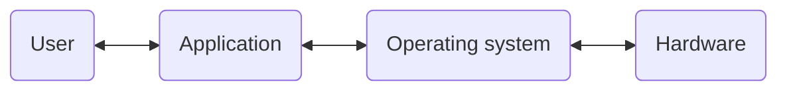
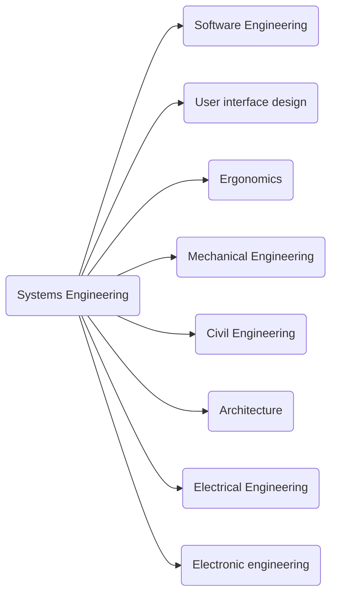
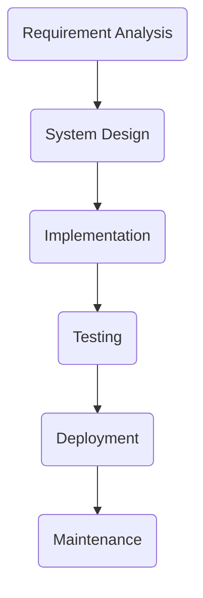
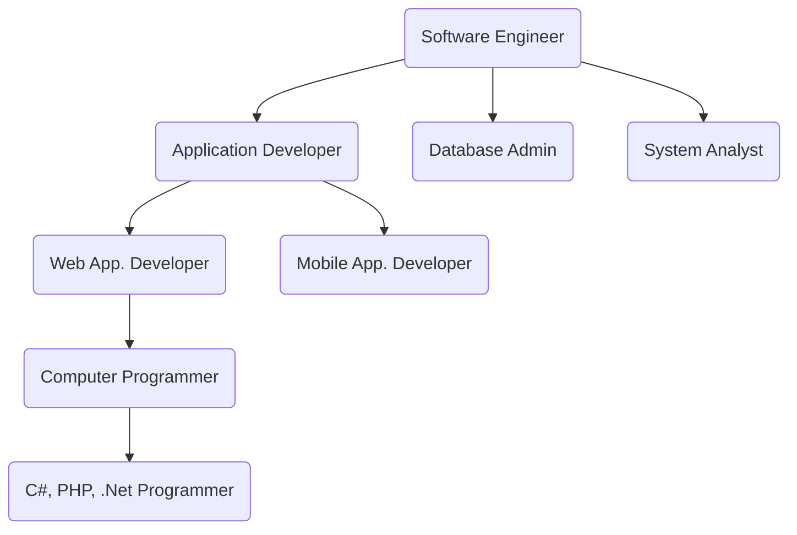

## What is Software Engineering?

**Engineering**
- Engineering is the study of using scientific principals to **design and build** machines, structures, items, etc.
- Engineering is the branch of science and technology concerned with the **design and building** of machines, structures, items, etc.

### Software Engineering
- IEEE Definition:
	- The study of approaches as in the application of a systemic, disciplined, quantifiable approach to the development, operation an maintenance of software; that is, the application of engineering to software
	- Fritz Bauer, a German computer scientist definition:
		- “Software engineering is the establishment and use of sound engineering principles in order to obtain economically software that is reliable and work efficiently on real machines.”

### Science vs. Engineering

|                 | **Differences**   | **Relationship**                    |
| --------------- | ----------------- | ----------------------------------- |
| **Engineering** | Build/Application | Math,  Apply Knowledge,  How? |
| **Science**     | Theory            | Math,  Knowledge,  Why?       |

>In the real world there is no clear border between Science and Engineering

### Engineering vs Software Engineering
Key differences:
- The final product is intangible
- Software engineering has a short history relative to other Engineering disciplines
- There so no standard process when developing software

### Software Engineering vs Computer Engineering
Computer Engineering deals with designing, developing, and operating computer systems. In contrast to SE, it emphasizes _solving problems_ in _digital hardware_ and at the _hardware-software interface_

### Software Products
- A software product is **merchandise** consisting of a computer program that is offered for sale
- A software product is a **software system** delivered to the customer with the **documentation** that describes how to install an use the system. In certain cases, software products may be part of system products where hardware, as well as software, is delivered to a customer

### Types of Software Products
- **Application Software**: web application, user interface software
- **Middle-ware**: database, relational database management system
- **Embedded software**: software that works in routers, smartphones
- **Real time embedded software**: software that works in airplanes, rail train control systems, etc

### Relationship between Engineering an Software Engineering
You can say that _Software Engineering_ is a **subset** of the Engineering discipline

### The process of SWE
Basic tasks of SWE
- Requirement gathering
- High-level design
- Low-level design
- Coding
- Testing
- Deployment
- Maintenance

1. Requirements:
	-  A requirement is a singular documented **physical or functional need** that a particular design, product or process aims to satisfy.
		- Understanding
		- Feasibility research
		- Negotiation
		- Requirements changes always happen
2. System design
	- Requirements decomposition
	- Specification
	- Tools selection
3. Software design document
	- Data flow
	- Object-oriented design
	- UML (Unified Modeling Language) Diagrams
4. Implementation
	- Coding
	- **Bug fixing**
		- Fixing one bug often creates new bugs
			- The bug fix is incorrect
			- The fix breaks other code that depends on the original buggy behavior
			- The fix may change system behavior
5. Testing
	- **Foundation is requirements**
	- Specification
6. Deployment
	- **The action of bringing resources into effective action**
	- It involves the following:
		- New or new version
		- User training
		- On-site support while the users get familiar with the system
		- Bug-fix
7. Maintenance
	- Software maintenance is the **modification of a software product** after delivery to correct faults, to improve performance, or other attributes.
	- It involves the following
		- Customer support
		- Bug Fixes

### SWE vs. Developer / Programmer

**Roles and their knowledge and skills**
_Software Engineer_:
- Has specific academic degree
- Some knowledge of engineering
- Capable of designing systems used by developers and programmers
- Lead developers and teams

_Programmer_:
- Writes code
- _Understands_ and _utilizes_ various **algorithms**
- Follows the specifications in the **software design document**

_Developer/Analyst_:
- Super type programmer
- Gathers requirements
- Designs and implements applications
- Writes technical documentation
