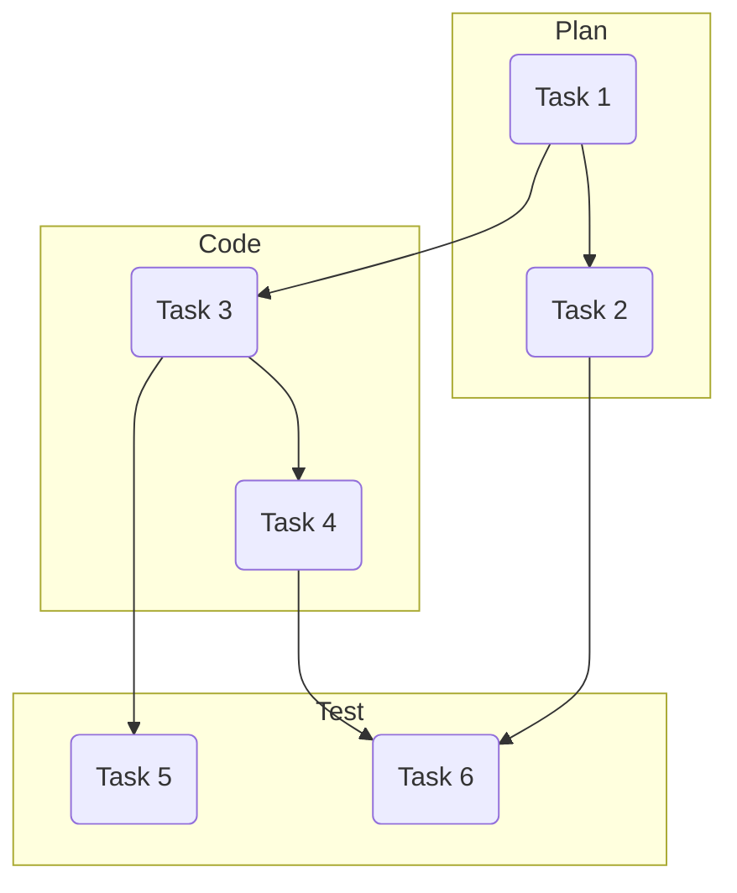
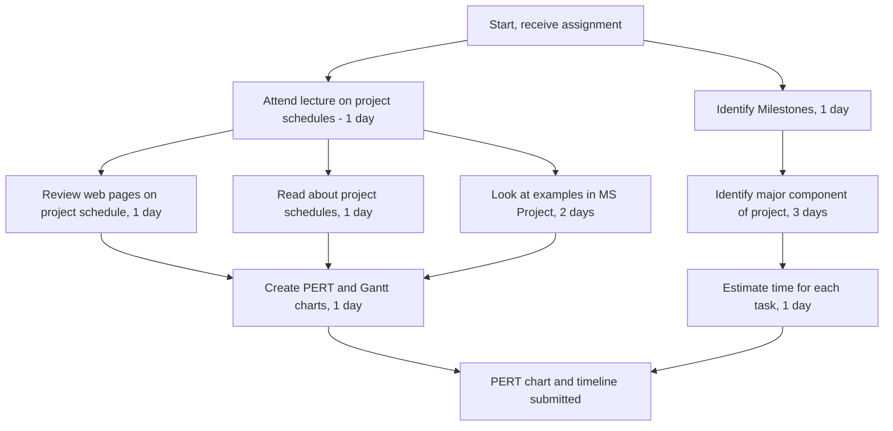

## Documentation
Documentation is important at every step of the software development cycle and a Source Control Management (SCM) system is one of the first tools utilized when starting a new project (Git).

### Benefits of using documents:
- Keep the team members on track
- Provides clear direction for work
- Prevents conflicts
- Produce high quality software products

### Seven Features of a Good Documentation System:
- Document sharing
- Prevent multiple users from changing a file at the same time
- Fetch the latest version of a file
- Fetch previous versions of a file
- Search through files by keyword
- Visualize changes made to a file
- Compare two versions of a file to see the differences

### Documentation types
- Requirements file
- System design file/ High-level design file
- Software specification document/Software design document (low-level design document)
- Software coding standard (best practices)
- Software testing procedures (unit testing, integration)
- Meeting notes
- Release notes

>Include Revision, Author, Date, Status and Description

## Project Management
The application of processes, methods, skills. knowledge and experience to achieve specific project **objectives** according to the project acceptance criteria within agree parameters.

#### Why is project management necessary?
It ensures that goals are set, tracked, and eventually met. It also keeps team members on track and focused on the problems at hand

> [!Important]
> **4 P's of Project management**:
> - **P**eople
> - **P**roduct
> - **P**rocess
> - **P**roject

## Project management Tools
### PERT Charts
**Program Evaluation and Review Technique**(PERT) charts are graphs that use nodes (circles or boxes) and links (arrows) to show the precedence relationships among the tasks in a project.
>The format of PERT charts can be varied

#### PERT Chart Examples:

#### Critical path method
A technique for planning, managing and analyzing the timing of a project

#### Critical path
_The longest duration path through the project network activities_. If any task along the critical path is delayed, the project's _final completion is also delayed_

#### 6 Benefits of using Critical Path methods:
- Visualizes project in clear graphical form
- Defines the most important tasks
- Saves time and helps manage deadlines
- Helps to compare planed vs real status
- Identifies all critical activities that need attention
- Makes dependencies clear and transparent

#### Gantt charts

## Software Cost Estimation Models
A kind of bar chart invented by Henry Gantt in the 1910s to show a project schedule with respect to time periods.

Example:

```mermaid
gantt
    title Project Activities
    dateFormat W
    axisFormat %W
    
    Planning   : 1, 3w
    Design     : 3, 6w
    Coding     : 6, 9w
    Testing    : 7, 3w
    Delivery   : 10, 1w
```

| Advantages                                                                                                           | Disadvantages                                                                                                  |
| -------------------------------------------------------------------------------------------------------------------- | -------------------------------------------------------------------------------------------------------------- |
| - Simple - Good visual communication - Task duration can be compared easily - Good for scheduling resources | - Dependencies are more difficult to visualise - Minor changes in data can cause major changes in the chart |
### Gantt vs PERT

| Gantt                            | PERT                                      |
| -------------------------------- | ----------------------------------------- |
| Shows duration of tasks          | Shows dependencies between tasks          |
| Shows time overlap between tasks | Shows which tasks can be done in parallel |
| Shows slack time                 | Shows slack time by data in rectangles    |
### Software Cost Estimation Models

#### COCOMO Model
**CO**nstructive **CO**st **MO**del
- A software cost estimate model for software projects that were created by Barry Boehm in the 1970s and published in 1981 in his book

#### Static Single Variable Model
Used to estimate the effort, cost and development time for a software project which depends on a single variable.

#### Static Multi-Variable Model
Used to estimate the effort, cost  and development time for a software project which depends on multiple internal or external variables

## Risk Management
Risk management is a process that allows individual risk events and overall risks to be understood and managed proactively, optimizing success by minimizing threats and maximizing opportunities

> [!Important]
> **Risk management steps**
> For each task, determine the following:
> 1. Likelihood
> 2. Severity/impact
> 3. Consequence
> 4. Workaround

