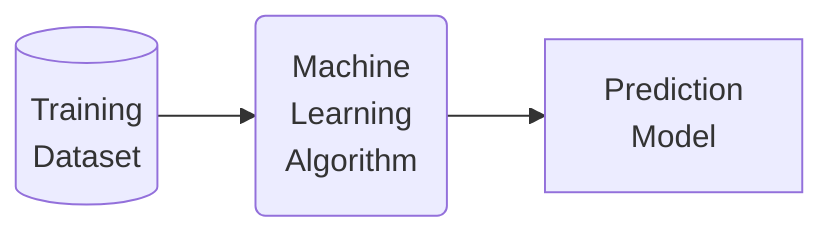

## What is Predictive Analytics

**Predictive data analytics** is the process of moving from **data** to **insights** to **decisions**.
**Example Applications:**
- Price Prediction 
- Fraud Detection 
- Diagnosis 
- Document Classification
- etc.

## What is Machine Learning
There is two types of Machine learning techniques **Supervised** and **Unsupervised**
- **Supervised**: Machine Learning model automatically learns the relationship between a set of **descriptive features** and a **target feature** from a set of historical examples.
- **Unsupervised**

## Roadmap of Machine Learning

Using ML to induce a prediction model from a training dataset.


Using the model to make predictions for new query instances

**Example Dataset**:

| ID  | Occupation   | Age | Ratio | Outcome |
| --- | ------------ | --- | ----- | ------- |
| 1   | industrial   | 34  | 2.96  | repaid  |
| 2   | professional | 41  | 4.64  | default |
| 3   | professional | 36  | 3.22  | default |
| 4   | professional | 41  | 3.11  | default |
| 5   | industrial   | 48  | 3.80  | default |
| 6   | industrial   | 61  | 2.52  | repaid  |
| 7   | professional | 37  | 1.50  | repaid  |
| 8   | professional | 40  | 1.93  | repaid  |
| 9   | industrial   | 33  | 5.25  | default |
| 10  | industrial   | 32  | 4.15  | default |
What is the relationship between the **descriptive features** and the **target feature**?

```python
if Ratio > 3:
	Outcome = 'default'
else:
	Outcome = 'repay'
```
This is an extremely basic example of a **prediction model** as well as an example of a **consistent** prediction model.

>[!Tip] Notice
> that this model is not using all the features available in the dataset and that it uses a **derived feature**. **Feature design** and **feature selection** are two important topics in machine learning that will be encountered multiple times when studying


## How does Machine Learning work?
- Machine learning algorithms work by searching through a set of possible prediction models for the model that best captures the relationship between features and the target feature.
- An obvious search criteria to drive this search is to look for models that are **consistent** with the data
- However, because a training dataset is only a sample ML is am **ill-posed** problem