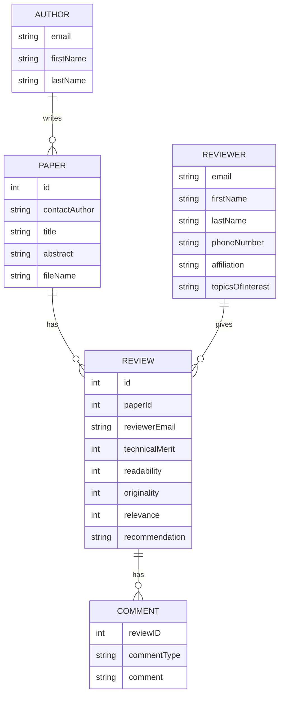

### Question 1
Design an entity–relationship diagram for the CONFERENCE_REVIEW database in which researchers submit their research papers for consideration. Reviews by reviewers are recorded for use in the paper selection process. The database system caters primarily to reviewers who record answers to evaluation questions for each paper they review and make recommendations regarding whether to accept or reject the paper.

The data requirements are summarized as follows: 
- Authors of papers are uniquely identified by email ID. First and last names are also recorded. 
- Each paper is assigned a unique identifier by the system and is described by a title, abstract, and the name of the electronic file containing the paper. 
- A paper may have multiple authors, but one of the authors is designated as the contact author. 
- Reviewers of papers are uniquely identified by e-mail address. Each reviewer’s first name, last name, phone number, affiliation, and topics of interest are also recorded. 
- Each paper is assigned between two and four reviewers. A reviewer rates each paper assigned to him or her on a scale of 1 to 10 in four categories: technical merit, readability, originality, and relevance to the conference. Finally, each reviewer provides an overall recommendation regarding each paper. 
- Each review contains two types of written comments: one to be seen by the review committee only and the other as feedback to the author(s).

### Question 2
UPS prides itself on having up-to-date information on each shipped item's processing and location. To do this, UPS relies on a company-wide information system. Shipped items are the heart of the UPS product tracking information system. Shipped items can be characterized by item number (unique), weight, dimensions, insurance amount, destination, and final delivery date. Shipped items are received into the UPS system at a single retail center. Retail centers are characterized by their type, uniqueID, and address. Shipped items arrive at their destination via one or more standard UPS transportation events (i.e., flights, truck deliveries). These transportation events are characterized by a unique scheduleNumber, a type (e.g, flight, truck), and a deliveryRoute. 

From the requirements above, identify the following. 
- the entities, 
- the attributes 
- relationships with cardinality

**Entities:**
1. Shipped Item
2. Retail Center
3. Transportation Event

**Attributes:**
1. Shipped Item: item number (unique), weight, dimensions, insurance amount, destination, final delivery date
2. Retail Center: type, uniqueID, address
3. Transportation Event: unique scheduleNumber, type (e.g., flight, truck), deliveryRoute

**Relationships with Cardinality:**
1. A `Shipped Item` is received at one `Retail Center` (1:1)
2. A `Shipped Item` arrives at its destination via one or more `Transportation Events` (1:N)
3. A `Transportation Event` can be associated with one or more `Shipped Items` (1:N)