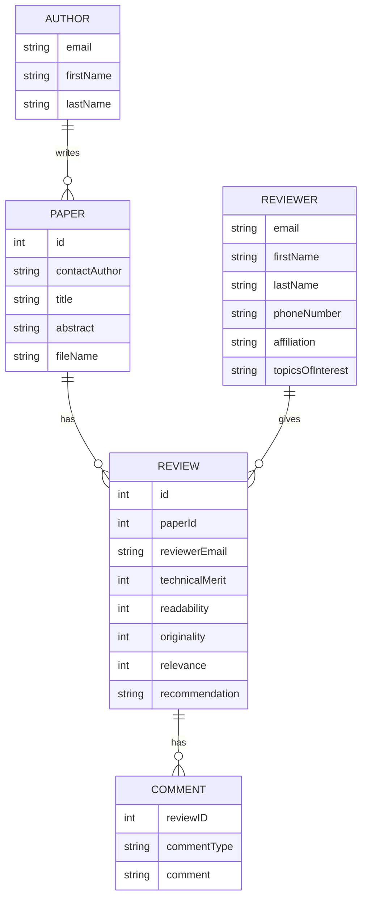
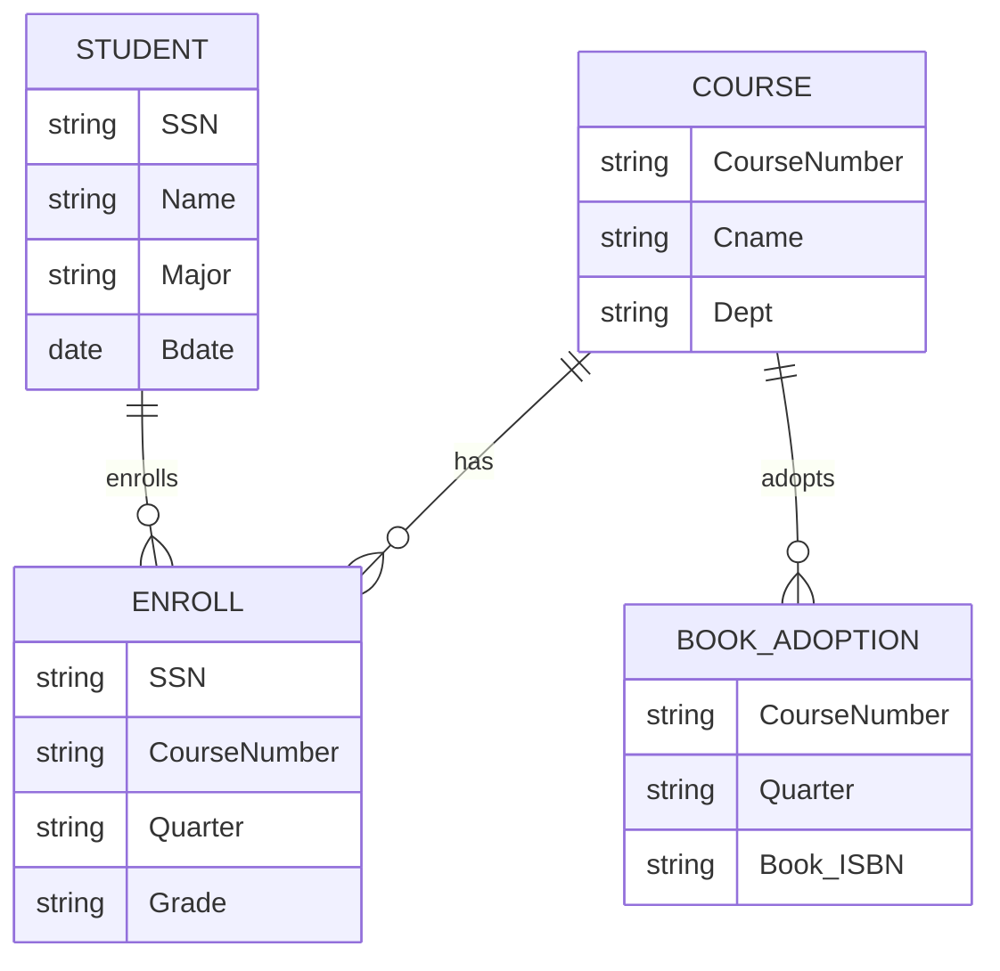

### Question 1
Design an entity–relationship diagram for the CONFERENCE_REVIEW database in which researchers submit their research papers for consideration. Reviews by reviewers are recorded for use in the paper selection process. The database system caters primarily to reviewers who record answers to evaluation questions for each paper they review and make recommendations regarding whether to accept or reject the paper.

The data requirements are summarized as follows: 
- Authors of papers are uniquely identified by email ID. First and last names are also recorded. 
- Each paper is assigned a unique identifier by the system and is described by a title, abstract, and the name of the electronic file containing the paper. 
- A paper may have multiple authors, but one of the authors is designated as the contact author. 
- Reviewers of papers are uniquely identified by e-mail address. Each reviewer’s first name, last name, phone number, affiliation, and topics of interest are also recorded. 
- Each paper is assigned between two and four reviewers. A reviewer rates each paper assigned to him or her on a scale of 1 to 10 in four categories: technical merit, readability, originality, and relevance to the conference. Finally, each reviewer provides an overall recommendation regarding each paper. 
- Each review contains two types of written comments: one to be seen by the review committee only and the other as feedback to the author(s).

### Question 2
UPS prides itself on having up-to-date information on each shipped item's processing and location. To do this, UPS relies on a company-wide information system. Shipped items are the heart of the UPS product tracking information system. Shipped items can be characterized by item number (unique), weight, dimensions, insurance amount, destination, and final delivery date. Shipped items are received into the UPS system at a single retail center. Retail centers are characterized by their type, uniqueID, and address. Shipped items arrive at their destination via one or more standard UPS transportation events (i.e., flights, truck deliveries). These transportation events are characterized by a unique scheduleNumber, a type (e.g, flight, truck), and a deliveryRoute. 

From the requirements above, identify the following. 
- the entities, 
- the attributes 
- relationships with cardinality

**Entities:**
1. Shipped Item
2. Retail Center
3. Transportation Event

**Attributes:**
1. Shipped Item: item number (unique), weight, dimensions, insurance amount, destination, final delivery date
2. Retail Center: type, uniqueID, address
3. Transportation Event: unique scheduleNumber, type (e.g., flight, truck), deliveryRoute

**Relationships with Cardinality:**
1. A `Shipped Item` is received at one `Retail Center` (1:1)
2. A `Shipped Item` arrives at its destination via one or more `Transportation Events` (1:N)
3. A `Transportation Event` can be associated with one or more `Shipped Items` (1:N)

### Question 3
The following tables form part of a database held in a relational DBMS. Identify the foreign keys in this schema. Explain how the entity and referential integrity rules apply to these relations. 
	`Hotel` - (`hotelNo`, `hotelName`, `city`) 
	`Room` - (`roomNo`, `hotelNo`, `type`, `price`) 
	`Booking` - (`hotelNo`, `guestNo`, `dateFrom`, `dateTo`, `roomNo`) 
	`Guest` - (`guestNo`, `guestName`, `guestAddress`) 
	where Hotel contains hotel details and hotelNo is the primary key; 
	Room contains room details for each hotel and (roomNo, hoteINo) forms the primary key; 
	Booking contains details of bookings and (hoteINo, guestNo, dateFrom) forms the primary key; 
	Guest contains guest details and guestNo is the primary key.

In the given schema, the foreign keys are as follows:
1. In the `Room` table, `hotelNo` is a foreign key that references `hotelNo` in the `Hotel` table.
2. In the `Booking` table, `hotelNo` is a foreign key that references `hotelNo` in the `Hotel` table, `guestNo` is a foreign key that references `guestNo` in the `Guest` table, and `roomNo` is a foreign key that references `roomNo` in the `Room` table.

Entity integrity rules ensure that the primary key of each entity is unique and not null. In this schema, this applies to `hotelNo` in `Hotel`, `(roomNo, hotelNo)` in `Room`, `(hotelNo, guestNo, dateFrom)` in `Booking`, and `guestNo` in `Guest`. Each of these primary keys must be unique within its table and cannot be null.

Referential integrity rules ensure that any foreign key value can only be in one of two states. The foreign key value can either match a primary key value in another table or it can be null. This means that if a value exists, it must correspond to an existing primary key in another table. In this schema, this applies to `hotelNo` in `Room` and `Booking`, `guestNo` in `Booking`, and  `roomNo` in `Booking`. Each of these foreign keys must either match a primary key in its referenced table or be null.

### Question 4
Consider the following relations for a database that keeps track of student enrollment in courses and the books adopted for each course. Draw a relational schema diagram specifying the foreign keys for this schema. 
	STUDENT (`SSN`, `Name`, `Major`, `Bdate`) 
	COURSE (`Course#`, `Cname`, `Dept`) 
	ENROLL (`SSN`, `Course#`, `Quarter`, `Grade`) 
	BOOK_ADOPTION (`Course#`, `Quarter`, `Book_ISBN`)

### Question 5
For the following binary relationships, suggest cardinality ratios based on the common-sense meaning of the entity types. Please make sure to mention any assumptions you make in your statements clearly.

| Entity 1 | Cardinality Ratio | Entity 2 |
| ---- | ---- | ---- |
| STUDENT | 1:1 | SOCIAL_SECURITY_CARD |
| STUDENT | N:M | TEACHER |
| CLASSROOM | 1:N | WALL |
| COUNTRY | 1:1 | CURRENT_PRESIDENT |
| CLASS | 1:N | INSTRUCTOR |
| INSTRUCTOR | 1:1 | OFFICE |
**Assumptions:**
- **STUDENT - SOCIAL_SECURITY_CARD**: Each student has one social security card, and each social security card belongs to one student.
- **STUDENT - TEACHER**: A student can have multiple teachers (for different subjects), and a teacher can have multiple students.
- **CLASSROOM - WALL**: A classroom has multiple walls, but a wall belongs to one classroom.
- **COUNTRY - CURRENT_PRESIDENT**: Each country has one current president, and each current president governs one country. This assumes a system of government where a country is led by a single president.
- **CLASS - INSTRUCTOR**: A class can have multiple instructors (for example, a main instructor and assistant instructors), but an instructor is assigned to one class at a time.
- **INSTRUCTOR - OFFICE**: Each instructor has one office, and each office belongs to one instructor.