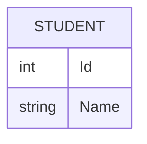

### Definitions
#defn
**Data** - known facts that can be recorded and have an implicit meaning. is usually unstructured

**Information** - Structured form of data where useful information and relationships are more easily found.

**Database** - a collection of related data
- Shared collection of logically related data, designed to meet the information needs of an organization
- system catalog (metadata) provides a description of data to enable program-data independence 
- logically related data comprises entities, attributes, and relationships of an organization's information

**Metadata** (or catalog) - describes attributes of your data that can be important to know, but may not be immediately relevant to your data’s primary function

DBMS - **D**ata**B**ase **M**anagement **S**ystem (Postgress, MySQL, SQLite, etc.) Supports Create Retrieve Update Delete operations

---
### File based data storage vs Relational data storage
Cons
- Inconsistant
- Redundant information might be copied
- Compatibility
- Tedious

---
### Recent developments
- Social networks - social graphs
- big data storage systems - large clusters of distributed computing systems
- NoSQL
- Cloud computing

### Typical DBMS functionality
- **Define** a database in terms of datatypes, structure, and constraints
- Construct or load contents on a secondary storage medium
- Manipulate the database using CRUD operations, 
- generates a catalog(or metadata) in order to work with different database applications
- Program-Data independence
- Data Abstraction
- multiple views of data
- sharing of data
- concurrency

### Database users
Actors on the scene
- those who use and control database content
- Database Administrators
	- authorizes access the the database and coordinates and monitors its use
- Database Designers
	- define the content, structure, constraints, and functions or transactions on the database
- end-users
	- use the data for queries, reports and a portion of them update the database
	- can be categorized into 
		- casual - access DB occasionally when needed
		- naive - 
		- sophisticated - use many tools in the form of software packages that work closely with the stored DB
		- stand-alone - mostly personal DBs using ready-to-use packaged applications

Workers behind the scene
- those who create and update the DBMS software
- system designers and implementors
- tool developers
- operators and maintenance personnel

---
### Example database
mini-world - part of the university environment

mini-world relationships
- SECTIONS are of specific COURSES
- STUDENTS take SECTIONS
- COURSES have prerequisite COURSES
- INSTRUCTORS teach SECTIONS
- COURSES are offered by DEPARTMENTS
- STUDENTS have GRADES