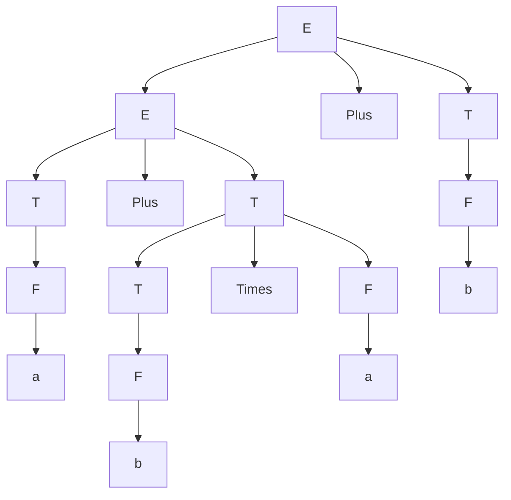
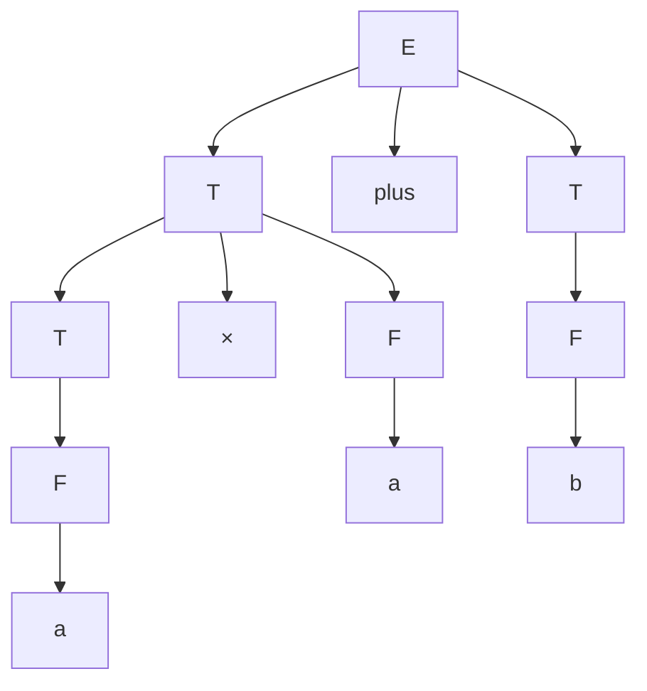
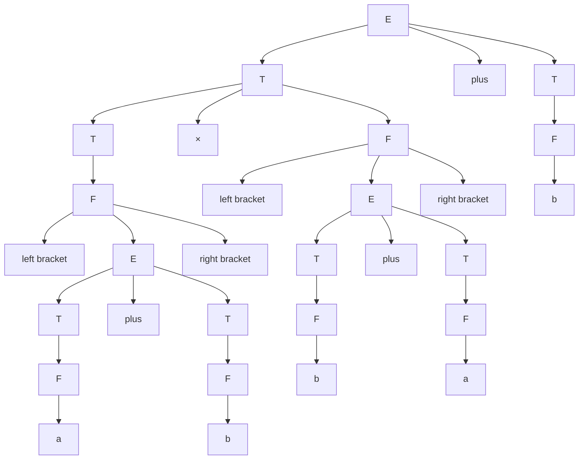
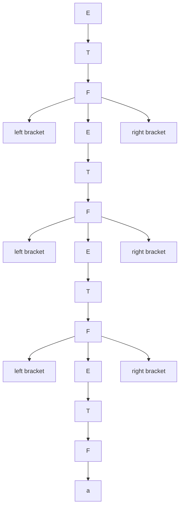
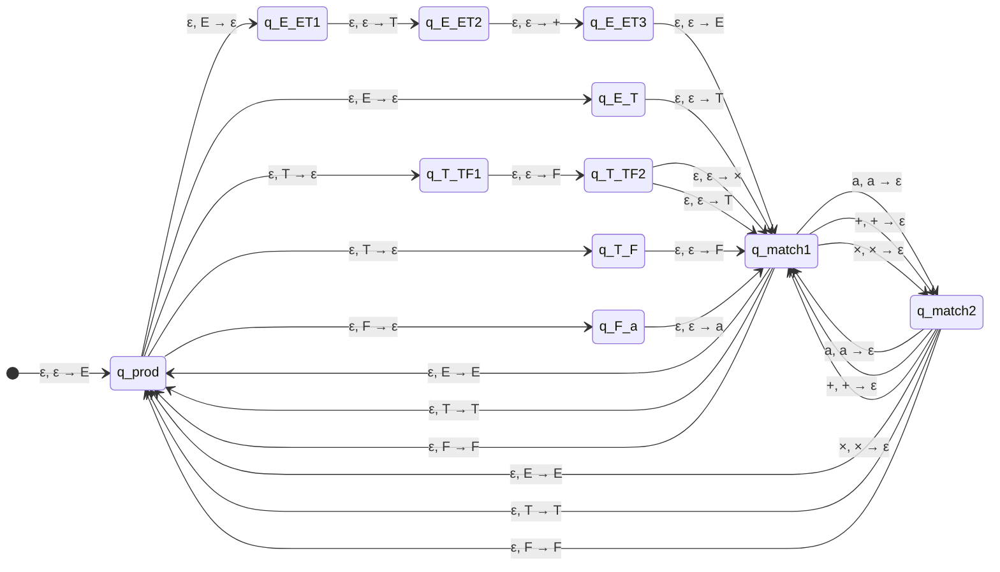

# Question 1 
### 1.A: $a + b \times a + b$
#### Leftmost Derivation
1. $E \to E + T$ 
2. $E + T \to (E + T) + T$ 
3. $(E + T) + T \to (T + T) + T$ 
4. $(T + T) + T \to (F + T) + T$ 
5. $(F + T) + T \to (a + T) + T$ ( $F \to a$)
6. $(a + T) + T \to (a + (T \times F)) + T$ 
7. $(a + (T \times F)) + T \to (a + (F \times F)) + T$ 
8. $(a + (F \times F)) + T \to (a + (b \times F)) + T$ 
9. $(a + (b \times F)) + T \to (a + (b \times a)) + T$ 
10. $(a + (b \times a)) + T \to (a + (b \times a)) + F$ 
11. $(a + (b \times a)) + F \to (a + (b \times a)) + b$ ( $F \to b$)

#### Parse Tree

---

### 1.B: $a \times a + b$
#### Leftmost Derivation
1. $E \to E + T$ 
2. $E + T \to T + T$ 
3. $T + T \to (T \times F) + T$ 
4. $(T \times F) + T \to (F \times F) + T$ 
5. $(F \times F) + T \to (a \times F) + T$ 
6. $(a \times F) + T \to (a \times a) + T$ 
7. $(a \times a) + T \to (a \times a) + F$ 
8. $(a \times a) + F \to (a \times a) + b$ ( $F \to b$)

#### Parse Tree

---

### 1.C: $(a + b) \times (b + a) + b$
#### Leftmost Derivation
1. $E \to E + T$ (for $+ b$)
2. $E + T \to T + T$ 
3. $T + T \to (T \times F) + T$ 
4. $(T \times F) + T \to (F \times F) + T$ 
5. $(F \times F) + T \to ((E) \times F) + T$ ( $F \to (E)$)
6. $((E) \times F) + T \to ((E + T) \times F) + T$ ( $E \to E + T$ for $a + b$)
7. $((E + T) \times F) + T \to ((T + T) \times F) + T$ ( $E \to T$)
8. $((T + T) \times F) + T \to ((F + T) \times F) + T$ ( $T \to F$ for $a$)
9. $((F + T) \times F) + T \to ((a + T) \times F) + T$ ( $F \to a$)
10. $((a + T) \times F) + T \to ((a + F) \times F) + T$ ( $T \to F$ for $b$)
11. $((a + F) \times F) + T \to ((a + b) \times F) + T$ ( $F \to b$)
12. $((a + b) \times F) + T \to ((a + b) \times (E)) + T$ ( $F \to (E)$ for $(b + a)$)
13. $((a + b) \times (E)) + T \to ((a + b) \times (E + T)) + T$ ( $E \to E + T$)
14. $((a + b) \times (E + T)) + T \to ((a + b) \times (T + T)) + T$ ( $E \to T$)
15. $((a + b) \times (T + T)) + T \to ((a + b) \times (F + T)) + T$ ( $T \to F$ for $b$)
16. $((a + b) \times (F + T)) + T \to ((a + b) \times (b + T)) + T$ ( $F \to b$)
17. $((a + b) \times (b + T)) + T \to ((a + b) \times (b + F)) + T$ ( $T \to F$ for $a$)
18. $((a + b) \times (b + F)) + T \to ((a + b) \times (b + a)) + T$ ( $F \to a$)
19. $((a + b) \times (b + a)) + T \to ((a + b) \times (b + a)) + F$ ( $T \to F$ for $b$)
20. $((a + b) \times (b + a)) + F \to ((a + b) \times (b + a)) + b$ ( $F \to b$)

#### Parse Tree

---

### 1.D: $(((a)))$
#### Leftmost Derivation
1. $E \to T$ 
2. $T \to F$ 
3. $F \to (E)$ 
4. $(E) \to (T)$ ( $E \to T$)
5. $(T) \to (F)$ ( $T \to F$)
6. $(F) \to ((E))$ ( $F \to (E)$)
7. $((E)) \to ((T))$ ( $E \to T$)
8. $((T)) \to ((F))$ ( $T \to F$)
9. $((F)) \to (((E)))$ ( $F \to (E)$)
10. $(((E))) \to (((T)))$ ( $E \to T$)
11. $(((T))) \to (((F)))$ ( $T \to F$)
12. $(((F))) \to (((a)))$ ( $F \to a$)

#### Parse Tree

# Question 2

# Question 3 
The grammar is ambiguous. The string $00111$ has two different leftmost derivations:

**First Leftmost Derivation:**  
$$S \to A \to 0S1S \to 0B1S \to 00S1S \to 0011S \to 00111$$

**Second Leftmost Derivation:**  
$$S \to B \to 0S \to 0A \to 00S1S \to 0011S \to 00111$$

These derivations correspond to different parse trees, proving the grammar’s ambiguity.

# Question 4
#### New Start Variable

New start variable $S'$
- $S' \to A$

Grammar becomes:
- $S' \to A$
- $A \to ABC \mid AC \mid B$
- $C \to BC1 \mid B \mid \epsilon$
- $B \to 00 \mid \epsilon$

---
#### Remove Nullable Variables

- $B \to \epsilon$, so $B$ is nullable.
- $C \to \epsilon$, so $C$ is nullable.

- **$S' \to A$**:
  - $A$ is not directly nullable yet, so this remains $S' \to A$.
  - However, since $A$ can derive $\epsilon$ (e.g., $A \to B \to \epsilon$), and $\epsilon$ is in the language, add $S' \to \epsilon$ after adjusting $A$’s productions.

- **$A \to ABC$**:
  - $B$ is nullable, $C$ is nullable.
  - All combinations:
    - $ABC$ (both present)
    - $AC$ (omit $B$)
    - $AB$ (omit $C$)
    - $A$ (omit both $B$ and $C$)
  - So, $A \to ABC \mid AB \mid AC \mid A$.

- **$A \to AC$**:
  - $C$ is nullable.
  - Combinations:
    - $AC$ (present)
    - $A$ (omit $C$)
  - So, $A \to AC \mid A$

- **$A \to B$**:
  - $B$ is nullable.
  - Combinations:
    - $B$ (present)
    - $\epsilon$ (omit $B$)

- **$C \to BC1$**:
  - $B$ is nullable.
  - Combinations:
    - $BC1$ (present)
    - $C1$ (omit $B$)
  - So, $C \to BC1 \mid C1$.

- **$C \to B$**:
  - $B$ is nullable.
  - Combinations:
    - $B$ (present)
    - $\epsilon$ (omit $B$)

- **$C \to \epsilon$**:
  - Remove this production.

- **$B \to 00$**:
  - No nullable variables, so $B \to 00$.

- **$B \to \epsilon$**:
  - Remove this production.

Grammar becomes:
- $S' \to A \mid \epsilon$
- $A \to ABC \mid AB \mid AC \mid A \mid B$
- $C \to BC1 \mid C1 \mid B$
- $B \to 00$

---
#### Remove Unit Productions

**Eliminate $S' \to A$**:
- $A \to ABC \mid AB \mid AC \mid A \mid B$
- $S' \to ABC \mid AB \mid AC \mid A \mid B \mid \epsilon$.

**Eliminate $A \to A$**:
- $A \to ABC \mid AB \mid AC \mid B$.

**Eliminate $A \to B$**:
- $B \to 00$
- Replace $A \to B$ with $A \to 00$.
- $A \to ABC \mid AB \mid AC \mid 00$.

**Eliminate $C \to B$**:
- $B \to 00$
- Replace $C \to B$ with $C \to 00$.
- $C \to BC1 \mid C1 \mid 00$.

Grammar after eliminating unit productions:
- $S' \to ABC \mid AB \mid AC \mid 00 \mid \epsilon$
- $A \to ABC \mid AB \mid AC \mid 00$
- $C \to BC1 \mid C1 \mid 00$
- $B \to 00$

---
#### Eliminate Useless Symbols
**Derivation to Terminals**:
- $B \to 00$ (terminals).
- $C \to 00$ (terminals), $C \to C1$ (since $C \to 00$, it can reach terminals), $C \to BC1$ (since $B \to 00$, reachable).
- $A \to 00$ (terminals), $A \to AB, AC, ABC$ (all use $B, C$, which reach terminals).
- $S' \to 00$ (terminals), $S' \to ABC, AB, AC$ (reachable).

No useless symbols exist.

Grammar Remains unchanged:
- $S' \to ABC \mid AB \mid AC \mid 00 \mid \epsilon$
- $A \to ABC \mid AB \mid AC \mid 00$
- $C \to BC1 \mid C1 \mid 00$
- $B \to 00$

---
#### Convert to Chomsky Normal Form
**Handle Terminals**:
Replace terminals in productions with more than one symbol by introducing new variables:
- Define $E \to 0$ (for terminal $0$).
- Define $D \to 1$ (for terminal $1$).

- **$A \to 00$**:
  - Replace $00$ with $EE$ (since $E \to 0$).
  - $A \to EE$.

- **$C \to 00$**:
  - $C \to EE$.

- **$B \to 00$**:
  - $B \to EE$.

- **$S' \to 00$**:
  - $S' \to EE$.

- **$C \to BC1$**:
  - Replace $1$ with $D$: $C \to BCD$.

- **$C \to C1$**:
  - Replace $1$ with $D$: $C \to CD$.

**Productions with More Than Two Symbols**:
- **$S' \to ABC$**:
  - Three variables: introduce $P \to BC$, then $S' \to AP$.
- **$A \to ABC$**:
  - Three variables: use $P \to BC$, then $A \to AP$.
- **$C \to BCD$**:
  - Three variables: introduce $Q \to CD$, then $C \to BQ$.

**Grammar in CNF**
- $S' \to AP \mid AB \mid AC \mid EE \mid \epsilon$
- $A \to AP \mid AB \mid AC \mid EE$
- $C \to BQ \mid CD \mid EE$
- $B \to EE$
- $P \to BC$
- $Q \to CD$
- $E \to 0$
- $D \to 1$

# Question 5
Let $L$ be a context-free grammar (CFG) that generates the language of all strings over the alphabet $\{0, 1\}$ where the number of 0s is equal to the number of 1s plus 2:

- **Start variable**: $S$
- **Productions**:
  - $S \to 0 A 0 \mid 0 B \mid C 0$
  - $A \to 0 A 1 \mid 1 A 0 \mid \epsilon$
  - $B \to 0 A \mid 1 A 0$
  - $C \to 0 A 1 \mid 1 A$

#### Justification

The language we need to generate is $L = \{ w \in \{0, 1\}^* \mid n_0(w) = n_1(w) + 2 \}$, where $n_0(w)$ is the number of 0s and $n_1(w)$ is the number of 1s in the string $w$. This means every string in the language must have exactly two more 0s than 1s. The grammar above achieves this by ensuring that each generated string consists of a balanced part (with an equal number of 0s and 1s) plus exactly two additional 0s.

- **Base Case**: $S \to 0 B \to 0 0$ generates $00$ (2 0s, 0 1s), which satisfies the condition.
- **Inductive Step**: Each production either:
  - Adds a 0 without a 1 ($S \to 0 S \mid S 0$, $B \to 0$, $C \to 0$),
  - Balances 0s and 1s ($A$, $B \to 0 A 1$, etc.),
  - Ensures the net excess of 0s over 1s remains exactly 2 by combining one extra 0 from $B$ or $C$ with another from $S$.

Thus, every derivation from $S$ produces a string where $n_0 = n_1 + 2$, and all such strings can be generated by placing two extra 0s around or within balanced substrings, which this grammar achieves efficiently.

# Question 6
**Language $L_1 = \{ x^n y^m x^m z^n \mid n > 0, m > 0 \}$** is context-free.
**Language $L_2 = \{ x^n y^n x^n z^m \mid n > 0, m \geq 0 \}$** is not context-free.

---
### Proof that $L_1$ is Context-Free
#### Context-Free Grammar for $L_1$:
- **Start symbol**: $S$
- **Productions**:
  - $S \to x A z$
  - $A \to x A z \mid B$
  - $B \to y B y \mid y y$

This CFG generates all strings in $L_1$, so $L_1$ is context-free.

---
### Proof that $L_2$ is Not Context-Free

To show that $L_2$ is not context-free, we use the **Pumping Lemma for context-free languages**.

#### Pumping Lemma Statement:
If $L_2$ is context-free, there exists a constant $p$ such that for any string $w \in L_2$ with $|w| \geq p$, we can write $w = uvxyz$ where:
1. $|vxy| \leq p$
2. $|vy| \geq 1$
3. For all $k \geq 0$, $uv^k x y^k z \in L_2$.

#### Proof by Contradiction:
Assume $L_2$ is context-free. Let $p$ be the pumping constant.

Choose $w = x^p y^p x^p$ (where $n = p > 0, m = 0 \geq 0$):
- $w \in L_2$
- $|w| = p + p + p = 3p \geq p$

Now, divide $w = uvxyz$ with $|vxy| \leq p$ and $|vy| \geq 1$. Since $|vxy| \leq p$, $vxy$ cannot span all three parts ($x^p, y^p, x^p$). We consider possible cases:

- **Case 1: $vxy$ is within the first $x^p$**  
  - $v$ and $y$ are $x$'s, $u = x^a, v = x^b, x = x^c, y = x^d, z = x^{p-a-b-c-d} y^p x^p$ (where $b + c + d \leq p, b + d \geq 1$).
  - Pump with $k = 2$: $uv^2 x y^2 z = x^{p + b + d} y^p x^p$.
  - This has more $x$'s in the first part than $y$'s or the second $x^p$, so it’s not in $L_2$.

- **Case 2: $vxy$ is within $y^p$**  
  - $v$ and $y$ are $y$'s, $u = x^p y^a, v = y^b, x = y^c, y = y^d, z = y^{p-a-b-c-d} x^p$.
  - Pump with $k = 2$: $uv^2 x y^2 z = x^p y^{p + b + d} x^p$.
  - The number of $y$'s exceeds $n$, so it’s not in $L_2$.

- **Case 3: $vxy$ is within the second $x^p$**  
  - $v$ and $y$ are $x$'s, $u = x^p y^p x^a, v = x^b, x = x^c, y = x^d, z = x^{p-a-b-c-d}$.
  - Pump with $k = 2$: $uv^2 x y^2 z = x^p y^p x^{p + b + d}$.
  - The third part has more $x$'s than the first, so it’s not in $L_2$.

- **Case 4: $vxy$ straddles $x^p y^p$ or $y^p x^p$**  
  - Similar analysis shows pumping disrupts the $x^n y^n x^n$ equality (e.g., adding $x$'s and $y$'s unevenly).

In all cases, pumping produces a string not in $L_2$, contradicting the assumption. Thus, $L_2$ is not context-free.
