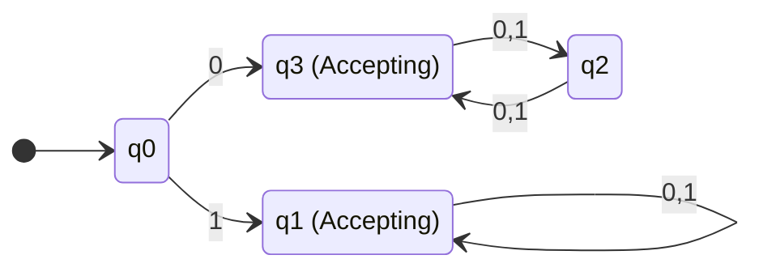
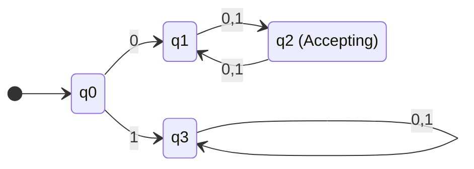
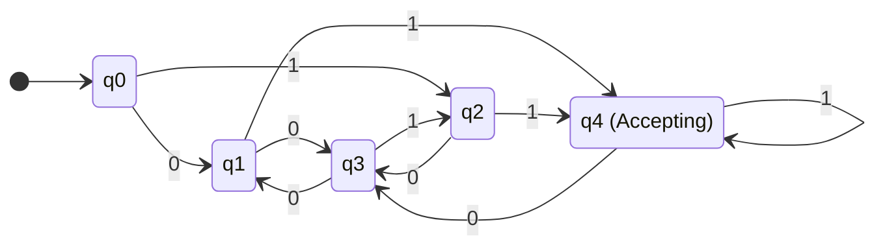
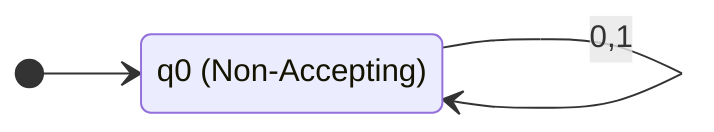
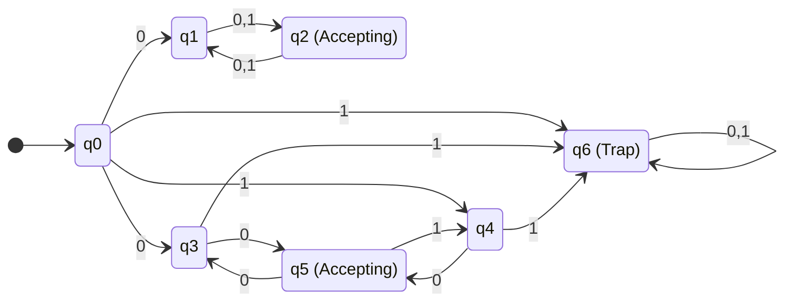
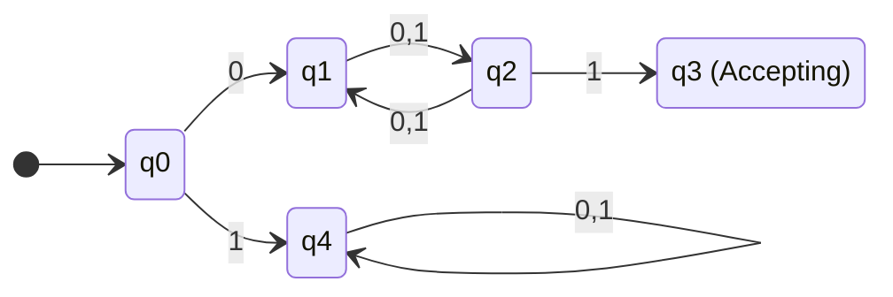
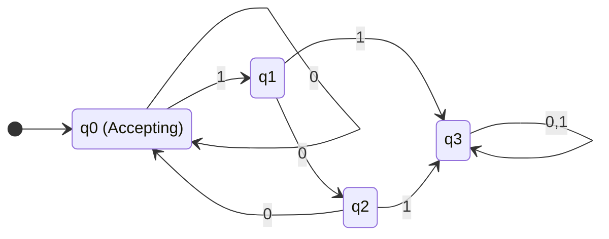
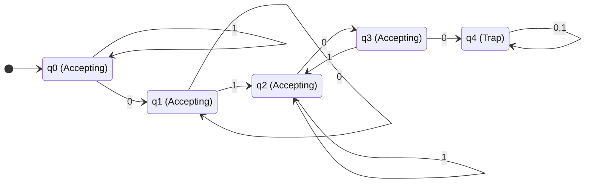
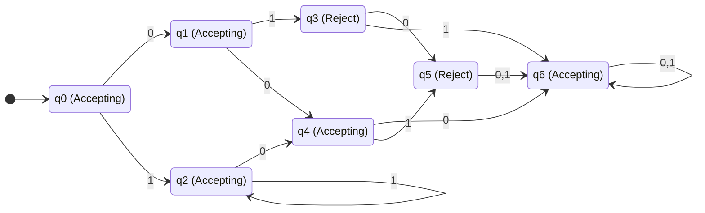

# Question 1
## 1.A

```mermaid
stateDiagram-v2
    direction LR
    [*] --> q0
    q0 --> q1: 1
    q0 --> q3: 0
    q3 --> q2: 0,1
    q2 --> q3: 0,1
    q1 --> q1: 0,1
    q1: q1 (Accepting)
    q3: q3 (Accepting)
```
## 1.B

```mermaid
stateDiagram-v2
    direction LR
    [*] --> q0
    q0 --> q1: 0
    q0 --> q3: 1
    q1 --> q2: 0,1
    q2 --> q1: 0,1
    q3 --> q3: 0,1
    q2: q2 (Accepting)
```
## 1.C

```mermaid
stateDiagram-v2
    direction LR
    [*] --> q0
    q0 --> q1: 0
    q0 --> q2: 1
    q1 --> q3: 0
    q1 --> q4: 1
    q2 --> q3: 0
    q2 --> q4: 1
    q3 --> q1: 0
    q3 --> q2: 1
    q4 --> q3: 0
    q4 --> q4: 1
    q4: q4 (Accepting)
```
## 1.D

```mermaid
stateDiagram-v2
    direction LR
    [*] --> q0
    q0 --> q0: 0,1
    q0: q0 (Non-Accepting)
```
## 1.E

```mermaid
stateDiagram-v2
    direction LR
    [*] --> q0
    q0 --> q1: 0
    q0 --> q6: 1
    q1 --> q2: 0,1
    q2 --> q1: 0,1
    q6 --> q6: 0,1
    q2: q2 (Accepting)
    q0 --> q3: 0
    q0 --> q4: 1
    q3 --> q5: 0
    q3 --> q6: 1
    q4 --> q5: 0
    q4 --> q6: 1
    q5 --> q3: 0
    q5 --> q4: 1
    q6: q6 (Trap)
    q5: q5 (Accepting)
```
## 1.F

```mermaid
stateDiagram-v2
    direction LR
    [*] --> q0
    q0 --> q1: 0
    q0 --> q4: 1
    q1 --> q2: 0,1
    q2 --> q1: 0,1
    q4 --> q4: 0,1
    q2 --> q3: 1
    q3: q3 (Accepting)
```
## 1.G

```mermaid
stateDiagram-v2
    direction LR
    [*] --> q0
    q0 --> q0: 0
    q0 --> q1: 1
    q1 --> q2: 0
    q1 --> q3: 1
    q2 --> q0: 0
    q2 --> q3: 1
    q3 --> q3: 0,1
    q0: q0 (Accepting)
```
## 1.H

```mermaid
stateDiagram-v2
    direction LR
    [*] --> q0
    q0 --> q0: 1
    q0 --> q1: 0
    q1 --> q1: 0
    q1 --> q2: 1
    q2 --> q2: 1
    q2 --> q3: 0
    q3 --> q2: 1
    q3 --> q4: 0
    q4 --> q4: 0,1
    q4: q4 (Trap)
    q0: q0 (Accepting)
    q1: q1 (Accepting)
    q2: q2 (Accepting)
    q3: q3 (Accepting)
```
## 1.I

```mermaid
stateDiagram-v2
    direction LR
    [*] --> q0
    q0 --> q1: 0
    q0 --> q2: 1
    q1 --> q3: 1
    q1 --> q4: 0
    q2 --> q4: 0
    q2 --> q2: 1
    q3 --> q5: 0
    q3 --> q6: 1
    q4 --> q6: 0
    q4 --> q5: 1
    q5 --> q6: 0,1
    q6 --> q6: 0,1
    q0: q0 (Accepting)
    q1: q1 (Accepting)
    q2: q2 (Accepting)
    q4: q4 (Accepting)
    q6: q6 (Accepting)
    q3: q3 (Reject)
    q5: q5 (Reject)
```

