## 1. DFA State Diagrams

For all diagrams, the start state is indicated by an incoming arrow, and accepting states are represented by double circles2.

### 0. Empty Language ($\emptyset$) over $\Sigma=\{a,b\}$

To recognize the empty language, the DFA must have no accepting states3.

- **Step 1:** Create a single non-accepting state4.
    
- **Step 2:** Any input ($a,b$) transitions back to itself.
    

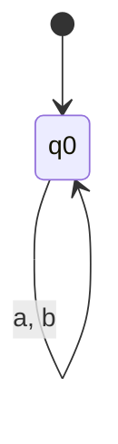

### 1. Language accepting only the empty string ($\epsilon$)
- **Step 1:** The start state must be an accepting state (to accept $\epsilon$)5.
- **Step 2:** Any input ($a$ or $b$) must lead to a "dead" state that never accepts. 
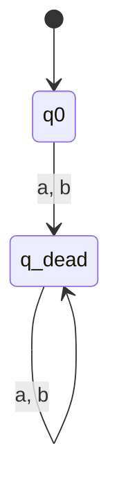

### 2. Length $\ge 3$ and 3rd character is '1'

- **Step 1:** Count the first two characters ($q_0 \to q_1 \to q_2$)6.
    
- **Step 2:** At $q_2$, if the input is '1', go to accepting state $q_3$7.
    
- **Step 3:** If the input is '0', go to dead state $q_d$.
    

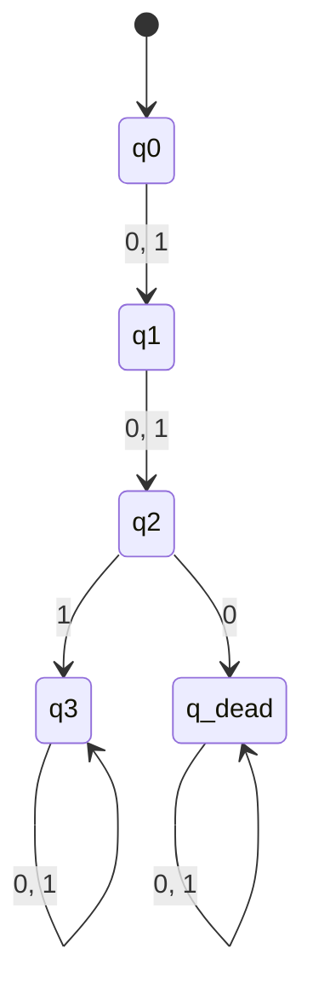

### 3. Odd $a$'s, even $b$'s, starts with $a$

- **Step 1:** If the first character is $b$, transition to a dead state888.
    
- **Step 2:** If the first character is $a$, move to a state tracking parity9.
    
- **States:** $q_{oe}$ (odd $a$, even $b$), $q_{ee}$ (even $a$, even $b$), $q_{oo}$ (odd $a$, odd $b$), $q_{eo}$ (even $a$, odd $b$).
    

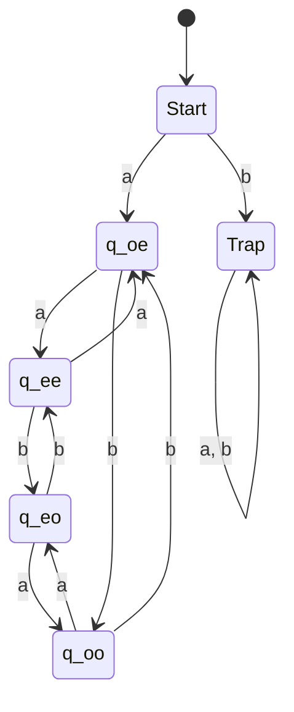

### 4. Does not contain pattern 0100

- **Step 1:** Create states representing progress toward the pattern: $\epsilon, 0, 01, 010$10.
    
- **Step 2:** A "trap" state $q_{0100}$ is reached if the pattern is completed.
    
- **Step 3:** All states except the trap state are accepting.
    

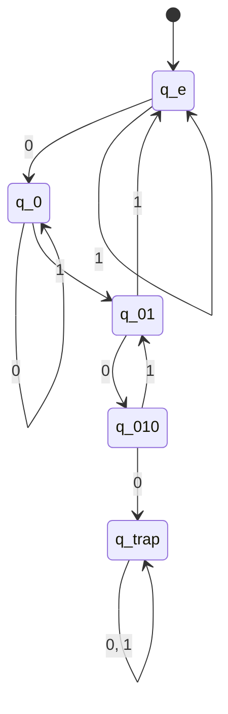

### 5. Exactly one occurrence of substring 11

- **Step 1:** Track progress toward the first "11"11.
    
- **Step 2:** Once "11" is found, track progress toward a second "11".
    
- **Step 3:** Note: "111" contains two occurrences and must be rejected12.
    

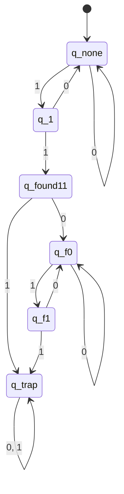

### 8. $L_1 \cup L_2$

$L_1$: Starts with $a$ OR odd length13.

$L_2$: Starts with $b$ AND even length14.

- **Analysis:** If a string starts with $a$, it is in $L_1$. If it starts with $b$ and is odd, it is in $L_1$. If it starts with $b$ and is even, it is in $L_2$.
    
- **Result:** Every string except $\epsilon$ is accepted.
    

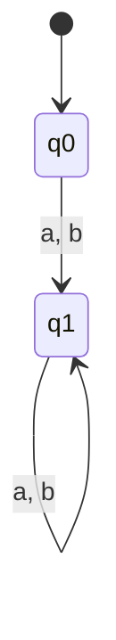

### 9. Every occurrence of '1' followed by at least two '0's

- **Logic:** A '1' must be immediately followed by '00'15.
    
- **States:** $q_0$ (Ready), $q_1$ (Saw 1), $q_2$ (Saw 10).
    

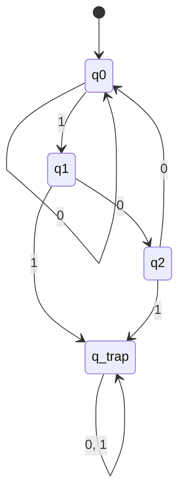

### 11. All strings except $abb$ and $ba$

- **Step 1:** Create a DFA recognizing $\Sigma^*$ and mark states corresponding to $abb$ and $ba$ as non-accepting16.
    

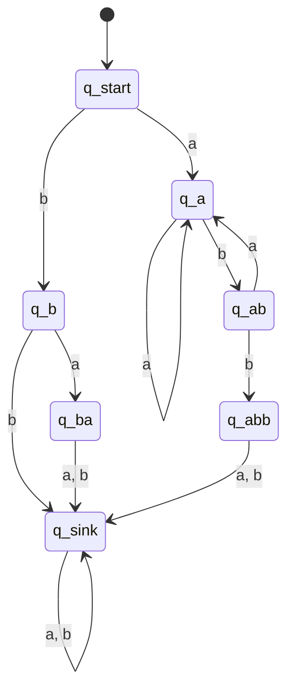

_(Note: $q_{ba}$ and $q_{abb}$ are the only non-accepting states)._

---

## 2. & 3. Advanced DFA/NFA Construction

**Languages:**

- $A = \{w \mid \text{every 1 followed by } \ge 1 \text{ zero}\}$17.
    
- $B = \{w \mid \text{odd number of zeroes}\}$18.
    

### (a) DFA for $A \cup B$

Using product construction:

1. **DFA A States:** $A_0$ (Accept, last was 0/Start), $A_1$ (Wait for 0), $A_{trap}$.
    
2. **DFA B States:** $B_{even}$ (Even 0s), $B_{odd}$ (Accept, Odd 0s).
    
3. **Union:** State $(A, B)$ is accepting if $A$ is accepting OR $B$ is accepting19.
    

### (b) NFA for $(A)^* \circ B$

- **Step 1:** Create NFA for $A^*$. Add $\epsilon$-transitions from accepting states of $A$ back to the start20.
    
- **Step 2:** Add $\epsilon$-transition from the accepting states of $A^*$ to the start state of $B$21.
    

---

## 4. Programming Comments NFA

Recognize strings starting with `/#`, ending with `#/`, with no `#/` in between22222222.

- **Alphabet:** $\Sigma = \{a, b, /, \#\}$23.
    

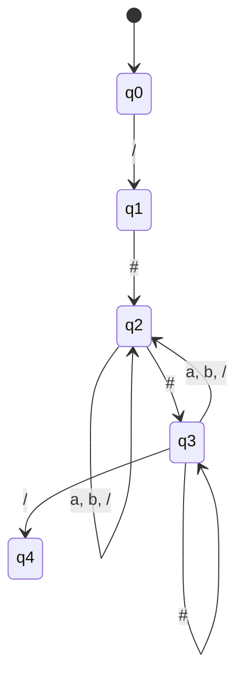

_Logic:_ In $q_3$, if we see another `#`, we stay in $q_3$ because the next character might be `/`. If we see $a, b,$ or $/$, we go back to $q_2$24.

---

## 5. Separated 1s NFA

Two 1s separated by a number of positions that is a multiple of 3 ($3, 6, 9 \dots$)25.

- **Step 1:** Use non-determinism to guess the "first" 1.
    
- **Step 2:** Count 3 transitions.
    
- **Step 3:** Use non-determinism to either count another 3 or look for the "second" 1.
    

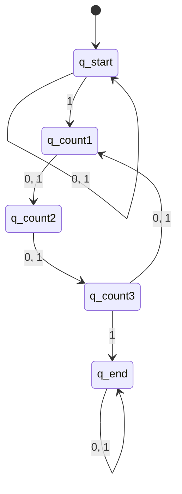

---

## 6. DFA for Even $a$, Odd $b$, No $ab$

- **Simpler Description:** The condition "no $ab$" means all $b$'s must appear before all $a$'s ($w \in b^*a^*$)26.
    
- **Refined Language:** $L = \{b^n a^m \mid n \text{ is odd and } m \text{ is even}\}$27.
    

**DFA States (5 total):**

1. $q_0$: Even $b$, 0 $a$ (Start).
    
2. $q_1$: Odd $b$, 0 $a$ (Accepting).
    
3. $q_2$: Odd $b$, Even $a$ (Accepting).
    
4. $q_3$: Odd $b$, Odd $a$.
    
5. $q_{trap}$: Saw $a$ then $b$.
    

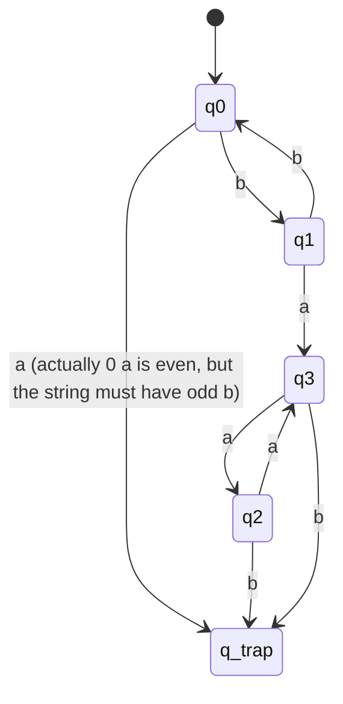

