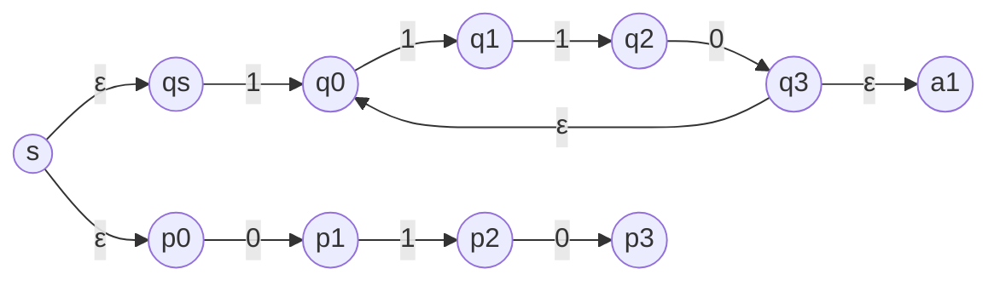
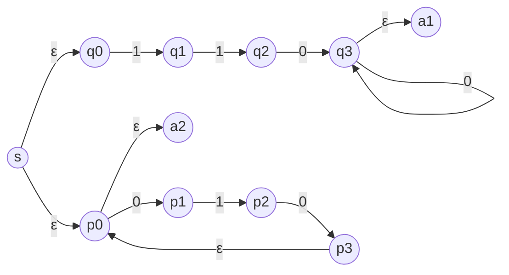
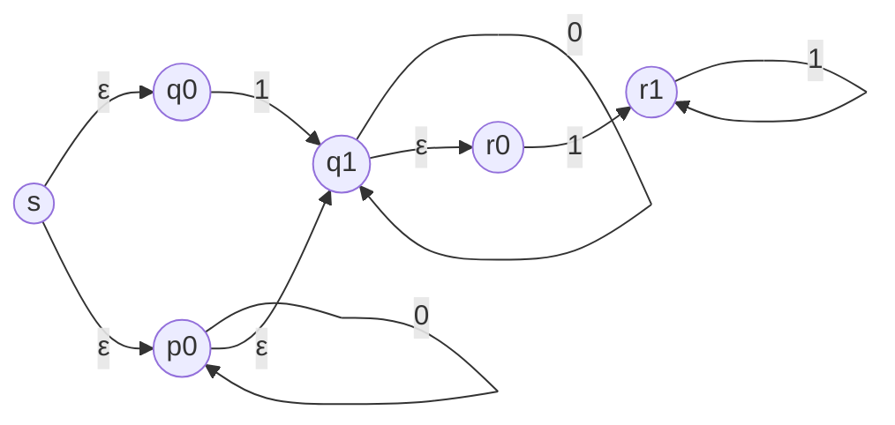

## Question 1
**Give regular expressions generating the following languages over the alphabet $\Sigma= \{ 0,1 \}$:**
1. **L1 = the set of all strings that start with 1 or have odd length**
	1. $1(0|1)^*|0((0|1)(0|1))^*$
2. **L2 = the set of all strings that start with 0 and have even length** 
	2. $1(0|1)^*|0((0|1)(0|1))^*$
3. **L3 = the set of all strings that end with 1 and have even length** 
	1. $(0|1)((0|1)(0|1))^*1$
4. **L1$\cap$L2** 
	2. $\emptyset$
5. **L2$\cup$L3** 
	1. $0(0|1)((0|1)(0|1))^*|(0|1)((0|1)(0|1))^*1$
6. **L2$\cap$L3** 
	2. $0((0|1)(0|1))^*1$
7. **The set of all strings such that every occurrence of 1 is followed by at least two 0s, e.g., 0001000100, 100, 0, 00000000010000000100100 are in this language, but 1011, 1, 101 are not.** 
	1. $(0|1000^*)^*$
8. **The set of all strings that does not contain pattern 0110.** 
	2. $(1+0(0+10)^*(\epsilon+1+11))^*(\epsilon+0(0+10)^*(\epsilon+1+11))$
9. **The set of all strings except 100 and 01.**
	1. $\epsilon|0|1|00|10|11|000|001|010|011|101|110|111|(0|1)4(0|1)^*$

---
## Question 2
**Use the procedure described in Lemma 1.60 to convert the following NFAs to regular expressions:**

### Part A
**Start state $q_{1}$, accepting state $q_{2}$**

|            | 0             | 1                    |$\epsilon$ |
| ---------- | ------------- | -------------------- | ----------- |
| ->$q_{1}$|$\{ q_{2} \}$|$\{ q_{1}, q_{2} \}$|$\emptyset$|
| *$q_{2}$  |$\{ q_{1} \}$|$\emptyset$         |$\emptyset$|

#### Convert NFA to GNFA
**States**:$\{ q_s, q_1, q_2, q_a \}$, where$q_s$is the start state and$q_a$is the accept state.

**GNFA G Transitions**:
- $q_s \to q_1$:$\epsilon$
- $q_s \to q_2$:$\emptyset$
- $q_s \to q_a$:$\emptyset$
- $q_1 \to q_1$: 1
- $q_1 \to q_2$:$0|1$
- $q_1 \to q_a$:$\emptyset$
- $q_2 \to q_1$: 0
- $q_2 \to q_2$:$\emptyset$
- $q_2 \to q_a$:$\epsilon$

#### Eliminate States
Since the GNFA has 4 states ($k = 4 > 2$), we eliminate states that are neither the start ($q_s$) nor accept ($q_a$) state, updating transitions using the formula:
$$\delta'(q_i, q_j) = (R_1)(R_2)^* (R_3) \cup R_4$$
where:
-$R_1 = \delta(q_i, q_{\text{rip}})$
-$R_2 = \delta(q_{\text{rip}}, q_{\text{rip}})$
-$R_3 = \delta(q_{\text{rip}}, q_j)$
-$R_4 = \delta(q_i, q_j)$
-$q_{\text{rip}}$is the state being removed.

**GNFA G' Transitions**:
-$q_s \to q_2$:$1^* (0|1)$
-$q_s \to q_a$:$\emptyset$
-$q_2 \to q_2$:$0 1^* (0|1)$
-$q_2 \to q_a$:$\epsilon$

**Remove $q_2$**:
- New states:$\{ q_s, q_a \}$($k = 2$).
- Update$q_s \to q_a$:
  -$R_1 = \delta(q_s, q_2) = 1^* (0|1)$
  -$R_2 = \delta(q_2, q_2) = 0 1^* (0|1)$
  -$R_3 = \delta(q_2, q_a) = \epsilon$
  -$R_4 = \delta(q_s, q_a) = \emptyset$
  - New label:$(1^* (0|1)) (0 1^* (0|1))^* (\epsilon) \cup \emptyset = 1^* (0|1) (0 1^* (0|1))^*$

**Final GNFA**: $q_s \to q_a$ labeled $1^* (0|1) (0 1^* (0|1))^*$.

Since $k = 2$, the regular expression is the label:$$1^* (0|1) (0 1^* (0|1))^*$$

---
### Part B 
**start state $q_{1}$, accepting state $q_{2}$**

|            | 0                    | 1             |$\epsilon$   |
| ---------- | -------------------- | ------------- | ------------- |
| ->$q_{1}$|$\emptyset$         |$\emptyset$  |$\{ q_{3} \}$|
| *$q_{2}$  |$\{ q_{2}, q_{3} \}$|$\{ q_{3} \}$|$\emptyset$  |
|$q_{3}$   |$\{ q_{3} \}$       |$\{ q_{2} \}$|$\{ q_{3} \}$|

#### Convert NFA to GNFA
**States**:$\{ q_s, q_1, q_2, q_3, q_a \}$,$q_s$ start, $q_a$ accept.

**GNFA G Transitions**:
- $q_s \to q_1$:$\epsilon$
- $q_1 \to q_3$:$\epsilon$
- $q_3 \to q_3$:$0 | \epsilon$
- $q_3 \to q_2$: 1
- $q_2 \to q_3$:$0|1$
- $q_2 \to q_2$: 0
- $q_2 \to q_a$:$\epsilon$
- Others:$\emptyset$

#### Eliminate States
**GNFA G' Transitions**:
-$q_s \to q_3$:$\epsilon$
-$q_3 \to q_3$:$0 | \epsilon$
-$q_3 \to q_2$: 1
-$q_2 \to q_3$:$0|1$
-$q_2 \to q_2$: 0
-$q_2 \to q_a$:$\epsilon$

**Remove $q_3$**:
- New states:$\{ q_s, q_2, q_a \}$.
- **$q_s \to q_2$**: 
  -$R_1 = \epsilon$,$R_2 = 0 | \epsilon$,$R_3 = 1$,$R_4 = \emptyset$
  -$(\epsilon)(0 | \epsilon)^* (1) \cup \emptyset = (0 | \epsilon)^* 1 = 0^* 1$
- **$q_2 \to q_2$**: 
  -$R_1 = 0|1$,$R_2 = 0 | \epsilon$,$R_3 = 1$,$R_4 = 0$
  -$(0|1)(0 | \epsilon)^* (1) \cup 0 = (0|1) 0^* 1 \cup 0$

**GNFA G'' Transitions**:
-$q_s \to q_2$:$0^* 1$
-$q_2 \to q_2$:$(0|1) 0^* 1 \cup 0$
-$q_2 \to q_a$:$\epsilon$

**Remove $q_2$**:
- New states:$\{ q_s, q_a \}$.
- **$q_s \to q_a$**: 
  -$R_1 = 0^* 1$,$R_2 = (0|1) 0^* 1 \cup 0$,$R_3 = \epsilon$,$R_4 = \emptyset$
  -$(0^* 1) [ (0|1) 0^* 1 \cup 0 ]^* (\epsilon) \cup \emptyset = 0^* 1 [ (0|1) 0^* 1 \cup 0 ]^*$

**Final Regular Expression**:$$0^* 1 [ (0|1) 0^* 1 \cup 0 ]^*$$

---

## Question 3
**Convert the following regular expressions to NFAs using procedure given in Theorem 1.54. In all parts $\Sigma = \{0,1\}$.**
10. **$1(110)^* \cup 010$**

11. **$110^+ \cup (010)^*$**

12. **$(1\cup0^*)0^*1^+$**

## Question 4
### Part A
**Consider language $L = \{10^n10^n | n > 0\}$ over alphabet$\Sigma =\{0,1\}$. Using Pumping Lemma prove that this language is not regular.**

To prove that the language $L = \{10^n10^n \mid n > 0\}$ over the alphabet $\Sigma = \{0,1\}$ is not regular, we use the Pumping Lemma for regular languages. The Pumping Lemma states that if $L$ is regular, there exists a pumping length $p$ such that for any string $w \in L$ with $|w| \geq p$, we can divide $w$ into three parts, $w = xyz$, satisfying:

13. $|y| > 0$,
14. $|xy| \leq p$,
15. For all $k \geq 0$, $xy^kz \in L$.

We proceed by contradiction. Assume $L$ is regular, and let $p$ be the pumping length. Choose the string $w = 10^p10^p$, which is in $L$ since it is of the form $10^n10^n$ with $n = p > 0$. The length of $w$ is $|w| = 2p + 2$ (since it has $p$ 0's, a 1, then $p$ 0's, and a 1), and since $p \geq 1$, $|w| \geq p$, satisfying the length condition.

Now, divide $w = 10^p10^p$ into $xyz$ such that $|xy| \leq p$ and $|y| > 0$. Since $|xy| \leq p$, the substring $xy$ must be within the first $p$ characters of $w$. Writing $w = 1 0^p 1 0^p$, the first $p$ characters are $1 0^{p-1}$ (the first 1 followed by $p-1$ 0's, since the $p$-th 0 is at position $p+1$, followed by the second 1). Thus, $xy$ is a prefix of $1 0^{p-1}$, and $y$ is a non-empty substring within these $p$ characters. We consider the possible cases for $y$:

- **Case 1: $y$ is some 0's from the first block of 0's.** Suppose $x = 1 0^a$ where $a \geq 0$, and $y = 0^b$ where $b > 0$, with $|xy| = 1 + a + b \leq p$, so $a + b \leq p - 1$. Then $z = 0^{p - a - b} 1 0^p$, and $w = xyz = 1 0^a 0^b 0^{p - a - b} 1 0^p = 1 0^p 1 0^p$. Pumping with $k = 2$:

 $$
  xy^2z = 1 0^a (0^b)^2 0^{p - a - b} 1 0^p = 1 0^a 0^{2b} 0^{p - a - b} 1 0^p = 1 0^{a + 2b + (p - a - b)} 1 0^p = 1 0^{p + b} 1 0^p
 $$

  This string has $p + b$ 0's between the two 1's and $p$ 0's after the second 1. Since $b > 0$, $p + b > p$, so $1 0^{p + b} 1 0^p \neq 10^m10^m$ for any $m$, as the counts of 0's are unequal. Thus, $xy^2z \notin L$.

- **Case 2: $y$ includes the first 1 and possibly some 0's.** Suppose $x = \epsilon$ (empty string), $y = 1 0^a$ where $a \geq 0$, and $|y| = 1 + a \leq p$ (so $a \leq p - 1$), with $z = 0^{p - a} 1 0^p$. Then $w = xyz = 1 0^a 0^{p - a} 1 0^p = 1 0^p 1 0^p$. Pumping with $k = 2$:

 $$
  xy^2z = y^2 z = (1 0^a) (1 0^a) 0^{p - a} 1 0^p = 1 0^a 1 0^a 0^{p - a} 1 0^p
 $$

  This has three 1's, but strings in $L$ have exactly two 1's, so $xy^2z \notin L$. Alternatively, for $k = 0$:

 $$
  xy^0z = xz = z = 0^{p - a} 1 0^p
 $$

  Since $a \leq p - 1$, $p - a \geq 1$, so this starts with a 0, but all strings in $L$ start with 1, hence $xy^0z \notin L$.

Since $|xy| \leq p$, and the second 1 is at position $p + 2 > p$, $y$ cannot include the second 1 or any part of the second block of 0's. In all cases, pumping produces a string not in $L$, contradicting the Pumping Lemma. Thus, $L$ is not regular.

---
### Part B
**Using result of (Part A) prove that language$B = \{ww | w \text{ from } \Sigma^*\}$is not regular. DO NOT USE PUMPING LEMMA! Use closure properties of regular languages instead.** 

Using the result that $L = \{10^n10^n \mid n > 0\}$ is not regular, we prove that $B = \{ww \mid w \in \Sigma^*\}$ over $\Sigma = \{0,1\}$ is not regular, relying on closure properties of regular languages instead of the Pumping Lemma.

Consider the regular language $R = 10^+10^+ = \{10^m10^n \mid m \geq 1, n \geq 1\}$, defined by the regular expression $10^+10^+$, which includes strings starting with a 1, followed by one or more 0's, then a 1, and one or more 0's (e.g., 1010, 10010, but not 11). Compute the intersection $B \cap R$:

- A string in $B$ is of the form $ww$, where $w \in \Sigma^*$.
- For $ww$ to be in $R$, it must be of the form $10^a10^b$ with $a \geq 1$, $b \geq 1$, and equal to $w w$.

Test possible forms of $w$:
- If $w = 10^k$ with $k \geq 1$, then $ww = 10^k10^k = 1 0^k 1 0^k$, which is in $R$ since $k \geq 1$.
- If $w = 1$ (i.e., $k = 0$), then $ww = 11$, but $11$ is not in $R$ because $10^+$ requires at least one 0 after the first 1.
- If $w = 0^a$ (no 1’s), $ww = 0^{2a}$, which starts with 0, not in $R$.
- If $w = 0^a 1 0^b$ with $a \geq 1$, $ww = 0^a 1 0^b 0^a 1 0^b$, which starts with 0, not in $R$.
- If $w = 11$, $ww = 1111$, which has four 1’s, but $R$ has exactly two 1’s.

Thus, $w$ must have exactly one 1 and start with 1, so $w = 10^k$ with $k \geq 1$. Hence:

$$
B \cap R = \{10^k10^k \mid k \geq 1\}
$$

This is exactly $L = \{10^n10^n \mid n > 0\}$, since $n > 0$ corresponds to $k \geq 1$. Now, if $B$ were regular, and $R$ is regular, then $B \cap R$ would be regular (since regular languages are closed under intersection). But $B \cap R = L$, and from Part 1, $L$ is not regular. This is a contradiction. Therefore, $B$ is not regular.

---

## Question 5
**Variation of Problem 1.53: Let $\Sigma={0,1,2,3,…,9,-,=}$ and $SUB = \{x-y=z | \text{ x,y,z are unsigned integers, and z is the difference of x and y }\}$. For example, string “99-21=78” is in$SUB$, while string “99-21=77” is not in $SUB$. Prove that $SUB$ is not a regular language.**

Assume $SUB$ is regular. Then, for $w = 10^p - 0 = 10^p$ with $|w| \geq p$, we can write:
$$w = xyz$$
where:
- $|xy| \leq p$,
- $|y| > 0$,
- For all $k \geq 0$, $xy^k z \in SUB$.

**Positions in $w$**:
- Positions 1 to $p + 1$: "1" + "0"^p (the $x$ part),
- Position $p + 2$: "-",
- Position $p + 3$: "0",
- Position $p + 4$: "=",
- Positions $p + 5$ to $2p + 5$: "1" + "0"^p.

Since $|xy| \leq p$, the substring $xy$ lies within the first $p$ characters of $w$, which are "1" + "0"^{p-1} (e.g., if $p = 3$, $w = "1000-0=1000"$, first 3 characters are "100"). Thus, $xy$ is entirely within the first $10^p$ (the $x$ part), and $y$ is a non-empty substring of "1" + "0"^{p-1}".

Since $xy$ occupies the first $|x| + |y| \leq p$ characters, and the first $p + 1$ characters are "1" + "0"^p, consider:
- $x = "1" + "0"^a$ (for some $a \geq 0$),
- $y = "0"^b$ (for some $b > 0$),
- $z = "0"^{p - a - b} + " - 0 = 1" + "0"^p$,
where $|x| + |y| = (a + 1) + b \leq p$, so $a + b \leq p - 1$, and $a + b + (p - a - b) = p$, matching the length of the first part.

The original $x$ part is $"1" + "0"^a + "0"^b + "0"^{p - a - b} = "1" + "0"^p$, representing $10^p$.

**Pumped string**:
$$w_k = xy^k z = "1" + "0"^a + ("0"^b)^k + "0"^{p - a - b} + " - 0 = 1" + "0"^p$$
- New $x' = "1" + "0"^a + "0"^{b k} + "0"^{p - a - b}$,
- $y' = "0"$,
- $z' = "1" + "0"^p$.

Simplify the new $x'$:
- Exponents: $a + bk + (p - a - b) = p + (k - 1)b$,
- So, $x' = "1" + "0"^{p + (k-1)b}$, representing the number $10^{p + (k-1)b}$,
- $y' = 0$,
- $z' = 10^p$.

Check if $w_k \in SUB$:
- $x' - y' = 10^{p + (k-1)b} - 0 = 10^{p + (k-1)b}$,
- Must equal $z' = 10^p$,
- $10^{p + (k-1)b} = 10^p$ requires $p + (k-1)b = p$, so $(k-1)b = 0$.

Since $b > 0$:
- $k - 1 = 0$,
- $k = 1$.

For $k = 1$, $w_1 = w$, which is in $SUB$, as expected. Test other values:
- **$k = 2$**: $w_2 = "1" + "0"^{p + b} + " - 0 = 1" + "0"^p$,
  - $x' = 10^{p + b}$,
  - $y' = 0$,
  - $z' = 10^p$,
  - $10^{p + b} - 0 = 10^{p + b} \neq 10^p$ (since $b > 0$, $p + b > p$),
  - Not in $SUB$.
- **$k = 0$**: $w_0 = "1" + "0"^a + "0"^{p - a - b} + " - 0 = 1" + "0"^p$,
  - $x' = "1" + "0"^{p - b}$,
  - Since $a + b \leq p - 1$, $p - a - b \geq 1$, and $b > 0$, so $p - b < p$,
  - $x' = 10^{p - b}$,
  - $10^{p - b} - 0 = 10^{p - b} \neq 10^p$,
  - Not in $SUB$.

**Case when $y$ includes the "1"**:
If $x = ""$ (empty), $y = "1"$, $z = "0"^p - 0 = 1" + "0"^p$:
- $w_k = "1"^k + "0"^p + " - 0 = 1" + "0"^p$,
- $k = 2$: "11" + "0"^p + " - 0 = 1" + "0"^p$,
  - $x' = 11 \cdot 10^p$,
  - $11 \cdot 10^p - 0 \neq 10^p$,
  - Not in $SUB$.
- $k = 0$: "0"^p + " - 0 = 1" + "0"^p$,
  - $x' = 0^p$ (if $p > 1$, leading zeros, still 0),
  - $0 - 0 = 0 \neq 10^p$ (since $p \geq 1$),
  - Not in $SUB$.

In all cases, for $k \neq 1$, $xy^k z \notin SUB$, violating the Pumping Lemma.

Since $|xy| \leq p$ restricts $y$ to the first $x$ part, pumping $y$ alters $x$ without adjusting $z$ (or $y$, which remains "0"), breaking the equality $z = x - y$. This contradiction shows that $SUB$ cannot satisfy the Pumping Lemma, so it is not regular.

Thus, $SUB$ is not a regular language.
