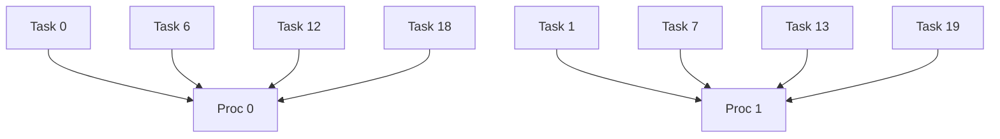
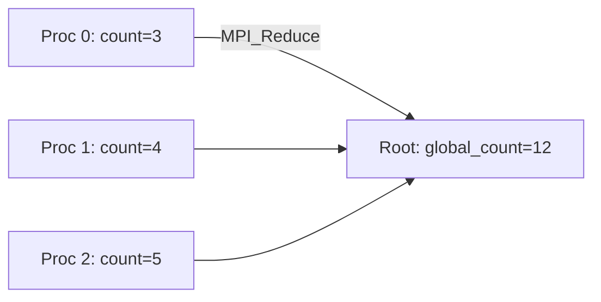

## Introduction to Circuit Satisfiability
- **Problem**: Determine if a boolean circuit can output `True` for any input combination.
- **NP-Hard**: Circuit Satisfiability is NP-Complete (_Cook-Levin Theorem_), meaning no known polynomial-time solution exists.
- **Assumptions**:
  - Circuits are acyclic (no loops).
  - Inputs: `n` boolean values (T/F).
  - Output: Single boolean value.
- **Evaluation**:
  - Done via Depth-First Search (DFS) in linear time.
  - Gates: AND, OR, NOT.

> [!NOTE] Key Concepts:
> - **NP-Hard**: Problems as hard as the hardest in NP. Solving one efficiently would solve all NP problems efficiently.
> - **Gates**:
>   - **AND**: Outputs `True` if all inputs are `True`.
>   - **OR**: Outputs `True` if at least one input is `True`.
>   - **NOT**: Inverts the input.

---

## Problem Definition and Naive Approach
- **Goal**: Find an input combination that makes the circuit output `True`.
- **Naive Solution**: Exhaustively check all $2^{16} = 65,\!536$ input combinations (for 16 inputs).
- **Limitation**: Exponential time complexity ($O(2^n)$).
- **Case Study**:
  - 16 inputs labeled `a-p`.
  - Each input can be `0` or `1`.

### Summary of Program Design:
- Check all 65,536 combinations in parallel using MPI.
- Print combinations that satisfy the circuit.

---

## Cyclic Task Distribution
- **Parallelization Strategy**: Divide input combinations cyclically across processes.
- **Example**:
  - Total tasks: 20
  - Processes ($p$): 6
  - Distribution:
    ```
    Proc 0: 0, 6, 12, 18
    Proc 1: 1, 7, 13, 19
    Proc 2: 2, 8, 14
    Proc 3: 3, 9, 15
    Proc 4: 4, 10, 16
    Proc 5: 5, 11, 17
    ```



---

## Code (sat1.c)
- **Structure**:
  - MPI program to check circuit satisfiability.
  - Each process checks a subset of inputs cyclically.
  - `check_circuit` function evaluates a 16-bit input (`z`).
- **Macro**: `EXTRACT_BIT(n,i)` extracts the `i`-th bit of `n`.
- **Logic in `check_circuit`**:
  - Converts `z` into a 16-bit array `v`.
  - Checks a predefined boolean formula (hardcoded circuit).

### Example Boolean Formula:
```c
(v[0] || v[1]) && (!v[1] || !v[3]) && (v[2] || v[3]) && ... 
```

- **Enhancements**:
  - Counts total solutions using `MPI_Reduce`.
  - `check_circuit` returns `1` if input satisfies the circuit.
- **MPI_Reduce**:
  - Aggregates counts from all processes to compute `global_count`.
  - Operation: `MPI_SUM` (sums all local counts).

---

## Collective Communication and MPI_Reduce
- **Collective Communication**: Operations involving all processes in a communicator.
- **MPI_Reduce**:
  - Parameters:
    - `operand`: Local value (e.g., `count`).
    - `result`: Global value (e.g., `global_count`).
    - `operator`: Reduction operation (e.g., `MPI_SUM`, `MPI_PROD`).
    - `root`: Process receiving the result (usually rank 0).
  - Example:
    ```c
    MPI_Reduce(&count, &global_count, 1, MPI_INT, MPI_SUM, 0, MPI_COMM_WORLD);
    ```



---

> [!NOTE] Key Takeaways
> 1. **NP-Hardness**: Explains why exhaustive search is necessary.
> 2. **Parallelization**: Cyclic distribution balances workload.
> 3. **MPI_Reduce**: Critical for aggregating results efficiently.
> 4. **Practical Use**: Circuit verification in hardware design.

### Why NP-Completeness Matters:
- If CircuitSat had a polynomial-time solution, all NP problems would too ($P=NP$). This is unsolved but widely believed to be false.