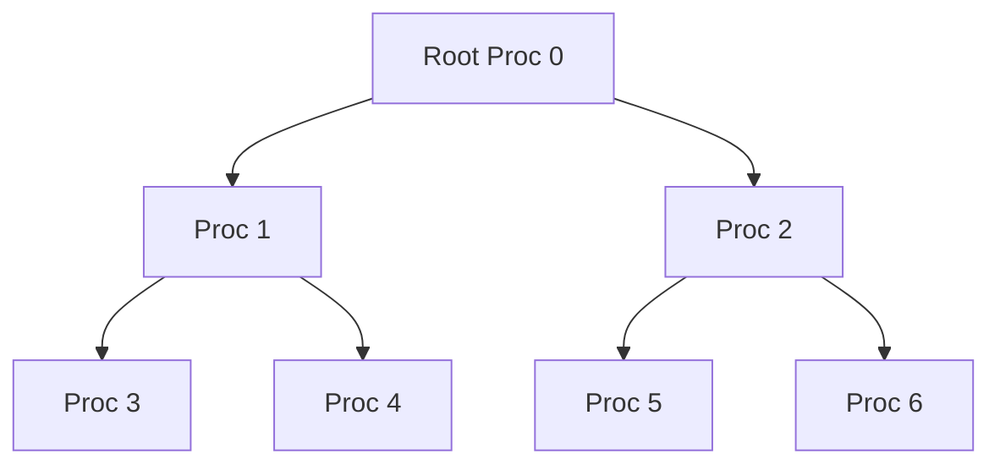

# Detailed Notes on Collective Communication in MPI

## Introduction to Collective Communication
- **Collective Communication**: Involves coordination among multiple processes in parallel computing.
- **Issues with Naive Approaches**:
  1. **Idle Processes**: Lower-ranked processes (1-7) remain idle while proc 0 handles all work.
  2. **Synchronization Delays**: Higher-ranked processes (e.g., proc 3) wait unnecessarily after proc 0 collects data.
  3. **Inefficient Distribution**: Proc 0 centralizes data collection and digitization, creating bottlenecks.
- **Tree-Structured Distribution**:
  - Reduces input distribution stages from 7 to 3 using a hierarchical approach.
  - Example: Proc 0 (root) sends data to proc 1, which then propagates to proc 3, 5, etc., in subsequent stages.
  - Formula: For $p$ processes, stages = $log(p)$ (e.g., 8 processes ⇒ 3 stages).

---

## Logarithmic Distribution and `Get_data` Modification
- **Logarithmic Scaling**:
  - Generalizes the tree approach: `log_p` stages instead of linear `p` stages.
  - Example: 104 processes ⇒ 10 stages (100x reduction).
- **Modified `Get_data` Function**:
  - Uses tree-structured distribution with stages.
  - Pseudocode Logic:
    ```c
    for (stage = first; stage <= last; stage++) {
        if (I_receive(stage, my_rank, bounce)) {
            Receive(data, source);
        } else if (I_send(stage, my_rank, bbley)) {
            Send(data, destination);
        }
    }
    ```
  - Key Calculations:
    1. Determine if a process receives data and identify the sender (`source`).
    2. Determine if a process sends data and identify the receiver.

---

## Tree Structure Implementation
- **Tree Design**:
  - No canonical structure; depends on system topology (e.g., hypercube, binary tree).
  - Example: Binary tree with `power_of_2` stages.
- **Pseudocode for `I_receive`**:
  ```c
  int I_receive(int stage, int my_rank, int* source_ptr) {
      int power_2_stage = pow(2, stage);
      if (power_2_stage <= my_rank && my_rank < 2 * power_2_stage) {
          *source_ptr = my_rank - power_2_stage;
          return 1;
      }
      return 0;
  }
  ```
- **Logic**:
  - A process receives data if its rank falls within the range $2^{stage}, 2^{(stage+1))}$.
  - Sender rank = $my\_rank - 2^{stage}$.

---

## MPI Broadcast (`MPI_Bcast`)
- **Definition**:
  - A root process sends identical data to all processes in a communicator.
  - **Parameters**:
    - `void* buffer`: Data to send/receive.
    - `int count`: Number of elements.
    - `MPI_Datatype datatype`: Type of data (e.g., `MPI_INT`).
    - `int root`: Rank of the root process.
    - `MPI_Comm comm`: Communicator group.
- **Key Rules**:
  1. All processes must call `MPI_Bcast` with the same `root` and `comm`.
  2. `count` and `datatype` must match across processes.
  3. Root process uses buffer as input; others use it as output.

---

## Example Code and Tag Safety
- **Example `Get_data` Implementation**:
  ```c
  void Get_data(int* a_ptr, int* b_ptr, int my_rank) {
      if (my_rank == 0) {
          scanf("%d %d", a_ptr, b_ptr);
          MPI_Bcast(a_ptr, 1, MPI_INT, 0, MPI_COMM_WORLD);
          MPI_Bcast(b_ptr, 1, MPI_INT, 0, MPI_COMM_WORLD);
      } else {
          MPI_Bcast(a_ptr, 1, MPI_INT, 0, MPI_COMM_WORLD);
          MPI_Bcast(b_ptr, 1, MPI_INT, 0, MPI_COMM_WORLD);
      }
  }
  ```
- **Tag Safety**:
  - MPI collective operations (e.g., `Bcast`) do not use tags, simplifying synchronization.
  - Tags are critical in point-to-point communication (`MPI_Send/Recv`) to match sends and receives.

---

## Buffering and Synchronization
- **Buffering**:
  - MPI may buffer messages if the receiver is not ready, preventing deadlocks.
  - **Risk**: If buffering is unavailable, `MPI_Send` blocks until the receiver calls `MPI_Recv`.
- **Deadlock Example**:
  - Proc A sends to B, and B sends to A simultaneously without buffering ⇒ both hang.
- **Broadcast Synchronization**:
  - Without buffering, `MPI_Bcast` is synchronous: the root waits until all processes start receiving.
  - With buffering, the root can proceed immediately, but data consistency must be ensured.

---

## Key Takeaways
1. **Tree-Structured Communication** reduces latency from `O(p)` to `O(log p)`.
2. **MPI_Bcast** ensures efficient data dissemination but requires strict parameter consistency.
3. **Buffering** is crucial for avoiding deadlocks in non-blocking operations.
4. **Tagless Collective Operations** simplify synchronization but require careful ordering (e.g., `Bcast` order affects data consistency).


*Example of a binary tree distribution for 7 processes.*