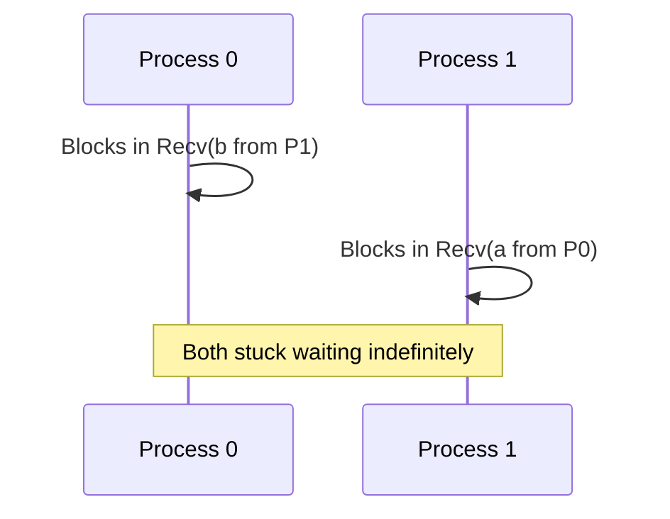
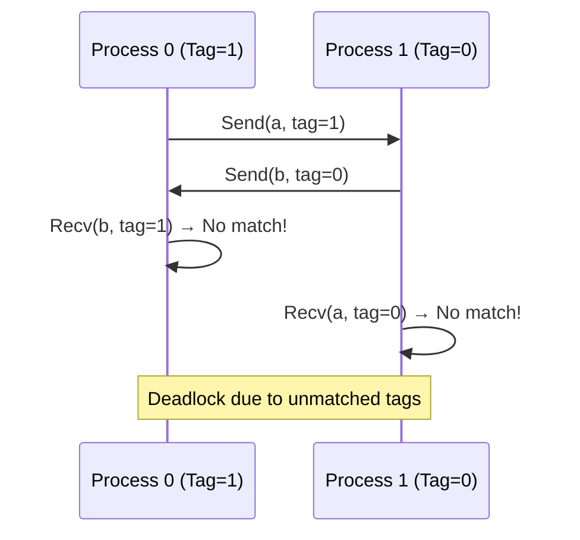

## Basic Deadlock Example

### Scenario
Two processes (rank 0 and 1) need to compute the average of variables `a` and `b`:
- **Process 0** has `a` but needs `b` from Process 1.
- **Process 1** has `b` but needs `a` from Process 0.

### Faulty Implementation
```c
if (id == 0) {
    MPI_Recv(&b, 1, MPI_FLOAT, 1, 0, MPI_COMM_WORLD, &status);
    MPI_Send(&a, 1, MPI_FLOAT, 1, 0, MPI_COMM_WORLD);
    c = (a + b) / 2.0;
} else if (id == 1) {
    MPI_Recv(&a, 1, MPI_FLOAT, 0, 0, MPI_COMM_WORLD, &status);
    MPI_Send(&b, 1, MPI_FLOAT, 0, 0, MPI_COMM_WORLD);
    c = (a + b) / 2.0;
}
```

### Issue: Blocking Order
- Both processes call `MPI_Recv` first, blocking until they receive data.
- Neither process proceeds to `MPI_Send`, causing a **deadlock**.



---

## Subtler Deadlock (Mismatched Tags)

### Scenario
Same problem: Processes exchange values but use tags incorrectly.

### Faulty Implementation
```c
if (id == 0) {
    MPI_Send(&a, 1, MPI_FLOAT, 1, 1, MPI_COMM_WORLD);  // Tag=1
    MPI_Recv(&b, 1, MPI_FLOAT, 1, 1, MPI_COMM_WORLD, &status); // Tag=1
} else if (id == 1) {
    MPI_Send(&b, 1, MPI_FLOAT, 0, 0, MPI_COMM_WORLD);  // Tag=0
    MPI_Recv(&a, 1, MPI_FLOAT, 0, 0, MPI_COMM_WORLD, &status); // Tag=0
}
```

### Issue: Mismatched Tags
- **Process 0** sends to 1 with **tag=1** but expects to receive with **tag=1**.
- **Process 1** sends to 0 with **tag=0** but expects to receive with **tag=0**.
- **Result**: Messages are never matched. Both processes block indefinitely in `MPI_Recv`.



---

> [!NOTE] Key Concepts
> 
**What Causes Deadlocks?**
> 1. Blocking Order: If all processes call `MPI_Recv` before `MPI_Send`, no data is sent.
> 2. Mismatched Tags: Tags must match between sender and receiver.
> 3. Wrong Source/Destination: Incorrect ranks in `MPI_Send` or `MPI_Recv`.
> 
Avoiding Deadlocks
> 1. Reorder Operations: Ensure at least one process sends before receiving.
>    - Example: Use `MPI_Send` followed by `MPI_Recv` on one process, and vice versa on the other.
> 2. Use Non-Blocking Calls: `MPI_Isend` and `MPI_Irecv` allow overlapping communication.
> 3. MPI_Sendrecv: Combines send and receive in one call, avoiding deadlocks.
>    ```c
>    MPI_Sendrecv(sendbuf, count, datatype, dest, sendtag,
>                 recvbuf, count, datatype, source, recvtag,
>                 comm, &status);
>    ```
> 4. Validate Tags/Ranks: Double-check tags and ranks in communication pairs.

---

## Summary Table

| Issue Type               | Example                          | Solution                          |
|--------------------------|----------------------------------|-----------------------------------|
| Blocking Order Deadlock  | All processes `Recv` before `Send` | Reorder to `Send` before `Recv`   |
| Tag Mismatch Deadlock    | Sender/receiver tags don’t match  | Ensure consistent tags            |
| Wrong Rank Deadlock      | Sending to incorrect rank        | Verify source/destination ranks   |
