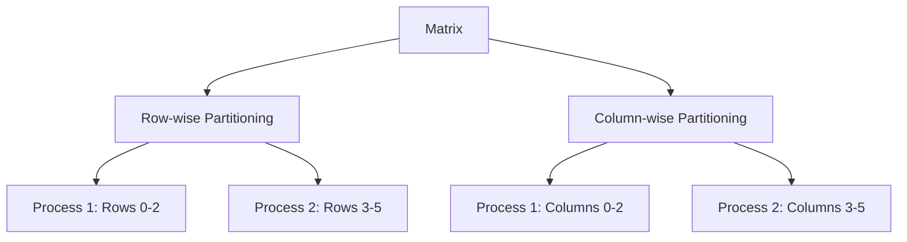
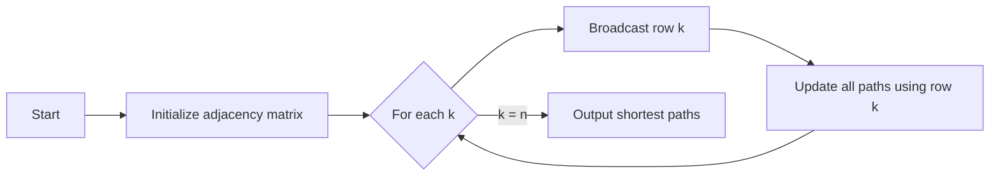

## Title Page
- **Title**: Introduction to the Floyd-Warshall Algorithm.

---

## Algorithm Overview
- **Goal**: Compute shortest paths between all pairs of vertices in a weighted graph.
- **Key Concepts**:
  - Uses **edge weights**, not the number of edges.
  - Represents the graph as an **adjacency matrix** where:
    - `a[i][j]` = weight of edge from vertex `i` to `j`.
    - Non-existent edges are marked with an "extremely high value" (\infty).
  - After execution, the matrix contains the shortest path lengths between every pair.
- **Example Matrix**:

  $$\begin{array}{cccccc}
  & 1 & 2 & 3 & 4 & 5 \\
  1 & 0 & 7 & 1 & \infty & \infty \\
  2 & \infty & 0 & 4 & \infty & \infty \\
  3 & \infty & \infty & 0 & 3 & \infty \\
  4 & \infty & 2 & \infty & 0 & 3 \\
  5 & 5 & \infty & 2 & 4 & 0 \\
  \end{array}$$

---

## Pseudocode and Time Complexity
- **Pseudocode**:
  ```python
  for k in 0 to n-1:
      for i in 0 to n-1:
          for j in 0 to n-1:
              a[i][j] = min(a[i][j], a[i][k] + a[k][j])
  ```
- **Time Complexity**: Θ(n³), where `n` is the number of vertices.
- **Dynamic Programming Insight**:
  - `k` represents an intermediate vertex.
  - Iteratively improves shortest paths by considering paths through vertex `k`.
- **Output Matrix Example**:
$$\begin{pmatrix} 0 & 2 & 5 & 3 & 6 & 9 \\ 0 & 0 & 6 & 1 & 4 & 7 \\ 0 & 15 & 0 & 4 & 7 & 10 \\ 0 & 11 & 5 & 0 & 3 & 6 \\ 0 & 8 & 2 & 5 & 0 & 3 \\ 0 & 5 & 6 & 2 & 4 & 0 \end{pmatrix}$$

---

## Parallelization Basics
- **Partitioning**:
  - Each process updates a subset of the matrix.
  - **Communication Challenge**: Updating `a[i][j]` requires access to `a[i][k]` and `a[k][j]`.
  - Example: For `k=1`, updating `a[3][4]` needs `a[3][1]` and `a[1][4]`.

---

## Task Aggregation Strategies
- **Row-wise vs Column-wise Partitioning**:
  - **Row-wise**: Each process owns a block of contiguous rows.
  - **Column-wise**: Each process owns a block of columns.
- **Why Row-wise?**:
  - Matches C's **row-major memory layout**, improving cache efficiency.
  - Reduces communication by grouping dependent data in the same process.



---

## MPI Implementation Details
- **Code Structure**:
  - **MPI Functions**: `MPI_Bcast` broadcasts the `k`-th row to all processes.
  - **Data Distribution**: `read_row_striped_matrix` splits the matrix row-wise.
- **Key Steps**:
  1. **Broadcast Row `k`**: The process owning row `k` broadcasts it to all others.
  2. **Local Updates**: Each process updates its assigned rows using the broadcasted row.

---

## Full C/MPI Code
- **Main Components**:
  - **Dynamic Allocation**: Uses `malloc` for matrix storage.
  - **Timing**: Measures execution time with `MPI_Wtime`.
  - **Function**: `compute_shortest_paths` handles iterations and broadcasting.
- **Code Snippet**:
  ```c
  void compute_shortest_paths(int id, int p, dtype **a, int n) {
      int root, offset;
      dtype *tmp = malloc(n * sizeof(dtype));
      for (k = 0; k < n; k++) {
          root = BLOCK_OWNER(k, p, n); // Determine which process owns row k
          if (root == id) { // If this process owns row k, prepare to broadcast
              offset = k - BLOCK_LOW(id, p, n);
              for (j = 0; j < n; j++) tmp[j] = a[offset][j];
          }
          MPI_Bcast(tmp, n, MPI_INT, root, MPI_COMM_WORLD);
          // Update local rows using tmp (row k)
          for (i = 0; i < BLOCK_SIZE(id, p, n); i++)
              for (j = 0; j < n; j++)
                  a[i][j] = MIN(a[i][j], a[i][k] + tmp[j]);
      }
      free(tmp);
  }
  ```

---

> [!NOTE] Key Takeaways
> 1. **Dynamic Programming**: Builds shortest paths incrementally using intermediate vertices.
> 2. **Parallelization**:
>    - **Row-wise partitioning** minimizes communication and aligns with memory layout.
>    - **MPI Broadcasts** are critical for sharing the `k`-th row efficiently.
> 3. **Complexity**: Θ(n³) time, but parallelization reduces wall-clock time.
> 4. **Use Cases**: All-pairs shortest paths in dense graphs with possible negative weights (no negative cycles).


