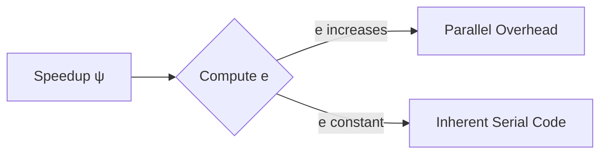
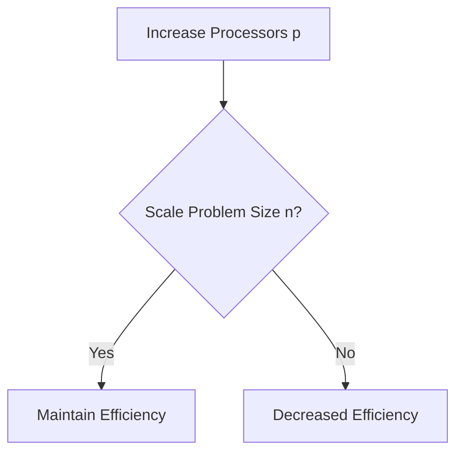

## Speedup Models and Examples

### Key Equations
1. **Amdahl-Inspired Model**  
   Given:
   $\sigma(n) = \left( \sigma(n) + \frac{\beta(n)}{p} \right) S$
   $\beta(n) = \left( \sigma(n) + \frac{\beta(n)}{p} \right) (1-s) p$
   - Likely represents iterative overhead in parallel execution.
   - $S$: Speedup factor, $s$: serial fraction, $p$: processors.

2. **Speedup Approximation**  
   $\psi(n, p) < p + (1-p)s$
   - Modified form of Amdahl’s Law, accounting for overhead.

### Example 1
- **Problem**: 52% serial time on 64 processors.  
  - Serial fraction $s = 0.52$.  
  - Speedup $\psi \leq \frac{1}{s + \frac{1-s}{p}} = \frac{1}{0.52 + \frac{0.48}{64}} \approx 1.87$.  
  - Document’s calculation ($ψ = 60.85$) likely includes additional assumptions.

### Example 2
- **Goal**: Achieve speedup 15,000 on 16,384 processors.  
  - Implies serial fraction $s$ must be extremely small.  
  - Calculation: $s \approx \frac{1/\psi - 1/p}{1 - 1/p} \approx 0.00008$ (0.008%).  

---

## Karp-Flatt Metric

### Purpose
- Measures **experimental serial fraction** $e$, identifying bottlenecks in parallel programs.

### Formulas
1. **Execution Time**  
   - Parallel: $T(p, p) = \sigma(p) + \frac{\rho(p)}{2} + k(p, p)$  
   - Serial: $T(p, i) = \sigma(p) + \frac{\rho(p)}{2}$  
   - $k(p,p)$: Parallel overhead.

2. **Serial Fraction**  
   $e = \frac{(p-1)\sigma(p) + p k(p,p)}{(p-1)T(p, i)}$
   Simplified to:
   $e = \frac{1/\psi - 1/p}{1 - 1/p}$
   - $e$ increases ⇒ Parallel overhead dominates.  
   - $e$ constant ⇒ Inherent serial sections limit speedup.

### Efficiency Trend
- Efficiency $\varepsilon = \frac{\psi}{p}$ decreases as $p$ increases if overhead ($k$) grows.

---

## Benchmark Analysis

### Example Data
| Processors ($p$) | 2   | 3   | 4   | 5   | 6   | 7   |
|---------------------|-----|-----|-----|-----|-----|-----|
| Speedup ($\psi$)  | 1.87| 2.50| 3.08| 3.57| 4.00| 4.38|
| Serial Fraction ($e$) | 0.07 | 0.075| 0.09| 0.085| 0.09| 0.095|

### Observations
- **Low $e$ (constant)**: Limited parallelism (e.g., Amdahl’s bottleneck).  
- **Rising $e$**: Increasing overhead (e.g., communication costs).  

---

## Iso-Efficiency Metric

### Definition
- **Scalability**: Ability to maintain efficiency ($\varepsilon$) as $p$ increases by scaling problem size $n$.

### Key Formula
$T(n, 1) \geq C \cdot T_0(n, p)$
- $T(n,1)$: Sequential execution time.  
- $T_0(n,p)$: Overhead time = $(p-1)\sigma(n) + p\kappa(n,p)$.  
- $C = \frac{\varepsilon}{1-\varepsilon}$: Constant to preserve efficiency.

### Implications
- For fixed efficiency, $n$ must grow with $p$ to offset overhead.  
- Example: If $T_0 \propto p^2$, $n$ must scale as $p^2$.

---

## Summary of Concepts

| Concept               | Formula/Purpose                                                                 | Use Case                                  |
|-----------------------|---------------------------------------------------------------------------------|------------------------------------------|
| **Amdahl’s Law**      | $\psi \leq \frac{1}{s + \frac{1-s}{p}}$                                      | Predict max speedup with serial sections |
| **Karp-Flatt Metric** | $e = \frac{1/\psi - 1/p}{1 - 1/p}$                                           | Diagnose overhead vs. serial bottlenecks |
| **Iso-Efficiency**    | $T(n,1) \geq \frac{\varepsilon}{1-\varepsilon} \cdot T_0(n,p)$               | Determine scalability requirements      |
