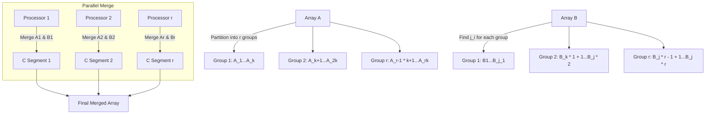

## Overview
The algorithm merges two sorted arrays `A` and `B` (each of size `n`) into a sorted array `C` of size `2n` using parallel processing. Key steps include partitioning the arrays, finding boundary indices, and merging in parallel.

---

## Page 1: Problem Setup and Sequential Merge

### Inputs
- **A**: Sorted array `[A₁, A₂, ..., Aₙ]`.
- **B**: Sorted array `[B₁, B₂, ..., Bₙ]`.
- **Output**: Merged sorted array `C` of size `2n`.

### Sequential Merge
1. Initialize indices `i = 1`, `j = 1`, `k = 1`.
2. Append `+∞` to `A` and `B` (sentinel values).
3. Compare `A[i]` and `B[j]`:
   - Place the smaller value into `C[k]`.
   - Increment the index of the chosen array and `k`.
4. Repeat until `k = 2n`.

**Time Complexity**: O(n).

---

## Page 2: Partitioning and Boundary Detection

### Parallel Strategy
- Use `p` processors to merge in parallel.
- Partition `A` and `B` into `r` groups each, where `r = n/(2p)` (assuming `n = 2ᵏ` and `r` is integer).

### Partitioning Array `A`
- Divide `A` into `r` groups, each of size `k = log₂ p`:
  ```
  Group 1: A₁ ... Aₖ
  Group 2: Aₖ₊₁ ... A₂ₖ
  ...
  Group r: A₍ᵣ₋₁₎ₖ₊₁ ... Aᵣₖ
  ```

### Finding Boundaries in `B`
For each group `i` in `A`:
- **j(i)**: Smallest index in `B` where `B[j(i)] > A[iₖ]`.
- This partitions `B` into `r` groups aligned with `A`'s partitions.

**Example**:
- If `Aₖ = 10`, then `j(1)` is the first index in `B` where `B[j(1)] > 10`.

---

## Page 3: Merging in Parallel

### Partitioning `B`
- `B` is partitioned into `r` groups based on `j(i)`:
  ```
  Group 1: B₁ ... Bⱼ₍₁₎
  Group 2: Bⱼ₍₁₎₊₁ ... Bⱼ₍₂₎
  ...
  Group r: Bⱼ₍ᵣ₋₁₎₊₁ ... Bⱼ₍ᵣ₎
  ```

### Key Observation
- All elements in `Group i` of `A` are ≤ elements in `Group i+1` of `A`.
- All elements in `Group i` of `B` are ≤ elements in `Group i+1` of `B`.
- Thus, merging `A_i` and `B_i` ensures ordered placement in `C`.

### Parallel Merge
- Assign **Processor i** to merge:
  - `A Group i`: `A₍ᵢ₋₁₎ₖ₊₁ ... Aᵢₖ`
  - `B Group i`: `Bⱼ₍ᵢ₋₁₎₊₁ ... Bⱼ₍ᵢ₎`
- Each processor writes its merged result to a segment in `C`.

---

## Page 4: Example (Simplified)

### Input Arrays
- **A**: `[1, 5, 15, 18, 19, 21, 23, 24]`
- **B**: `[2, 3, 4, 13, 15, 19, 20, 28, 29, 38, 41, 42, 43, 49, 50]`

### Partitioning
- Let `p = 4`, `n = 8`, so `r = 8/(2*4) = 1` (simplified for demo).
- **j-values**: Boundaries in `B` are `j(1)=5`, `j(2)=8`, `j(3)=10`, `j(4)=15`.

### Merging
- **Processor 1**: Merge `A[1-2]` and `B[1-5]` → `[1, 2, 3, 4, 5, 13, 15]`.
- **Processor 2**: Merge `A[3-4]` and `B[6-8]` → `[15, 18, 19, 19, 20, 28]`.
- **Processor 3**: Merge `A[5-6]` and `B[9-10]` → `[21, 23, 24, 29, 38]`.
- **Processor 4**: Merge `A[7-8]` and `B[11-15]` → `[41, 42, 43, 49, 50]`.

**Final `C`**: Concatenate all results.

---

## Diagram



---

> [!NOTE] Key Concepts
> 
> **Boundary Detection**
> - Use **binary search** to find `j(i)` efficiently (O(log n) per group).
> - Ensures partitions in `B` align with partitions in `A`.
> 
> **Load Balancing**
> - Each processor merges `O(n/p)` elements, leading to **O(n/p + log n)** time complexity.
> 
> **Correctness**
> - Partitions guarantee no overlap in `C`, as all elements in `A_i` and `B_i` are ≤ elements in `A_{i+1}` and `B_{i+1}`.

---

## Common Pitfalls
- **Unbalanced Partitions**: If `j(i)` boundaries are miscalculated, merged segments may overlap.
- **Synchronization**: Processors must write to distinct segments of `C` to avoid race conditions.