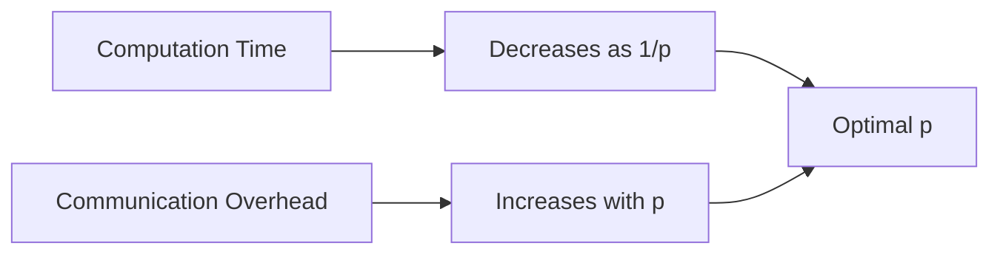
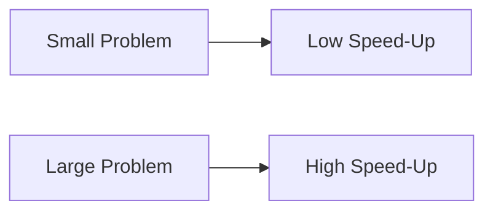

## Introduction to Performance Analysis
**Aim**: Derive a general formula for the speed-up of parallel programs and analyze barriers to performance.  

### Key Performance Prediction Models:  
1. **Amdahl's Law**:  
   - Predicts the maximum speed-up achievable when parallelizing a program.  
   - Formula:  
     $\psi(p) \leq \frac{1}{f + \frac{(1-f)}{p}}$
     where $f$ = fraction of inherently sequential code.  

2. **Gustafson-Barsis Law**:  
   - Evaluates performance by scaling the problem size with processors.  
   - Formula:  
     $\psi(p) = p - f(p-1)$  
     where $f$ = sequential fraction.  

3. **Harp-Flatt Metric**:  
   - Determines if the main barrier to speed-up is sequential code or parallel overhead.  
   - Measures the "serial fraction" after parallelization.  

4. **Isoefficiency Metric**:  
   - Evaluates scalability: how well a parallel algorithm performs as both problem size ($n$) and processors ($p$) increase.  

---

## Execution Time Breakdown  
### Serial vs. Parallel Execution:  
- **Serial Program**: Total time = $\sigma_{CD} + \beta_{CD}$  
  - $\sigma_{CD}$: Sequential portion (e.g., initialization).  
  - $\beta_{CD}$: Parallelizable portion.  

- **Parallel Program**:  
  - Sequential time remains $\sigma_{CD}$.  
  - Parallel time = $\frac{\beta_{CD}}{p} + k(p,p)$, where $k(p,p)$ = communication overhead.  

### Speed-Up Formula:  
$\psi(p) < \frac{\sigma + \beta}{\sigma + \frac{\beta}{p} + k(p,p)}$  
- **Key Insight**:  
  - Adding processors reduces computation time but increases communication overhead.  
  - **Optimal #Processors**: Exists where computation reduction outweighs overhead increase.  

---

## Deriving Amdahl's Law  
### Assumptions:  
- Ignore parallel overhead ($k(p,p) \approx 0$).  
- Define sequential fraction:  
  $f = \frac{\sigma}{\sigma + \beta} \quad \Rightarrow \quad \beta = \sigma\left(\frac{1}{f} - 1\right)$  

### Final Speed-Up Formula:  
$\psi(p) \leq \frac{1}{f + \frac{(1-f)}{p}}$  
- **Efficiency**:  
  $\epsilon(p) = \frac{\psi(p)}{p} \leq \frac{1}{p \cdot f + (1-f)}$  

---

## Amdahl's Law Examples & Limitations  
### Example 1:  
- 10% sequential ($f = 0.1$), 90% parallel.  
- Max speed-up on 8 processors:  
  $\psi(8) = \frac{1}{0.1 + \frac{0.9}{8}} \approx 4.7$  

### Example 2:  
- 25% sequential ($f = 0.25$).  
- Max speed-up as $p \to \infty$:  
  $\psi_{\text{max}} = \frac{1}{0.25} = 4$  

### Limitations of Amdahl's Law:  
- Ignores parallel overhead (e.g., communication, synchronization).  
- Assumes fixed problem size.  

---

## Amdahl Effect & Scalability  
### Amdahl Effect:  
- Increasing problem size ($n$) reduces the sequential fraction ($f$), leading to better speed-up.  
- **Example**:  
  - For $n=10^3$, $f=0.2$.  
  - For $n=10^6$, $f=0.01$.  

### Isoefficiency Metric:  
- A scalable algorithm maintains efficiency if $n$ grows with $p$.  
- Formula:  
  $T(n, p) = \text{Comp. Time} + \text{Comm. Time} = O\left(\frac{n}{p}\right) + O(p \log p)$  

---

> [!NOTE] Key Takeaways:  
> 1. **Amdahl's Law**: Predicts speed-up for fixed problem sizes.  
> 2. **Gustafson-Barsis Law**: Focuses on scaling problem size with processors.  
> 3. **Trade-offs**: Computation vs. communication overhead.  
> 4. **Practical Insight**: Optimize algorithms to reduce $f$ and $k(p,p)$.  

**Formulas**:  

| Concept              | Formula                                      |     |
| -------------------- | -------------------------------------------- | --- |
| Amdahl's Law         | $\psi(p) \leq \frac{1}{f + \frac{(1-f)}{p}}$ |     |
| Gustafson-Barsis Law | $\psi(p) = p - f(p-1)$                       |     |
| Isoefficiency        | $n \propto p \log p$                         |     |
