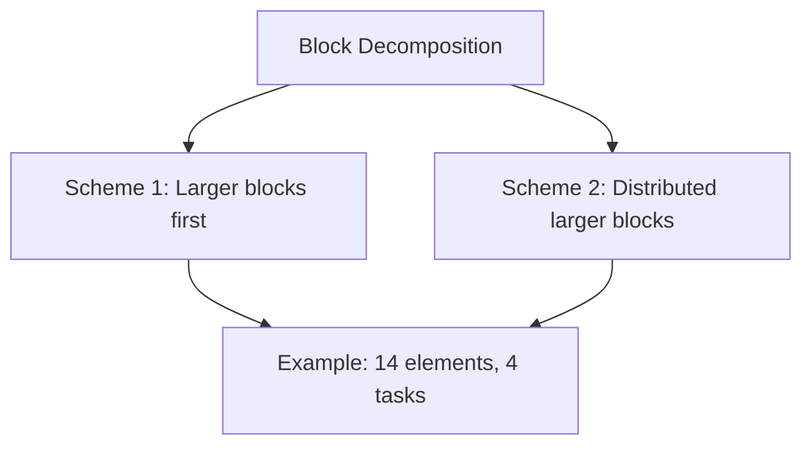

## The Sieve of Eratosthenes

### Introduction
**Algorithm Goal**:  
Find all primes ≤ *n* by iteratively marking multiples of primes starting from 2.

**Parallelization Strategy**:  
- **Domain Decomposition**: Split the array of integers across processes.
- **MPI Functions**: `MPI_Bcast` for broadcasting primes to all processes.

---

### Sequential Algorithm
```Pseudocode  
Create a list of numbers 2, 3, ..., n.  
Start with k = 2 (first prime).  
Loop:  
   Mark all multiples of k.  
   Set k to the next unmarked number.  
   Until k² > n.  
Remaining unmarked numbers are primes.
```

**Example**:  
For $n = 60$, primes are found by marking multiples of 2, 3, 5, and 7 (Figure 5.2).

---

### Sources of Parallelism
**Domain Decomposition**:  
- **Primitive Task**: Each integer is a task.  
- **Key Steps**:  
  - **Marking Multiples (3a)**: Parallelizable as tasks check `j % k == 0`.  
  - **Finding Next Prime (3b)**: Requires communication (reduction + broadcast).

**Challenges**:  
- High communication overhead from frequent broadcasts/reductions.  
- Load imbalance in interleaved decomposition.

---

### Data Decomposition Options

#### Interleaved Decomposition
- **Process Assignment**:  
  Process *i* handles numbers: `i, i + p, i + 2p, ...`  
- **Pros**: Easy index-to-process mapping.  
- **Cons**: Load imbalance (e.g., process 0 marks all even numbers).

#### Block Decomposition
- **Process Assignment**:  
  Contiguous blocks of size `⌈n/p⌉` or `⌊n/p⌋`.  
- **Pros**: Better load balancing.  
- **Formulas**:  
  - First index for process *i*: `i * ⌈n/p⌉`  
  - Last index: `(i+1) * ⌈n/p⌉ - 1`  

**Example**:  
For $n = 14$ and $p = 4$:  
- Scheme 1: $0-3$, $4-7$, $8-11$, $12-13$ (uneven).  
- Scheme 2: Distributed larger blocks.



---

### Parallel Algorithm Design
**Steps**:  
3. **Array Initialization**: Each process initializes its block.  
4. **Prime Broadcast**: Process 0 finds next prime, broadcasts via `MPI_Bcast`.  
5. **Marking Multiples**: Each process marks its local block.  
6. **Prime Counting**: Local counts summed via `MPI_Reduce`.

**MPI_Bcast Syntax**:  
```c
MPI_Bcast(&k, 1, MPI_INT, 0, MPI_COMM_WORLD);
```

---

### 5.6 Performance Analysis
**Execution Time Model**:  
$T_{\text{parallel}} = \frac{\chi n \ln \ln n}{p} + \left(\frac{\sqrt{n}}{\ln \sqrt{n}}\right) \lambda \log p$
- $χ$: Time per mark operation.  
- $\lambda$: Message latency.  

**Benchmarking Results**:  
- For $n = 100m$, 8 processors: ~3.6x speedup over sequential (original).  

---

### Optimizations

#### 1. Eliminate Even Numbers
- **Impact**: Halves memory and computation.  
- **Execution Time**:  
  $T_{\text{parallel}} = \frac{\chi n \ln \ln n}{2p} + \left(\frac{\sqrt{n}}{\ln \sqrt{n}}\right) \lambda \log p$

#### 2. Eliminate Broadcasts
- **Method**: Redundant computation of primes ≤ √n on all processes.  
- **Trade-off**: Extra memory for primes, but removes broadcast overhead.

#### 3. Loop Reordering
- **Goal**: Improve cache hit rate by processing smaller chunks.  
- **Example**: Strike all primes for a cache block before moving to the next.

**Benchmark Comparison**:  

| Version | 1 Processor | 8 Processors |  
|---------|-------------|--------------|  
| Original | 24,900 sec | 3,577 sec |  
| Optimized | 2,543 sec | 0.342 sec |  

> [!NOTE] Key Concepts
> - **Domain Decomposition**: Splitting data (integers) among processes.  
> - **Block vs. Interleaved**: Block preferred for load balancing.  
> - **MPI_Bcast**: Critical for synchronizing primes across processes.  
> - **Cache Optimization**: Loop reordering to maximize locality.
