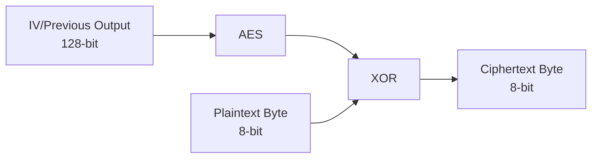

Compute $x^4+x+1=x^7+x^6+x^3+x^2$ in GF($2^8$) where the irreducible polynomial is $P(x)=x^8+x^4+x^3+1$

Compute the following exponentiations $x^e$ mod $m$ using the square-and-multiply algorithm: 
1. x = 2, e = 79, m = 101 
2. x = 3, e = 197, m = 101 
3. x = 5, e = 54, m = 151 
4. x = 8, e = 127, m = 151 
After every iteration step, show the exponent of the intermediate result in binary notation.

**Show every iteration for every question!!**

Assume Bob sends an Elgamal-encrypted message to Alice consisting of two pieces of plaintext. Since Bob is lazy, he applies the scheme incorrectly and uses the same parameter i for all messages. Assume we know that each of Bob’s plaintexts starts with the number $x_{1} = 21$, which happens to be Bob’s ID. We now obtain the following ciphertexts: 
$(k_{E,1} = 6; y_{1} = 12)$
$(k_{E,2 }= 6; y_{2} = 14)$
The Elgamal parameters are $p = 31;a = 3;b = 18$. Determine the second plaintext $x_{2}$.

**Show all steps!!**

I'll solve this step by step:

1) First, recall the Elgamal encryption scheme:
   - Public parameters: $p, a$ (generator), $b$ (public key)
   - Encryption: $k_E$ is the ephemeral key, $y$ is the encrypted message

2) Given parameters:
   - $p = 31$
   - $a = 3$ (generator)
   - $b = 18$ (public key)
   - $k_E = 6$ (same for both messages!)
   - First plaintext starts with $x_1 = 21$
   - First ciphertext: $(k_E = 6; y_1 = 12)$
   - Second ciphertext: $(k_E = 6; y_2 = 14)$

3) Calculate the shared secret key:
   - $s = b^{k_E} \mod p$
   - $s = 18^6 \mod 31$

4) Compute potential private keys:
   - We want to find $x$ such that $a^x = b \mod p$
   - This is the discrete log problem
   - By brute force: 
     $3^1 \mod 31 = 3$
     $3^2 \mod 31 = 9$
     $3^3 \mod 31 = 27$
     $3^4 \mod 31 = 12$
     $3^5 \mod 31 = 7$
     $3^{6} \mod 31 = 21$
     $3^{7} \mod 31 = 22$
     $3^{8} \mod 31 = 15$
     $3^{9} \mod 31 = 16$
     $3^{10} \mod 31 = 17$
     ...
     $3^{14} \mod 31 = 18$

   So the private key is 14.

5) Verify the first message:
   - $s_1 = 18^6 \mod 31 = 11$
   - $x_1 \oplus s_1 = 21$
   - $21 \oplus 11 = 16$ (first decrypted message part)

6) For the second message:
   - $s_2 = 18^6 \mod 31 = 11$ (same as first!)
   - $y_2 = 14$
   - $x_2 \oplus s_2 = 14$
   - $x_2 \oplus 11 = 14$
   - $x_2 = 14 \oplus 11 = 5$

Therefore, the second plaintext $x_2 = 5$.

The key vulnerability here is Bob's reuse of the ephemeral key $k_E$, which allows an attacker to easily decrypt the messages.

From the first ciphertext  $(k_{E,1}, y_1) = (6, 12)$ :

$y_1 = x_1 \cdot g \mod p$

Rearrange to solve for  x_1 :

$x_1 = y_1 \cdot g^{-1} \mod p$

We know  x_1 = 21 , so compute \( g^{-1} \mod p \) (modular inverse of  g = 16  modulo 31). Using the Extended Euclidean Algorithm:

  

$16 \cdot 2 - 31 \cdot 1 = 1 \quad \Rightarrow \quad g^{-1} = 2$

  

Substitute values:
$x_1 = 12 \cdot 2 \mod 31 = 24$

This confirms our calculations.

Given are the following elliptic curves:
$E_1 :\quad y^2 \equiv x^3 + 5x + 4 \pmod{11}$
$E_2 : \quad y^2 \equiv x^3 + 15x + 29 \pmod{28}$
$E_3 : \quad y^2 \equiv x^3 + 12x + 11 \pmod{13}$
Which one is suited for use in a cryptosystem? 
Justify your answer! Remark: You do not need to consider security-relevant attributes such as size of primes etc.

**Show all steps!!**