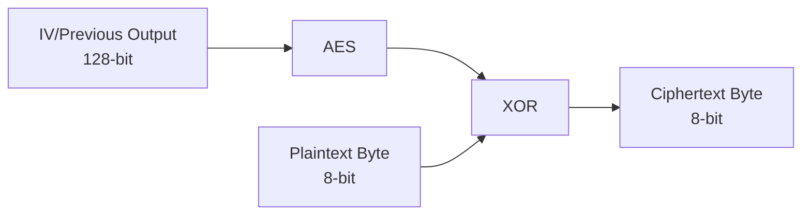

Compute $x^4+x+1=x^7+x^6+x^3+x^2$ in GF($2^8$) where the irreducible polynomial is $P(x)=x^8+x^4+x^3+1$

```mermaid
flowchart LR
    A[IV/Previous Output<br>128-bit] --> B[AES]
    B --> C[XOR]
    D[Plaintext Byte<br>8-bit] --> C
    C --> E[Ciphertext Byte<br>8-bit]
```
