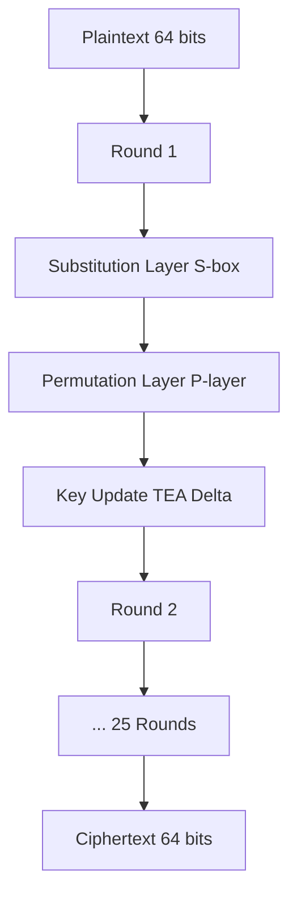

Your task is to write a literature review on the following topic:

We look at various encryption schemes for use in IOT devices and review the feasibility and performance of each technique. So far in our references, we found various techniques some of which are: Feistel Ciphers, Block Ciphers, PRESENT Ciphers, SEED Block Ciphers, etc. We conclude our literature review by presenting what we believe to be the best cryptographic method for IOT devices.

In order to achieve this **first** read all the articles attatched and write down your understanding of them. Be as **detailed** as possible so that you don't miss out on any important information! Make sure that when you are writing down information you found from these articles to include where in the article such information was found and to cite your sources properly. Aim for this literature review to be about 10 pages long. You may use LaTeX for formatting.

The following structure is recommended for your report. While adherence to this format is not mandatory, and modifications may be required based on the specifics of your project, it is imperative that you type and paginate your report. The sections suggested are as follows:

1. **Abstract**: This section should be positioned at the beginning of your report but written last. It should provide a concise summary of your project, including the purpose, methods used, main findings, and conclusions.
2. **Introduction**: This should include relevant background material and a literature review. Discuss the scope of your project and any limitations you have identified.
3. **Discussion**: This constitutes the main body of your report and should detail the methodology you employed. Be thorough in describing any figures, tables, or diagrams used, ensuring they are fully explained within the text.
4. **Results**: Present the findings of your project here, clearly and systematically.
5. **Conclusions**: Summarize the implications of your results and what they contribute to the field.
6. **Recommendations**: Offer suggestions for future work and outline any problems that remain unresolved.
7. **References**: This section is mandatory and should comply with either the American Psychological Association (APA) or IEEE citation styles. For more detailed guidelines, visit APA and IEEE Citation Styles.
8. **Appendices**: Include any supporting material that is relevant but not essential to the main text of your report.

The report should not exceed 10-20 pages, including figures and references. It should be neat, readable, and self-contained, written with the potential readership in mind. Every class member should be able to understand and derive benefits from the results obtained in your report. Therefore, you must include adequate references and/or background materials. Utilize tables, diagrams, graphs, figures, and excerpts of printouts to enhance the comprehension of your project by the readers.

The rubric below is how this paper will be graded. **Aim for getting Exceptional in each category!!!!**

| Criteria      | Exceptional                                                                                                                                         | Outstanding                                                                                                                           | Strong                                                                                                                                | Moderate                                                                                           | Insufficient                                                                                                    |
| ------------- | --------------------------------------------------------------------------------------------------------------------------------------------------- | ------------------------------------------------------------------------------------------------------------------------------------- | ------------------------------------------------------------------------------------------------------------------------------------- | -------------------------------------------------------------------------------------------------- | --------------------------------------------------------------------------------------------------------------- |
| Organization  | The report is structured exceptionally well, facilitating an easy understanding and seamless flow of ideas                                          | The report is very well organized, promoting clarity and a logical progression of ideas.                                              | The report is organized effectively with a clear structure                                                                            | The organization of the report is adequate but may lack some clarity in the flow of ideas.         | The report's organization is poor, making it difficult to follow the progression of ideas                       |
| Content       | The content is presented and argued exceptionally well; ideas are thoroughly detailed, extensively developed, and supported by specific evidence    | Content is well- presented and argued; ideas are detailed, well-developed, and include most relevant specifics.                       | Content is reliable and solid; ideas are present and correct but lack detailed development.                                           | Content meets basic criteria but lacks depth and detail. Required word count may not be met        | Content lacks depth and coherence, and does not meet the required word count                                    |
| Understanding | Demonstrates an exceptional understanding of the security issues, with insights that indicate a deep comprehension beyond basic knowledge.          | Displays a strong grasp of the security issues, showing a clear understanding and ability to discuss them effectively.                | Shows a competent understanding of the security issues, though some aspects may not be fully explored.                                | Understanding of the security issues is present but superficial.                                   | Shows poor understanding of the security issues, with many concepts not addressed or misunderstood.             |
| References    | References are exceptionally well-integrated, significantly enhancing the argument. All sources are cited flawlessly according to APA or IEEE style | References are effectively integrated and support the claims made, with only minor citation errors. All conform to APA or IEEE style. | References support the arguments but may not be seamlessly integrated into the narrative. Minor errors in APA or IEEE style citations | References are present but poorly integrated and incorrectly cited according to APA or IEEE style. | The report lacks adequate references, and the few included are incorrectly cited according to APA or IEEE style |

