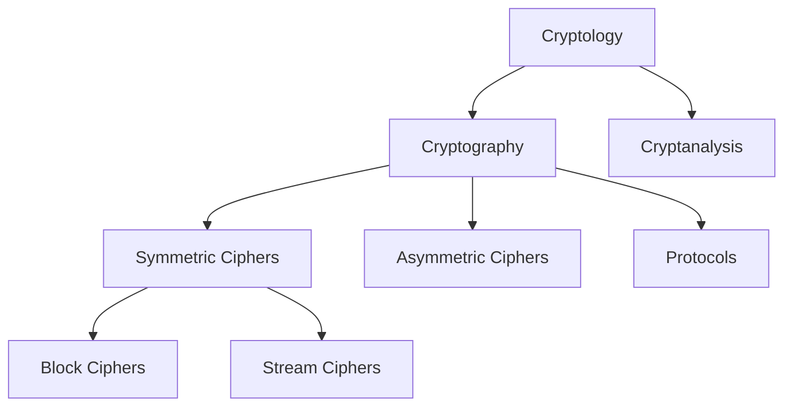
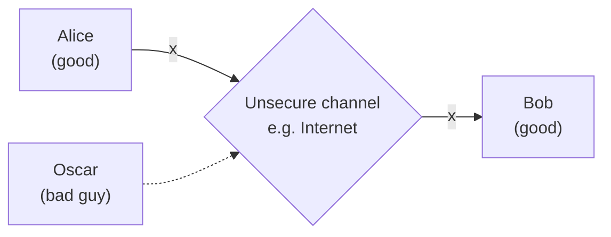
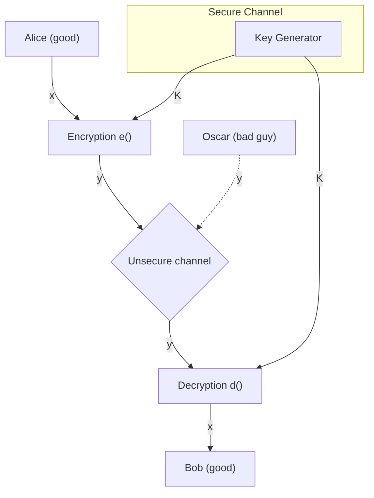
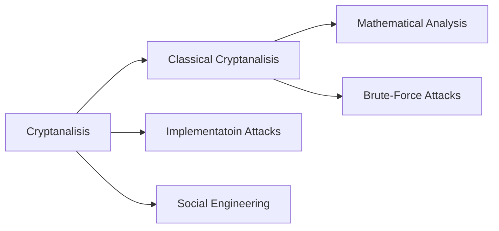

## Overview of the cryptology field

### Classification of the Field of Cryptology

### Basic facts about cryptology
- **Ancient Cryptology**: Early signs of cryptology can be found in Egypt during 2000 B.C. Letter based encryption schemes were mostly used
- **Symmetric ciphers**: All encryption schemes from ancient times until 1976 were symmetric ones.
- **Asymmetric ciphers**: In 1976 public-key (or asymmetric) cryptography was openly proposed by Diffie, Hellman, and Merkle
- **Hybrid Schemes**: The majority of today's protocols are hybrid schemes (use both)
	- _symmetric ciphers_ (for encryption and message authentication)
	- _asymmetric ciphers_ (for key exchange and digital signature)
## Basics of Symmetric Cryptography

### Symmetric Cryptography
Also called **private-key**, **single-key**, or **secret-key** cryptography

**Problem Statement**:
1. Alice and Bob would like to communicate via an unsecure channel
2. A malicious third party, Oscar (the bad guy) has channel access but should not be able to understand the communication

- x is the **plaintext**
- y is the **cyphertext**
- _K_ is the **key**
- Set of all keys $\{ K_{1}, K_{2}, \dots, K_{n} \}$ is the key space

>[!Theorem]
>Encryption:
>$$y=e_{k}(x)$$
>Decryption:
>$$x=d_{k}(y)$$
>
Encryption and decryption are inverse opperations if the same key $K$ is used on both sides: $$d_{K}(y)=d_{K}(e_{K}(x))$$

>[!Important]
>The key must be transmitted via a **secure channel** between Alice and Bob. A secure channel can be realized however, the system is only secure if an attacker does not learn the key $K$!
>
>Therefore: **The problem of secure communication is reduced to the secure transmission and storage of the key $K$**
## Cryptanalysis
### Why do we need Cryptanalysis?
There is no _mathimatical proof_ of security for any practical cipher and the only way to have assurance that a cipher is secure is to try to break it(and possibly fail)

>[!Important]
>**Kerckhoff's Principal**
>A very important idea in modern cryptography
>>A cryptosystem should be secure even if the attacker (Oscar) knows all details about the system, with the exception of the secret key

**How do we follow this principle?**
Only use **known** ciphers that have been cryptanalized for several years by good cryptographers.

>[!Remark]
>It might be tempting to assume that a cipher is _"more secure"_ if its details are kept secret. However, throughout history it has been shown that secret ciphers are almost always reverse engineered and broken.

### Cryptanalysis: Attacking Cryptosystems

**Classical Attacks**
- Mathematical Analysis
- Brute-Force Attack

**Implementation Attack**
- The method of extracting a key through reverse engineering or power measurement 
	- EX. smart banking card

**Social Engineering**
- The method of extracting the key or other important information through person to person interactions
	- EX. tricking a user into giving up their password or recovery answers

### Brute-Force Attack (or Exhaustive Key Search) against Symmetric Ciphers
This method treats the cipher as a black box. It requires at least 1 plaintext-ciphertext pair $(X_{0}, Y_{0})$ and checks all possible keys until the conditions are fulfilled.
$$d_{K}(Y_{0}=?X_{0})$$
How many keys are needed?

| Key length (bits) | Key space | Security lifetime                                                                                                        |
| ----------------- | --------- | ------------------------------------------------------------------------------------------------------------------------ |
| $64$              | $2^{64}$  | **Short-term** (a few days or less)                                                                                      |
| $128$             | $2^{128}$ | **Long-term** (several decades in the absence of quantum computers)                                                      |
| $256$             | $2^{256}$ | **Long-term** (also resistant against quantum computers – note that QC do not exist at the moment and might never exist) |
>[!Important]
>An adversary only needs to succeed with one attack. Thus, a long key space does not help if other attacks (social engineering) is possible

## Substitution Cipher

## Modular Arithmetic

## Shift(Ceasar) Cipher and Affine Cipher
