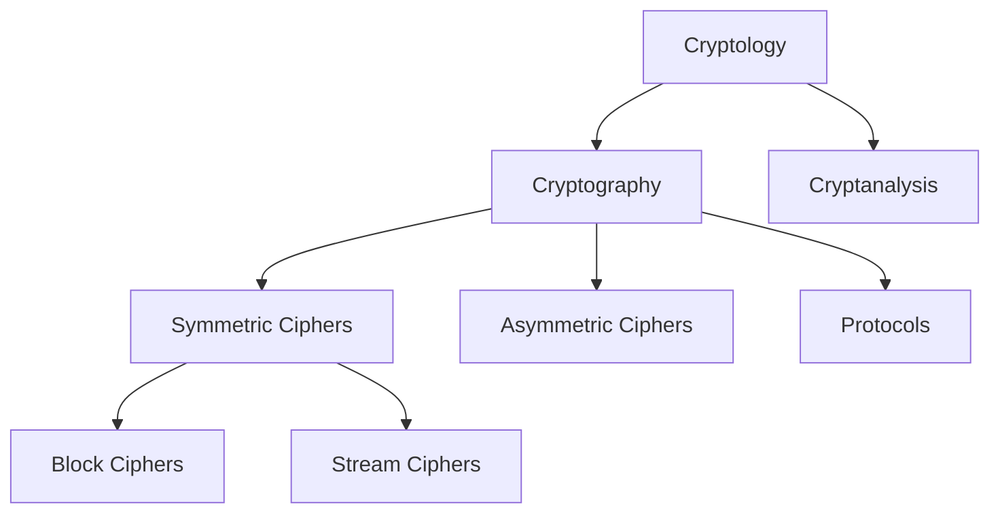
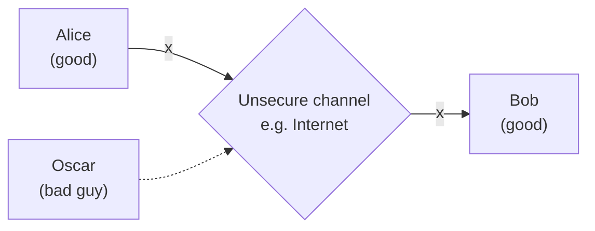
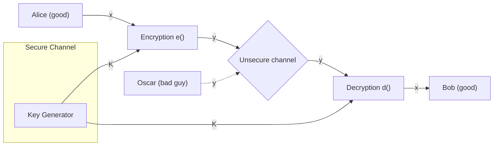

## Overview of the cryptology field

### Classification of the Field of Cryptology

### Basic facts about cryptology
- **Ancient Cryptology**: Early signs of cryptology can be found in Egypt during 2000 B.C. Letter based encryption schemes were mostly used
- **Symmetric ciphers**: All encryption schemes from ancient times until 1976 were symmetric ones.
- **Asymmetric ciphers**: In 1976 public-key (or asymmetric) cryptography was openly proposed by Diffie, Hellman, and Merkle
- **Hybrid Schemes**: The majority of today's protocols are hybrid schemes (use both)
	- _symmetric ciphers_ (for encryption and message authentication)
	- _asymmetric ciphers_ (for key exchange and digital signature)
## Basics of Symmetric Cryptography

### Symmetric Cryptography
Also called **private-key**, **single-key**, or **secret-key** cryptography

**Problem Statement**:
1. Alice and Bob would like to communicate via an unsecure channel
2. A malicious third party, Oscar (the bad guy) has channel access but should not be able to understand the communication

- x is the **plaintext**
- y is the **cyphertext**
- _K_ is the **key**
- Set of all keys $\{ K_{1}, K_{2}, \dots, K_{n} \}$ is the key space

>[!Theorem]
>Encryption:
>$$y=e_{k}(x)$$
>Decryption:
>$$x=d_{k}(y)$$
>
Encryption and decryption are inverse opperations if the same key $K$ is used on both sides: $$d_{K}(y)=d_{K}(e_{K}(x))$$

>[!Important]
>The key must be transmitted via a **secure channel** between Alice and Bob. A secure channel can be realized however, the system is only secure if an attacker does not learn the key $K$!
>
>Therefore: **The problem of secure communication is reduced to the secure transmission and storage of the key $K$**
## Cryptanalysis

## Substitution Cipher

## Modular Arithmetic

## Shift(Ceasar) Cipher and Affine Cipher
