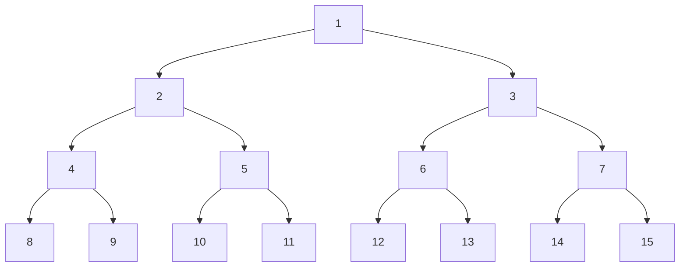

# Problem 1
### **PEAS Descriptions**

|Activity|Performance Measure|Environment|Actuators|Sensors|
|---|---|---|---|---|
|**Playing Soccer**|Score goals, prevent opponent goals, win matches|Soccer field, ball, teammates, opponents|Legs (running/kicking), voice (communication)|Vision (ball/player tracking), proprioception|
|**Exploring Titan's Oceans**|Collect samples, map terrain, avoid hazards|Subsurface ocean, methane/ethane liquid, pressure|Propulsion, robotic arms, sensors|Sonar, cameras, chemical analyzers|
|**Shopping for Used AI Books**|Find books at optimal price, minimize time|Online marketplaces (eBay, Amazon), sellers|Search queries, bids, purchases|Screen (listings/prices), notifications|
|**Playing a Tennis Match**|Win points/games, minimize errors|Court, ball, opponent, umpire|Racket swings, serves, footwork|Vision (ball tracking), hearing (line calls)|
|**Practicing Tennis Against a Wall**|Improve accuracy/consistency|Wall, ball, court|Racket swings, footwork|Vision (ball tracking), proprioception|
|**Performing a High Jump**|Maximize height, correct technique|Bar, mat, approach track|Legs (jumping), body control|Vision (bar position), proprioception|
|**Knitting a Sweater**|Correct pattern, no errors|Yarn, needles, pattern|Hand movements (stitching)|Vision (stitch inspection)|
|**Bidding at an Auction**|Win item at minimal cost|Auction platform, bidders, timer|Bid submissions, strategy adjustments|Screen (current bids/time)|

### **Task Environment Properties**

|Activity|Observable|Agents|Deterministic vs. Stochastic|Episodic vs. Sequential|Static vs. Dynamic|Discrete vs. Continuous|Known vs. Unknown|
|---|---|---|---|---|---|---|---|
|**Playing Soccer**|Partially|Multiagent|Stochastic|Sequential|Dynamic|Continuous|Known|
|**Exploring Titan's Oceans**|Partially|Single|Stochastic|Sequential|Static|Continuous|Unknown|
|**Shopping for Used AI Books**|Partially|Multiagent|Stochastic|Sequential|Dynamic|Discrete|Known|
|**Playing a Tennis Match**|Partially|Multiagent|Stochastic|Sequential|Dynamic|Continuous|Known|
|**Practicing Tennis Against a Wall**|Fully|Single|Deterministic|Sequential|Dynamic|Continuous|Known|
|**Performing a High Jump**|Fully|Single|Deterministic|Episodic|Static|Continuous|Known|
|**Knitting a Sweater**|Partially|Single|Deterministic|Sequential|Static|Discrete|Known|
|**Bidding at an Auction**|Partially|Multiagent|Stochastic|Sequential|Dynamic|Discrete|Known|

# Problem 2
**a) False**  
An agent with complete state information isn't necessarily perfectly rational. Rationality requires optimal decision-making based on goals and computational constraints. 
_Example_: A chess agent with full board visibility might still lose if its search algorithm is too shallow to evaluate future moves effectively.

**b) True**  
In environments where the optimal action depends solely on the current state, a reflex agent can act rationally. 
_Example_: A thermostat (reflex agent) optimally adjusts heating/cooling based only on the current temperature, achieving its goal perfectly.

**c) True**  
If a task environment’s performance measure is inherently unachievable or independent of the agent’s actions, no agent can be rational. 
_Example_: A casino slot machine with purely random payouts—no agent can influence outcomes, making rationality impossible.

**d) False**  
The agent function maps _entire percept sequences_ to actions, while the agent program typically receives only the _current percept_. 
_Example_: A reflex agent program uses only the latest percept, but its agent function’s input includes all prior percepts.

# Problem 3
**a) Navigation State Space (States 1 to 15)**

The hierarchical decision tree forms a binary tree where each node $k$ branches to $2k$ (left) and $2k+1$ (right). The structure is:

**b) Search Order for Goal State 11**

|**Search Algorithm**|**Order of States Explored**|
|---|---|
|**Breadth-First Search (BFS)**|`1, 2, 3, 4, 5, 6, 7, 8, 9, 10, 11`|
|**Depth-Limited Search (DLS)**   (Limit = 3)|`1, 2, 4, 8, 9, 5, 10, 11`|
|**Iterative Deepening Search (IDS)**|`1, 2, 3, 4, 5, 6, 7, 8, 9, 10, 11`|

**Explanation**:
- **BFS** explores all nodes level by level until reaching state 11.
- **DLS** (limit 3) performs depth-first search up to depth 3, prioritizing the leftmost path first.
- **IDS** mimics BFS by incrementally increasing depth limits, resulting in the same final order as BFS.

**c) GBFS vs. A_ Search**

**Heuristic Function**:  
$$h(k)=\lceil log⁡_{2}11 \rceil - \lceil log⁡_{2}k \rceil=4-\lceil log⁡_{2}k \rceil$$
**Key Values**:
$$h(1)=4, h(2)=3, h(3)=2, h(5)=1, h(11)=0$$

| **Algorithm**                       | **Expansion Order**                              | **Explanation**                                                                                                                                                        |
| ----------------------------------- | ------------------------------------------------ | ---------------------------------------------------------------------------------------------------------------------------------------------------------------------- |
| **Greedy Best-First Search (GBFS)** | `1, 3, 6, 12, 13, 7, 14, 15, 2, 4, 9, 5, 10, 11` | Prioritizes nodes with the lowest heuristic $h(k)$, leading to exploration of many low-$h(k)$ nodes (e.g., 12, 13, 14, 15) before reaching 11.                         |
| **A\* Search**                      | `1, 3, 6, 7, 12, 13, 14, 15, 2, 5, 10, 11`       | Balances path cost $g(k)$ and heuristic $h(k)$. Expands nodes with lowest $f(k)=g(k)+h(k)$, finding the goal faster by prioritizing the path through state 2 → 5 → 11. |

**Comparison**:

- **GBFS** is misled by the heuristic h(k)h(k), exploring irrelevant nodes with h(k)=0h(k)=0 (e.g., 12, 13) before finding the goal.
- **A*** efficiently combines path cost and heuristic, focusing on the optimal path 1→2→5→111→2→5→11.

> [!IMPORTANT] Key Takeaway 
> While GBFS relies solely on the heuristic (leading to suboptimal exploration), A\* leverages both path cost and heuristic for a more effective search. However, the heuristic $h(k)=4-\lceil log⁡_{2}k \rceil$ is **not admissible** (overestimates cost for $k=1$), so A\* may not guarantee optimality here.

# Problem 4
**a) Number of Possible Games**
**255,168** possible games of tic-tac-toe exist when accounting for all valid move sequences and early terminations due to wins. This number considers symmetry reduction and excludes invalid continuations after a win.

**b) Game Tree (Depth 2 with Symmetry)**
The tree starts at the root (empty board) and branches as follows:

- **Depth 1 (X's first move)**:
    - **Corner (C)**
    - **Edge (E)**
    - **Center (M)**
- **Depth 2 (O's responses)**:
    - **X in Corner (C)**:
        - O in Center (C-M): `Eval = -2`
        - O in Opposite Corner (C-C'): `Eval = 0`
        - O in Adjacent Edge (C-E): `Eval = +1`
    - **X in Edge (E)**:
        - O in Center (E-M): `Eval = -2`
        - O in Adjacent Corner (E-C): `Eval = -1`
        - O in Opposite Edge (E-E'): `Eval = 0`
    - **X in Center (M)**:
        - O in Corner (M-C): `Eval = 0`
        - O in Edge (M-E): `Eval = +1`

**c) Evaluations at Depth 2**

|**Position**|**Evaluation**|
|---|---|
|X in C → O in Center (C-M)|-2|
|X in C → O in Corner (C-C')|0|
|X in C → O in Edge (C-E)|+1|
|X in E → O in Center (E-M)|-2|
|X in E → O in Corner (E-C)|-1|
|X in E → O in Edge (E-E')|0|
|X in M → O in Corner (M-C)|0|
|X in M → O in Edge (M-E)|+1|

**d) Minimax Backed-Up Values and Best Move**
- **Backed-Up Values**:
    - **X in Corner (C)**: Min(O’s choices) = `-2`
    - **X in Edge (E)**: Min(O’s choices) = `-2`
    - **X in Center (M)**: Min(O’s choices) = `0`
- **Best Starting Move**:  
    **X in Center (M)** with a backed-up value of **0**, as it maximizes the minimum guaranteed outcome.

> [!IMPORTANT] **Key Takeaways**:
> - The evaluation function prioritizes creating two-in-a-row threats (`X₂`) while blocking opponent threats (`O₂`).
> - The **center** is the optimal first move under minimax, balancing offensive and defensive potential.
> - Symmetry reduction simplifies the game tree significantly, enabling tractable analysis.

