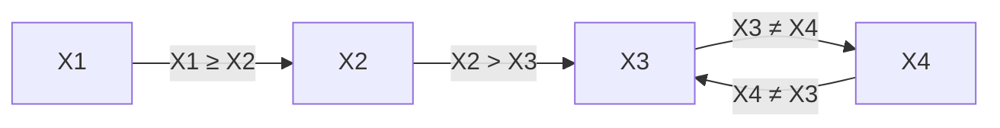

**Group 13**
Members:
Vikas Movva, 190957230 | Samiha Mridha, 169060718 | Adam Menzies, 210886410
# Question 1
### 1.A 
![[Pasted image 20250321202726.png]]

---

### 1.B
```python
import math

#Euclidian distance
def euclidean_distance(point1, point2):
	return math.sqrt((point1[0] - point2[0])**2 + (point1[1] - point2[1])**2)

  

#K Nearest Neighbours
def fnKNN(dataset, new_point, k):
	distances = []
	#Find distances
	
	for data in dataset:
		x1, x2, c = data
		dist = euclidean_distance((x1, x2), new_point)
		distances.append((dist, c))
	
	#Find k nearest
	distances.sort()
	neighbors = distances[:k]
	
	#Get prediction
	votes = {0: 0, 1: 0}
	for neighbor in neighbors:
		votes[int(neighbor[1])] += 1
	
	predicted_label = 1 if votes[1] > votes[0] else 0
	return predicted_label
```

---

### 1.C
```python
import random

#assess the performance
def assess_knn(data, k, ratio):
	#Shuffle data
	random.seed(42)
	shuffled = data.copy()
	random.shuffle(shuffled)
	
	#Split dataset
	train_size = int(len(shuffled) * ratio)
	train_data = shuffled[:train_size]
	test_data = shuffled[train_size:]
	
	#Test accuracy of KNN
	correct = 0
	for point in test_data:
		x1, x2, c = point
		predicted_c = fnKNN(train_data, (x1, x2), k)
		if predicted_c == c:
			correct += 1
	  
	accuracy = correct / len(test_data)
	return accuracy

data = df[["x1", "x2", "c"]].values.tolist()

#Test splits with k = 1
acc_80 = assess_knn(data, 1, 0.8)
acc_60 = assess_knn(data, 1, 0.6)
acc_50 = assess_knn(data, 1, 0.5)

print(f"80% train: {acc_80:.2f}")
print(f"60% train: {acc_60:.2f}")
print(f"50% train: {acc_50:.2f}")
```

**80% train:** 1.00 
**60% train:** 0.75 
**50% train:** 0.50

---

### 1.D
```python
results = []
for k in range(1, 5):
	acc_80 = assess_knn(data, k, 0.8)
	acc_60 = assess_knn(data, k, 0.6)
	acc_50 = assess_knn(data, k, 0.5)
	results.append((k, acc_80, acc_60, acc_50))

print("K\t80%\t60%\t50%")
for result in results:
	print(f"{result[0]}\t{result[1]:.2f}\t{result[2]:.2f}\t{result[3]:.2f}")
```

| K   | 80%  | 60%  | 50%  |
| --- | ---- | ---- | ---- |
| 1   | 1.00 | 0.75 | 0.50 |
| 2   | 0.75 | 0.50 | 0.50 |
| 3   | 1.00 | 0.75 | 0.80 |
| 4   | 0.50 | 0.38 | 0.50 |

K affects performance in the way that a lower value may be influenced by noise while higher values may underfit and miss smaller trends. The training set also affects the performance in the way that larger training sets are most often better and generalize better.

---

### 1.E
The best combinations are K = 1 and k = 2 at an 80% split with both having a 100% accuracy rate.

---

# Question 2
### 1.A
![[Pasted image 20250321203819.png]]

---

### 1.B
```python
import random
import math
from copy import deepcopy

#Euclidian Distance
def euclidean_distance(x, y):
  return math.sqrt((x[0] - y[0])**2 + (x[1] - y[1])**2)

#K_Means
def k_means(data, k, max_iterations):
	#Initialize centroids
	centroids = deepcopy(data[:k])

	for iteration in range(max_iterations):
		#Assign clusters
	    clusters = [[] for _ in range(k)]
	    for point in data:
		    distances = [euclidean_distance(point, centroid) for centroid in centroids]
		    cluster_index = distances.index(min(distances))
		    clusters[cluster_index].append(point)

    #New centroids
    new_centroids = []
    for cluster in clusters:
	    if cluster:
	        x_vals = [point[0] for point in cluster]
	        y_vals = [point[1] for point in cluster]
	        new_centroids.append([sum(x_vals) / len(x_vals), sum(y_vals) / len(y_vals)])
	    else:
			new_centroids.append(centroids[clusters.index(cluster)])
    #Check changes
    if all(euclidean_distance(c1, c2) <0.001 for c1, c2 in zip(centroids, new_centroids)):
      break
    centroids = new_centroids

	#Labels
	labels = []
	for point in data:
		distances = [euclidean_distance(point, centroid) for centroid in centroids]
	    labels.append(distances.index(min(distances)))

	return labels, centroids
```

---

### 2.C
```python
#Change to list
data_points = df[["f1", "f2"]].values.tolist()

#K_Means
labels, centroids = k_means(data_points, 2, 100)

#Plot
plt.figure(figsize=(10, 6))

colors = ["blue", "red"]
for i, point in enumerate(data_points):
	plt.scatter(point[0], point[1], c=colors[labels[i]])

for i, centroid in enumerate(centroids):
	plt.scatter(centroid[0], centroid[1], c="red", marker="x", s=100)

plt.xlabel("Customer’s average monthly spending")
plt.ylabel("Customer’s total number of purchases")
plt.title("Customer Clustering Results")
plt.grid(True)
plt.show()
```

**Centroid 1:** x1 = 38.75, x2 = 61.62
**Centroid 2:** x1 = 47.07, x2 = 22.14

![[Pasted image 20250321204320.png]]

### 2.D
**Cluster 1:** 14 data points
**Cluster 2:** 16 data points

---

### 2.E
**Centroid 1:** (47.07, 22.14)
**Centroid 2:** (38.75, 61.62)

---

# Question 3
### 3.A
![[Pasted image 20250321204554.png]]

---

### 3.B
```python
import pandas as pd
import numpy as np

# Load the dataset
weather_data = pd.read_csv("WeatherData_Q3.csv")  # Change to your actual path if needed

# Prepare the features and labels
X = weather_data[['temp', 'humid']].values
y = weather_data['rain'].values

# Split into training (first 15) and test set (last 5)
X_train, y_train = X[:15], y[:15]
X_test, y_test = X[15:], y[15:]

# Initialize perceptron parameters
learning_rate = 0.1
max_iterations = 1000
np.random.seed(42)
weights = np.random.uniform(-0.5, 0.5, size=2)
bias = np.random.uniform(-0.5, 0.5)

# Step activation function
def activation(z):
    return 1 if z >= 0 else 0

# Train the perceptron
for epoch in range(max_iterations):
    errors = 0
    for xi, target in zip(X_train, y_train):
        z = np.dot(weights, xi) + bias
        prediction = activation(z)
        error = target - prediction
        if error != 0:
            weights += learning_rate * error * xi
            bias += learning_rate * error
            errors += 1
    if errors == 0:
        break

# Prediction function
def predict(X):
    return [activation(np.dot(weights, xi) + bias) for xi in X]

# Evaluate accuracy
train_predictions = predict(X_train)
test_predictions = predict(X_test)
train_accuracy = np.mean(train_predictions == y_train)
test_accuracy = np.mean(test_predictions == y_test)

# Output results
print("Final Weights:", weights)
print("Final Bias:", bias)
print("Training Accuracy:", train_accuracy)
print("Test Accuracy:", test_accuracy)
```
**Final Weights:** \[-0.10245988  0.45371431\]
**Final Bias:** -0.16800605818859493
**Training Accuracy:** 1.0
**Test Accuracy:** 1.0

---

### 1.C
**Does the Perceptron separate the two classes (Rain vs. No Rain)?:**
Based on the plot and accuracy on both the training and test sets, the Perceptron does successfuly sepreate the data into the two classes. This indicates that the dataset is linearly separable, which is exactly what the Perceptron is designed for.

**Based on the dataset's pattern, explain why or why not the perceptron works well (or**
**fails):**
The perceptron works well because the relationship between temperature and humidity appears to be linearly separable, meaning there exists a straight line that can divide the two classes (rain vs. no rain).Also the data points for each class (Rain = 1, No Rain = 0) form clear, non-overlapping clusters in the 2D graph.
The problem is simple as it only contains 2 features and clear separation which makes it ideal for a Perceptron.

**Suggestions for Improvement:**
Possible improvements are that we could've added code to show how many times the model loops (epochs) before learning the pattern. This helps understand how fast the model learns. Also it could've been helpful to calculate accuracy on the test set during training to see if the model is improving or not. A different could have also been beneficial because if the data was not linearly separable, this model would fail

**Decision boundary:**
![[Pasted image 20250321205003.png]]

**Testing 2 different train/test splits:**
**Split 1:** First 15 train / Last 5 test
Training Accuracy: 1.00
Testing Accuracy : 1.00

**Split 2:** Random 15 train / 5 test
Training Accuracy: 1.00
Testing Accuracy : 0.80

**Comparing Results:**
Split 1 performed perfectly on both training and test sets while split 2 performed perfectly for training but only 80% test accuracy. Since split 2 is random, it's possible the test set had harder examples that the model didn't handle it well. While the perceptron performs well overall, the results show that its performance can vary depending on how the data is split.

---

# Question 4
### 4.A
**Variables and Domains:**
  - $X_1$: {1, 2, 3, 4}
  - $X_2$: {3, 4, 5, 8, 9}
  - $X_3$: {2, 3, 5, 6, 7, 9}
  - $X_4$: {3, 5, 7, 8, 9}

**Constraints:**
  1. $X_1 \geq X_2$
  2. $X_2 > X_3$
  3. $X_3 \neq X_4$

**Constraint graph:**
- **Nodes**: $X_1, X_2, X_3, X_4$
- **Directed Arcs**:
  - $X_1 \to X_2$ (for $X_1 \geq X_2$)
  - $X_2 \to X_3$ (for $X_2 > X_3$)
  - $X_3 \to X_4$ and $X_4 \to X_3$ (for $X_3 \neq X_4$)




---

### 4.B
**Initial Queue of Arcs**
- $X_1 \geq X_2$: Arcs $(X_1, X_2)$ and $(X_2, X_1)$
- $X_2 > X_3$: Arcs $(X_2, X_3)$ and $(X_3, X_2)$
- $X_3 \neq X_4$: Arcs $(X_3, X_4)$ and $(X_4, X_3)$

**Initial Queue**: $(X_1, X_2), (X_2, X_1), (X_2, X_3), (X_3, X_2), (X_3, X_4), (X_4, X_3)$

**Initial Domains**
- $D_1 = \{1, 2, 3, 4\}$
- $D_2 = \{3, 4, 5, 8, 9\}$
- $D_3 = \{2, 3, 5, 6, 7, 9\}$
- $D_4 = \{3, 5, 7, 8, 9\}$


1. **Arc $(X_1, X_2)$**, Constraint: $X_1 \geq X_2$
   - For each $x_1 \in D_1$, check if there exists $x_2 \in D_2$ such that $x_1 \geq x_2$:
     - $x_1 = 1$: $D_2 = \{3, 4, 5, 8, 9\}$, all $> 1$, no support.
     - $x_1 = 2$: All $x_2 > 2$, no support.
     - $x_1 = 3$: $x_2 = 3$, $3 \geq 3$, supported.
     - $x_1 = 4$: $x_2 = 3$, $4 \geq 3$, supported.
   - Remove 1 and 2 from $D_1$.
   - **Revised $D_1 = \{3, 4\}$**.
   - $D_1$ changed, add neighbors’ arcs to $X_1$ except $X_2$. Only neighbor is $X_2$, so no new arcs.

2. **Arc $(X_2, X_1)$**, Constraint: $X_1 \geq X_2$
   - For each $x_2 \in D_2$, check if there exists $x_1 \in D_1$ such that $x_1 \geq x_2$:
     - $x_2 = 3$: $D_1 = \{3, 4\}$, $3 \geq 3$, supported.
     - $x_2 = 4$: $x_1 = 4$, $4 \geq 4$, supported.
     - $x_2 = 5$: $D_1 = \{3, 4\}$, both $< 5$, no support.
     - $x_2 = 8$: No $x_1 \geq 8$.
     - $x_2 = 9$: No $x_1 \geq 9$.
   - Remove 5, 8, 9 from $D_2$.
   - **Revised $D_2 = \{3, 4\}$**.
   - $D_2$ changed, add $(X_k, X_2)$ for neighbors $X_1, X_3$ except $X_1$. Add $(X_3, X_2)$.

3. **Arc $(X_2, X_3)$**, Constraint: $X_2 > X_3$
   - $D_2 = \{3, 4\}$, $D_3 = \{2, 3, 5, 6, 7, 9\}$:
     - $x_2 = 3$: $x_3 = 2$, $3 > 2$, supported.
     - $x_2 = 4$: $x_3 = 2$, $4 > 2$, supported.
   - No revision to $D_2$.

4. **Arc $(X_3, X_2)$**, Constraint: $X_2 > X_3$
   - For each $x_3 \in D_3$, check if there exists $x_2 \in D_2$ such that $x_2 > x_3$:
     - $x_3 = 2$: $x_2 = 3$, $3 > 2$, supported.
     - $x_3 = 3$: $x_2 = 4$, $4 > 3$, supported.
     - $x_3 = 5$: $D_2 = \{3, 4\}$, both $< 5$, no support.
     - $x_3 = 6, 7, 9$: No $x_2 > 6, 7, 9$.
   - Remove 5, 6, 7, 9 from $D_3$.
   - **Revised $D_3 = \{2, 3\}$**.
   - $D_3$ changed, add $(X_4, X_3)$ (neighbors $X_2, X_4$, except $X_2$).

5. **Arc $(X_3, X_4)$**, Constraint: $X_3 \neq X_4$
   - $D_3 = \{2, 3\}$, $D_4 = \{3, 5, 7, 8, 9\}$:
     - $x_3 = 2$: $x_4 = 3$, $2 \neq 3$, supported.
     - $x_3 = 3$: $x_4 = 5$, $3 \neq 5$, supported.
   - No revision.

6. **Arc $(X_4, X_3)$**, Constraint: $X_3 \neq X_4$
   - $D_4 = \{3, 5, 7, 8, 9\}$, $D_3 = \{2, 3\}$:
     - $x_4 = 3$: $x_3 = 2$, $3 \neq 2$, supported.
     - $x_4 = 5, 7, 8, 9$: All $\neq 2, 3$, supported.
   - No revision.

7. **Arc $(X_3, X_2)$** (re-added), Constraint: $X_2 > X_3$
   - $D_3 = \{2, 3\}$, $D_2 = \{3, 4\}$:
     - $x_3 = 2$: $x_2 = 3$, $3 > 2$, supported.
     - $x_3 = 3$: $x_2 = 4$, $4 > 3$, supported.
   - No revision.

8. **Arc $(X_4, X_3)$** (re-added), Constraint: $X_3 \neq X_4$
   - Same as step 6, no revision.

The queue is now empty, and no further revisions occur.

#### **Final Domains**
- $X_1$: {3, 4}
- $X_2$: {3, 4}
- $X_3$: {2, 3}
- $X_4$: {3, 5, 7, 8, 9}

---

### 4.C
A network is arc-consistent if, after applying AC-3, all domains are non-empty, and every arc is consistent. Since no domain became empty and all arcs were processed without further revisions, the scheduling network is **arc-consistent**.

---

### 4.D
Since the network is arc-consistent, we assign values satisfying all constraints:
- Choose $X_3 = 2$ ($D_3 = \{2, 3\}$).
- $X_2 > X_3 = 2$, $D_2 = \{3, 4\}$, pick $X_2 = 3$.
- $X_1 \geq X_2 = 3$, $D_1 = \{3, 4\}$, pick $X_1 = 3$.
- $X_3 \neq X_4$, $X_3 = 2$, $D_4 = \{3, 5, 7, 8, 9\}$, pick $X_4 = 3$.

**Schedule**: $X_1 = 3, X_2 = 3, X_3 = 2, X_4 = 3$

**Verification**:
1. $X_1 \geq X_2$: $3 \geq 3$, true.
2. $X_2 > X_3$: $3 > 2$, true.
3. $X_3 \neq X_4$: $2 \neq 3$, true.


---

### 4.E
**Revise Domains**
Starting from part (b)’s domains:
- $D_1 = \{3, 4\}$
- $D_2 = \{3, 4\}$
- $D_3 = \{2, 3\}$
- $D_4 = \{3, 5, 7, 8, 9\}$

New constraint: $X_1 \neq X_4$. Add arcs $(X_1, X_4)$ and $(X_4, X_1)$ to the queue.

1. **Arc $(X_1, X_4)$**, Constraint: $X_1 \neq X_4$
   - $x_1 = 3$: $x_4 = 5$, $3 \neq 5$, supported.
   - $x_1 = 4$: $x_4 = 3$, $4 \neq 3$, supported.
   - No revision to $D_1$.

2. **Arc $(X_4, X_1)$**, Constraint: $X_1 \neq X_4$
   - $x_4 = 3$: $x_1 = 4$, $3 \neq 4$, supported.
   - $x_4 = 5, 7, 8, 9$: All $\neq 3, 4$, supported.
   - No revision to $D_4$.

No domains change, so they remain:
- $X_1$: {3, 4}
- $X_2$: {3, 4}
- $X_3$: {2, 3}
- $X_4$: {3, 5, 7, 8, 9}

The original network was arc-consistent, and the new arcs are consistent with no domain reductions. All domains are non-empty, so the network **remains arc-consistent**. Solutions like $X_1 = 4, X_2 = 4, X_3 = 3, X_4 = 5$ still exist, satisfying all constraints, including $X_1 \neq X_4$.
