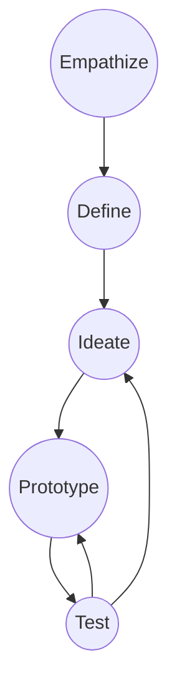

### Design Thinking Process
- Empathize
	- This is the step where we take time to get to know our user
	- What is the problem/issues that the users are having 
	- Qualitative data
- Define
	- What is the **Problem** in **concrete** terms
	- What is the **exact problem** trying to be solved not the **solution**
- Ideate
	- Brainstorm some **ideas** that can solve the problem
- Prototype
	- A **minimal viable solution** to the problem
- Test
	- Test the prototype and go back to previous steps as needed

### Empathy mapping
Moderated Empathy interview
- 1-1 interview asking about user's feelings/problems

| Says  | Thinks |
| ----- | ------ |
| Feels | Does   |
| Pain  | Gain   |
Ex. Pickup coffe app

| Says: Busy Wants Convenience Likes to use Phone Enjoys Picking up Coffee | Thinks: No time for Long Lines Needs caffeine to function     |
| ------------------------------------------------------------------------------------ | ------------------------------------------------------------------------- |
| Feels: Guilty for using large chain stores Impatient Overwhelmed            | Does: Drinks Coffee everyday Heavy Smartphone user Walks to work |
| Pain                                                                           | Gain                                                                      |
Journey map
![[Pasted image 20240515182356.png]]

Why is creating empathy for your users important?

### Problem Framing
How might we statements

| How might we ___ | Action       |
| ---------------- | ------------ |
| ______________   | What         |
| for _______      | Stakeholder  |
| in order to ____ | What change? |
