Consider the following set of jobs to be scheduled for execution on a single CPU system. 

|     | Arrival time | Burst time |
| --- | ------------ | ---------- |
| J1  | 0            | 10         |
| J2  | 2            | 8          |
| J3  | 3            | 3          |
| J4  | 10           | 4          |
| J5  | 12           | 1          |
| J6  | 15           | 4          |

Compute the turnaround time and total waiting time for each job using each of the following CPU  schedulers:  

**FCFS scheduling**  

```mermaid
gantt
    dateFormat  X
    axisFormat  %s
    title FCFS Scheduling Gantt Chart

    section Jobs
    J1 :active, 0, 10
    J2 :active, 10, 18
    J3 :active, 18, 21
    J4 :active, 21, 25
    J5 :active, 25, 26
    J6 :active, 26, 30
```

| Job | Arrival | Burst | Completion | Turnaround (=C − A) | Waiting (=T − Burst) |
| --- | ------: | ----: | ---------: | ------------------: | -------------------: |
| J1  |       0 |    10 |         10 |                  10 |                    0 |
| J2  |       2 |     8 |         18 |                  16 |                    8 |
| J3  |       3 |     3 |         21 |                  18 |                   15 |
| J4  |      10 |     4 |         25 |                  15 |                   11 |
| J5  |      12 |     1 |         26 |                  14 |                   13 |
| J6  |      15 |     4 |         30 |                  15 |                   11 |

**SJF scheduling**  

```mermaid
gantt
    dateFormat  X
    axisFormat  %s
    title SJF (Non-preemptive) Scheduling Gantt Chart

    section Jobs
    J1 :active, 0, 10
    J3 :active, 10, 13
    J5 :active, 13, 14
    J4 :active, 14, 18
    J6 :active, 18, 22
    J2 :active, 22, 30
```

|Job|Arrival|Burst|Completion|Turnaround|Waiting|
|---|--:|--:|--:|--:|--:|
|J1|0|10|10|10|0|
|J2|2|8|30|28|20|
|J3|3|3|13|10|7|
|J4|10|4|18|8|4|
|J5|12|1|14|2|1|
|J6|15|4|22|7|3|

**Preemptive SJF scheduling**  

```mermaid
gantt
    dateFormat  X
    axisFormat  %s
    title Preemptive SJF (SRTF) Scheduling Gantt Chart

    section Jobs
    J1 (Part 1) :active, 0, 3
    J3         :active, 3, 6
    J1 (Part 2):active, 6, 13
    J5         :active, 13, 14
    J4         :active, 14, 18
    J6         :active, 18, 22
    J2         :active, 22, 30
```

| Job | Arrival | Burst | Completion | Turnaround | Waiting |
| --- | ------: | ----: | ---------: | ---------: | ------: |
| J1  |       0 |    10 |         13 |         13 |       3 |
| J2  |       2 |     8 |         30 |         28 |      20 |
| J3  |       3 |     3 |          6 |          3 |       0 |
| J4  |      10 |     4 |         18 |          8 |       4 |
| J5  |      12 |     1 |         14 |          2 |       1 |
| J6  |      15 |     4 |         22 |          7 |       3 |

**MLFQ scheduling with three queues as follows:**  
- Queue 1: 3 time slices  
- Queue 2: 6 time slices  
- Queue 3: FCFS (First-Come, First-Served)  

```mermaid
gantt
    dateFormat  X
    axisFormat  %s
    title MLFQ Scheduling Gantt Chart (Q1=3, Q2=6, Q3=FCFS)

    section Jobs
    J1 (Q1 slice 1) :active, 0, 3
    J2 (Q1)        :active, 3, 6
    J3 (Q1)        :active, 6, 9
    J1 (Q2 slice 1):active, 9, 10
    J4 (Q1)        :active, 10, 13
    J5 (Q1)        :active, 13, 14
    J1 (Q2 slice 2):active, 14, 15
    J6 (Q1)        :active, 15, 18
    J1 (Q3 part)   :active, 18, 22
    J2 (Q2 slice)  :active, 22, 27
    J4 (Q3)        :active, 27, 28
    J6 (Q3)        :active, 28, 29
    J1 (Q3 final)  :active, 29, 30
```

```mermaid
gantt
    dateFormat  X
    axisFormat  %s
    title MLFQ Scheduling Gantt Chart (Q1=3, Q2=6, Q3=FCFS)

    section Jobs
    J1 (Q1 slice 1) :active, 0, 3
    J2 (Q1 slice 1) :active, 3, 6
    J3 (Q1 slice 1) :active, 6, 9
    J1 (Q2 slice 1) :active, 9, 10
    J4 (Q1 slice 1) :active, 10, 13
    J5 (Q1 slice 1) :active, 13, 14
    J1 (Q2 slice 2) :active, 14, 15
    J6 (Q1 slice 1) :active, 15, 18
    J1 (Q2 slice 3) :active, 18, 22
    J2 (Q2 slice 1) :active, 22, 27
    J4 (Q2 slice 1) :active, 27, 28
    J6 (Q2 slice 1) :active, 28, 29
    J1 (Q3 final)   :active, 29, 30

```

| Job | Arrival | Burst | Completion | Turnaround = C − A | Waiting = T − Burst |
| --- | ------: | ----: | ---------: | -----------------: | ------------------: |
| J1  |       0 |    10 |         30 |                 30 |                  20 |
| J2  |       2 |     8 |         27 |                 25 |                  17 |
| J3  |       3 |     3 |          9 |                  6 |                   3 |
| J4  |      10 |     4 |         28 |                 18 |                  14 |
| J5  |      12 |     1 |         14 |                  2 |                   1 |
| J6  |      15 |     4 |         29 |                 14 |                  10 |
