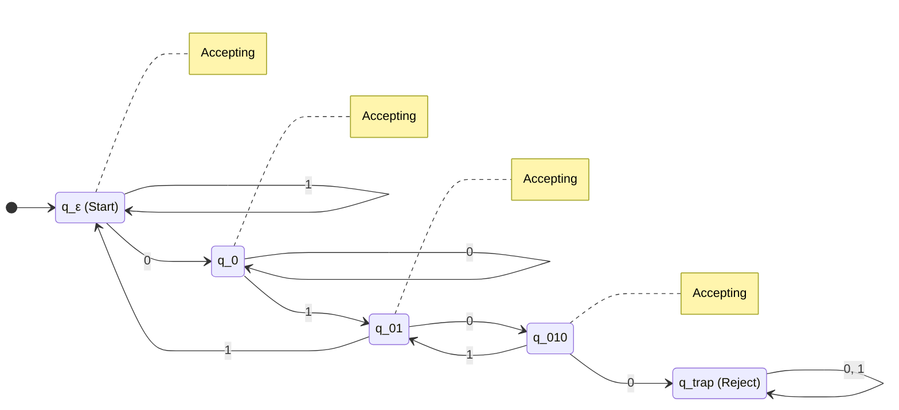

```mermaid
stateDiagram-v2
    direction LR

    %% Defining states
    state "q_ε (Start)" as q_eps
    state "q_0" as q0
    state "q_01" as q01
    state "q_010" as q010
    state "q_trap (Reject)" as q_trap

    %% Transitions
    [*] --> q_eps
    
    q_eps --> q_eps : 1
    q_eps --> q0 : 0
    
    q0 --> q0 : 0
    q0 --> q01 : 1
    
    q01 --> q_eps : 1
    q01 --> q010 : 0
    
    q010 --> q01 : 1
    q010 --> q_trap : 0
    
    q_trap --> q_trap : 0, 1

    %% Styling for clarity
    note right of q_eps : Accepting
    note right of q0 : Accepting
    note right of q01 : Accepting
    note right of q010 : Accepting
```
