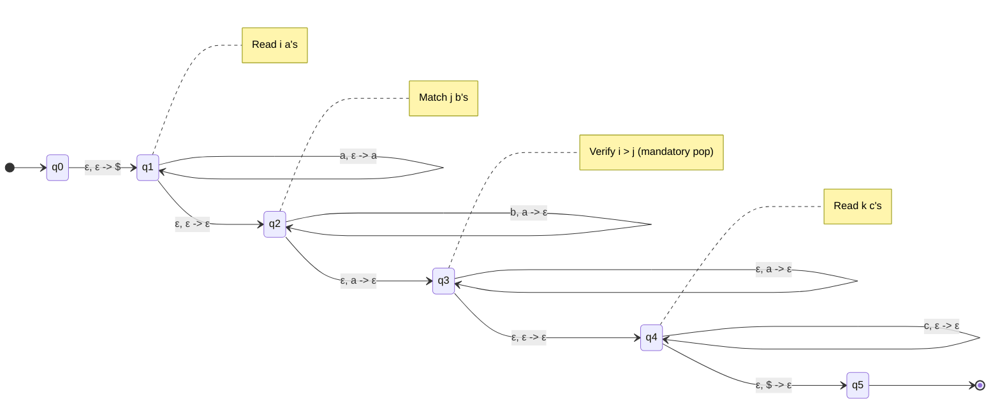
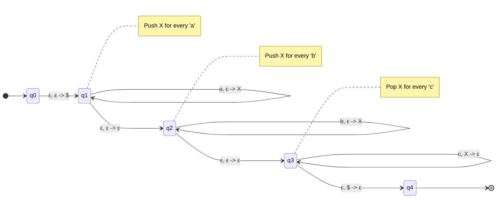

```mermaid
stateDiagram-v2
    direction LR
    [*] --> q0
    q0 --> q1: ε, ε -> $
    note right of q1: Read i a's
    q1 --> q1: a, ε -> a
    q1 --> q2: ε, ε -> ε
    note right of q2: Match j b's
    q2 --> q2: b, a -> ε
    q2 --> q3: ε, a -> ε
    note right of q3: Verify i > j (mandatory pop)
    q3 --> q3: ε, a -> ε
    q3 --> q4: ε, ε -> ε
    note right of q4: Read k c's
    q4 --> q4: c, ε -> ε
    q4 --> q5: ε, $ -> ε
    q5 --> [*]
```

```mermaid
stateDiagram-v2
    direction LR
    [*] --> q0
    q0 --> q1: ε, ε -> $
    note right of q1: Push X for every 'a'
    q1 --> q1: a, ε -> X
    q1 --> q2: ε, ε -> ε
    note right of q2: Push X for every 'b'
    q2 --> q2: b, ε -> X
    q2 --> q3: ε, ε -> ε
    note right of q3: Pop X for every 'c'
    q3 --> q3: c, X -> ε
    q3 --> q4: ε, $ -> ε
    q4 --> [*]
```