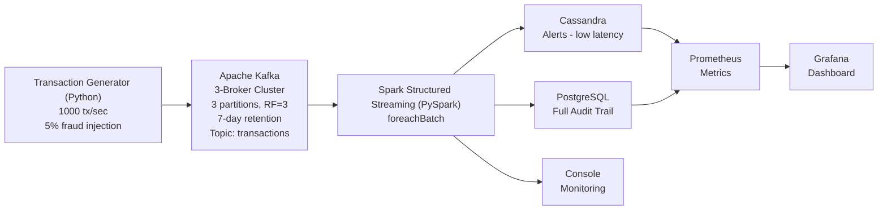

# Real-Time Fraud Detection Streaming Pipeline

  

End-to-end data engineering pipeline for real-time credit card fraud detection using Apache Kafka, Spark Structured Streaming, Cassandra, and PostgreSQL.

  

## Architecture

  



  

## Fraud Detection Rules

  

| Rule              | Description                                  | Risk Score                   |
| ----------------- | -------------------------------------------- | ---------------------------- |
| HIGH_AMOUNT       | Transaction amount > $5,000                  | 30-50 pts (scaled by amount) |
| VELOCITY          | >5 transactions per card in 60-second window | 25+ pts (scaled by count)    |
| OFFLINE_HIGH      | In-person transaction > $2,000               | 15 pts                       |
| GEO_IMPOSSIBILITY | Same card, different city, within 10 min     | 20 pts                       |

  

Risk scores are composited (max 100). Severity levels: LOW (0-30), MEDIUM (30-50), HIGH (50-70), CRITICAL (70+).

  

## Tech Stack

  

- **Apache Kafka** (Confluent 7.6.0) — 3-broker cluster with 3-partition topics, replication factor 3

- **Apache Spark** (3.5.1) — Structured Streaming with foreachBatch processing

- **Cassandra** (4.1) — Low-latency alert storage for real-time lookups

- **PostgreSQL** (16) — Full audit trail and analytical queries

- **Prometheus** — Metrics collection from Kafka and Spark

- **Grafana** — Real-time dashboards

- **Docker Compose** — Full infrastructure orchestration

- **Python** — Transaction generator (kafka-python) and Spark job (PySpark)

  

## Quick Start

  

### Prerequisites

  

- Docker Desktop (or Docker Engine + Docker Compose)

- Python 3.10+ (for the transaction generator)

- 4GB+ RAM available for Docker

  

### 1. Start the Infrastructure

  

```bash

cd fraud-detection-pipeline

docker compose up -d zookeeper kafka-1 kafka-2 kafka-3 kafka-ui cassandra postgres prometheus grafana spark-master spark-worker spark-job

```

  

### 2. Create Kafka Topics

  

```bash

docker exec fraud-kafka-1 kafka-topics \

--create --bootstrap-server kafka-1:29092,kafka-2:29093,kafka-3:29094 \

--topic transactions --partitions 3 --replication-factor 3 \

--config retention.ms=604800000

  

docker exec fraud-kafka-1 kafka-topics \

--create --bootstrap-server kafka-1:29092,kafka-2:29093,kafka-3:29094 \

--topic transactions-dlq --partitions 3 --replication-factor 3

```

  

### 3. Start the Transaction Generator

  

```bash

cd producer

python -m venv venv

source venv/bin/activate

pip install -r requirements.txt

  

# Generate 100 tx/sec with 10% fraud rate across 50 cards

python transaction_producer.py --bootstrap-servers localhost:9092 --topic transactions --rate 100 --cards 50 --fraud-rate 0.1

```

  

### 4. Verify the Pipeline

  

```bash

# Check PostgreSQL audit tables

docker exec fraud-postgres psql -U fraud -d fraud_audit -c "

SELECT alert_type, count(*), round(avg(risk_score)::numeric,2) as avg_risk

FROM fraud_detection_results GROUP BY alert_type ORDER BY count DESC;

"

  

# Check Cassandra alerts

docker exec fraud-cassandra cqlsh -e "

SELECT count(*) FROM fraud_detection.fraud_alerts;

"

```

  

## Accessing the UIs

  

| Service | URL | Credentials |

|---------|-----|-------------|

| Kafka UI | http://localhost:8080 | None |

| Spark Master UI | http://localhost:8081 | None |

| Spark Worker UI | http://localhost:8082 | None |

| Prometheus | http://localhost:9090 | None |

| Grafana | http://localhost:3000 | admin / admin |

  

## Project Structure

  

```

fraud-detection-pipeline/

├── docker-compose.yml # Full infrastructure orchestration

├── Dockerfile.spark # Custom Spark image with JARs + Python driver

├── producer/

│ ├── transaction_producer.py # Kafka producer (synthetic tx generator)

│ └── requirements.txt # kafka-python

├── spark/

│ └── jobs/

│ └── fraud_detection.py # Spark Structured Streaming job

├── cassandra/

│ └── init.cql # Cassandra schema (keyspace + tables)

├── postgres/

│ └── init.sql # PostgreSQL schema (audit tables + indexes)

├── prometheus/

│ ├── prometheus.yml # Prometheus scrape config

│ └── kafka-jmx.yml # Kafka JMX exporter config

├── grafana/

│ ├── datasources/ # Prometheus datasource provisioning

│ └── dashboards/ # Fraud detection dashboard JSON

└── scripts/

├── create-topics.sh # Kafka topic creation helper

└── verify-pipeline.sh # End-to-end verification script

```

  

## Key Design Decisions

  

### foreachBatch Processing Pattern

The Spark job uses `foreachBatch` to process each micro-batch as a static DataFrame, enabling:

- Complex joins and aggregations within each batch

- Multiple sink writes (Cassandra + PostgreSQL) per batch

- Per-batch error handling and retry logic

  

### Dual-Sink Architecture

- **Cassandra**: Fraud alerts only — optimized for low-latency card-level lookups

- **PostgreSQL**: All detection results (fraud + non-fraud) — full audit trail for batch analytics

  

### Fraud Detection Logic

The fraud rules are implemented using native Spark SQL functions (no UDFs) to avoid serialization issues and maximize performance:

- Per-row rules (HIGH_AMOUNT, OFFLINE_HIGH) are evaluated directly on the stream

- Windowed rule (VELOCITY) uses watermarked window aggregation

- Risk scores are computed using conditional SQL expressions

  

## Stopping the Pipeline

  

```bash

# Stop all services

docker compose down

  

# Stop and remove volumes (full reset)

docker compose down -v

```